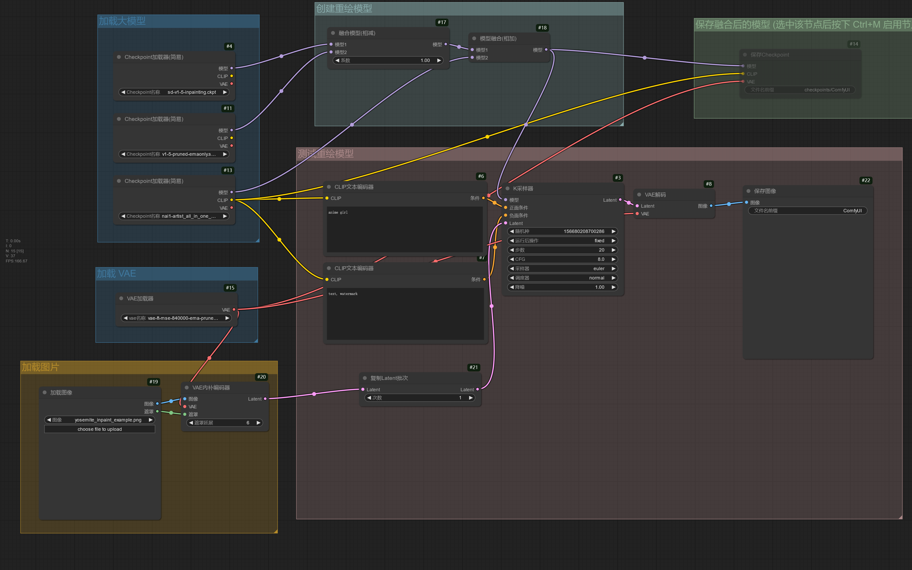

# 杂项
这里列出 ComfyUI 的其他功能。


<!-- TODO https://github.com/T8star1984/Comfyui-Aix-NodeMap -->

## ComfyUI 中不同模型的放置路径
|模型种类|放置路径|
|---|---|
|Stable Diffusion 模型（大模型）|ComfyUI/models/checkpoints|
|VAE 模型|ComfyUI/models/vae|
|VAE-approx 模型|ComfyUI/models/vae_approx|
|LoRA Lycoris 模型|ComfyUI/models/loras|
|Embedding 模型|ComfyUI/models/embeddings|
|Hypernetwork 模型|ComfyUI/models/hypernetworks|
|高清修复模型|ComfyUI/models/upscale_models|
|ControlNet 模型|ComfyUI/models/controlnet|
|ControlNet 预处理器模型|ComfyUI/custom_nodes/comfyui_controlnet_aux/ckpts|
|AnimateDiff 模型|ComfyUI/custom_nodes/ComfyUI-AnimateDiff-Evolved/models|
|DanTagGen 模型|ComfyUI/custom_nodes/ComfyUI_DanTagGen/models|
|保存的工作流|ComfyUI/user/default/workflows|

<!-- TODO: 需要更新路径-->


## ComfyUI 共享 SD WebUI 的模型
在 ComfyUI 启动一次后，在 ComfyUI 的根目录会生成一个 extra_model_paths.yaml.example 共享目录示例文件，通过修改这个文件可以使 ComfyUI 共享 SD WebUI 的模型文件。

这是一个例子，我的 SD WebUI 路径在 E:/Softwares/stable-diffusion-webui，则将这个示例文件的 base_path: 后面的路径改成 SD WebUI 的路径。

```yaml
#Rename this to extra_model_paths.yaml and ComfyUI will load it


#config for a1111 ui
#all you have to do is change the base_path to where yours is installed
a111:
    base_path: E:/Softwares/stable-diffusion-webui # 填写 SD WebUI 的路径, 注意冒号后面必须有空格

    checkpoints: models/Stable-diffusion # 大模型
    configs: models/Stable-diffusion # 大模型配置文件
    vae: models/VAE # VAE 模型
    loras: | # LoRA 模型
         models/Lora
         models/LyCORIS
    upscale_models: | # 放大模型
                  models/ESRGAN
                  models/RealESRGAN
                  models/SwinIR
    embeddings: embeddings # Embedding 模型
    hypernetworks: models/hypernetworks # Hypernetwork 模型
    controlnet: models/Controlnet # ControlNet 模型
    ipadapter: models/Controlnet # IP Adapter 模型
    clip_vision: extensions/sd-webui-controlnet/annotator/downloads/clip_vision # clip_vision 模型
    # animatediff模型共享的说明: https://github.com/Kosinkadink/ComfyUI-AnimateDiff-Evolved?tab=readme-ov-file#model-setup
    animatediff_models: extensions/sd-webui-animatediff/model # AnimateDiff 模型
    animatediff_motion_lora: extensions/sd-webui-animatediff/model # AnimateDiff LoRA 模型


#config for comfyui
#your base path should be either an existing comfy install or a central folder where you store all of your models, loras, etc.

comfyui:
#     base_path: path/to/comfyui/
#     checkpoints: models/checkpoints/
#     clip: models/clip/
#     configs: models/configs/
#     controlnet: models/controlnet/
#     embeddings: models/embeddings/
#     loras: models/loras/
#     upscale_models: models/upscale_models/
#     vae: models/vae/
#     classifiers: models/classifiers/
#     clip_vision: models/clip_vision/
#     diffusers: models/diffusers/
#     diffusion_models: models/diffusion_models/
#     gligen: models/gligen/
#     hypernetworks: models/hypernetworks/
#     photomaker: models/photomaker/
#     style_models: models/style_models/
#     unet: models/unet/
#     vae_approx: models/vae_approx/
#     animatediff_models: models/animatediff_models/
#     animatediff_motion_lora: models/animatediff_motion_lora/
#     animatediff_video_formats: models/animatediff_video_formats/
#     ipadapter: models/ipadapter/
#     liveportrait: models/liveportrait/
#     insightface: models/insightface/
#     layerstyle: models/layerstyle/
#     LLM: models/LLM/
#     Joy_caption: models/Joy_caption/
#     sams: models/sams/
#     blip: models/blip/
#     CogVideo: models/CogVideo/
#     xlabs: models/xlabs/
#     instantid: models/instantid/
#     custom_nodes: custom_nodes/


#other_ui:
#    base_path: path/to/ui
#    checkpoints: models/checkpoints
#    gligen: models/gligen
#    custom_nodes: path/custom_nodes
```

修改并保存文件完成后，将 extra_model_paths.yaml.example 文件名改成 extra_model_paths.yaml，重新启动 ComfyUI 后就能看到 SD WebUI 里的模型了。

!!!note
    如果看不到文件名的后缀，需要将显示文件名后缀打开，参看：[杂项 - 显示隐藏的文件和文件后缀名 - SDNote](../../help/other.md#_4)


## 模型融合
下面是搭建工作流使用的模型。

|模型下载|放置路径|
|---|---|
|[animefull-final-pruned.safetensors](https://modelscope.cn/models/licyks/sd-model/resolve/master/sd_1.5/animefull-final-pruned.safetensors)|ComfyUI/models/checkpoints|
|[nai1-artist_all_in_one_merge.safetensors](https://modelscope.cn/models/licyks/sd-model/resolve/master/sd_1.5/nai1-artist_all_in_one_merge.safetensors)|ComfyUI/models/checkpoints|
|[AnythingV5Ink_ink.safetensors](https://modelscope.cn/models/licyks/sd-model/resolve/master/sd_1.5/AnythingV5Ink_ink.safetensors)|ComfyUI/models/checkpoints|
|[sd-v1-5-inpainting.ckpt](https://modelscope.cn/models/licyks/sd-model/resolve/master/sd_1.5/sd-v1-5-inpainting.ckpt)|ComfyUI/models/checkpoints|
|[v1-5-pruned-emaonly.safetensors](https://modelscope.cn/models/licyks/sd-model/resolve/master/sd_1.5/v1-5-pruned-emaonly.safetensors)|ComfyUI/models/checkpoints|
|[cosxl.safetensors](https://modelscope.cn/models/licyks/sd-model/resolve/master/sdxl_1.0/cosxl.safetensors)|ComfyUI/models/checkpoints|
|[sd_xl_base_1.0_0.9vae.safetensors](https://modelscope.cn/models/licyks/sd-model/resolve/master/sdxl_1.0/sd_xl_base_1.0_0.9vae.safetensors)|ComfyUI/models/checkpoints|
|[Illustrious-XL-v0.1.safetensors](https://modelscope.cn/models/licyks/sd-model/resolve/master/sdxl_1.0/Illustrious-XL-v0.1.safetensors)|ComfyUI/models/checkpoints|
|[nai1-artist_all_in_one_6-000032.safetensors](https://modelscope.cn/models/licyks/sd-lora/resolve/master/sd_1.5/style/nai1-artist_all_in_one_6-000032.safetensors)|ComfyUI/models/loras|
|[vae-ft-mse-840000-ema-pruned.safetensors](https://modelscope.cn/models/licyks/sd-vae/resolve/master/sd_1.5/vae-ft-mse-840000-ema-pruned.safetensors)|ComfyUI/models/vae|

下面的工作流可以简单进行模型融合，**融合模型**节点的计算方式为`模型 1 * 比率 + 模型 2 * (1.0 - 比率)`，如果融合的效果不错，可以选中**保存Checkpoint**节点，按下 Ctrl + M 快捷键启用该节点，再次运行工作流时将会把模型保存在`ComfyUI/output/checkpoint`路径中。


如果想要融合 3 个模型，可以使用下面的工作流，该工作流使用**融合模型(分层)**节点，可以调整 UNet 层的输入、中间和输出块的权重。


LoRA 模型在训练好后，也可以融入大模型中，对大模型进行微调。


模型权重可以减去再重新添加，下面使用公式`(重绘模型 - 基础模型) x 1.0 + 其他模型`来融合出重绘模型。



COSXL 模型也可以通过融合模型的方式进行创建，使用的公式为`(COSXL - SDXL 官方模型) + 其他模型`。

在**模型融合(SDXL)**节点调整融合模型的权重，该节点的计算方式为`模型 1 * 比率 + 模型 2 * (1.0 - 比率)`。建议将输出块设置为 0 ~ 4 之间的值使融合后的模型和原来的模型效果更加相似。

**模型连续采样算法EDM**节点可以尝试调整 Sigma 值以达到更好的效果。


<!-- TODO: 包含有用的原生节点 https://www.bilibili.com/video/BV17pmbYqEvN -->

<!-- TODO:关系 ControlNet 模式的说明: https://github.com/Kosinkadink/ComfyUI-Advanced-ControlNet/issues/87#issuecomment-2116370541 -->

<!-- TODO: https://comfyanonymous.github.io/ComfyUI_examples/faq/ -->

<!-- TODO https://github.com/Acly/krita-ai-diffusion/wiki/ComfyUI-Setup -->