# 简述
ComfyUI 的界面和 Stable Diffusion WebUI 的界面完全不相同，在 ComfyUI 中，每个功能都被拆散成一个个节点，通过连接不同的节点搭建起一个完整的生图流程。


## 前期配置
如果 ComfyUI 未安装扩展管理器和中文翻译扩展，建议通过以下几种方式进行安装。


### 使用绘世启动器安装
打开绘世启动器的 版本管理 -> 安装新扩展，分别搜索 ComfyUI-Manager 和 AIGODLIKE-COMFYUI-TRANSLATION 并下载安装。


### 使用 Git 命令安装
进入 ComfyUI 的 custom_nodes 文件夹中，打开终端，输入以下的命令安装 ComfyUI-Manager 和 AIGODLIKE-COMFYUI-TRANSLATION 扩展。

```
git clone https://github.com/ltdrdata/ComfyUI-Manager
git clone https://github.com/AIGODLIKE/AIGODLIKE-COMFYUI-TRANSLATION
```

安装后重新启动 ComfyUI。


## 设置中文
安装以上的扩展后，在 ComfyUI 界面顶部可以看到 Manager 按钮，说明扩展管理器已经成功安装，但是通常情况下 ComfyUI 中文翻译扩展安装后并不会自动设置 ComfyUI 界面为中文，需要手动设置。

在 ComfyUI 左下角点击齿轮按钮进入 ComfyUI 设置，找到 AGL 选项并点击，在 AGLTranslation-langualge 选项选择 中文[Chinese Simplified] 后 ComfyUI 将自动重启，此时 ComfyUI 的界面就切换成中文了。


## 快捷键
以下为操作 ComfyUI 界面的快捷键。

|操作|作用|
|---|---|
|鼠标滚轮|缩放工作流的大小。|
|鼠标右键|打开节点列表。|
|鼠标左键双击|打开节点搜索列表。|
|Ctrl + Enter|运行当前的工作流|
|Ctrl + Shift + Enter|将当前的工作流作为运行列表里第一个被运行的工作流|
|Ctrl + Z|撤销工作流更改|
|Ctrl + Y|重做工作流更改|
|Ctrl + S|保存工作流|
|Ctrl + O|导入工作流|
|Alt + C|折叠 / 取消折叠选中的节点。|
|Ctrl + M|禁用 / 激活选中的节点。|
|Ctrl + B|使被选中的节点在工作流运行时被绕过。|
|Delete / Backspace|删除选中的节点。|
|Ctrl + 右 Ctrl + Backspace|清除当前的工作流。|
|Space + 移动鼠标|移动画布。|
|Ctrl + 鼠标左键单击|多选节点。|
|Shift + 鼠标左键长按|拖动选中的多个节点。|
|Ctrl + C / V|复制 / 粘贴选中的节点（不复制节点的连线）。|
|Ctrl + Shift + C / V|复制 / 粘贴选中的节点（同时复制节点的连线）。|
|Ctrl + D|加载默认的工作流。|
|Alt + `+`|放大工作流。|
|Alt + `-`|缩小工作流。|
|Alt + 点击连接线上的点|创建转接点。|
|Shift + 按住连接线上的转接点|从转接点拉出连接线。|
|Q|显示当前运行的工作流队列。|
|H|显示历史工作流。|
|R|刷新工作流。|


## 节点操作
在节点的左侧接口为输入点，节点右侧的接口为输出点，鼠标按住接口并向外拖动可以看到延伸出来的线，将线拖到匹配这个线的接口上可完成不同节点之间的连接。


### 节点菜单
右键节点可以看到该节点的编辑功能。

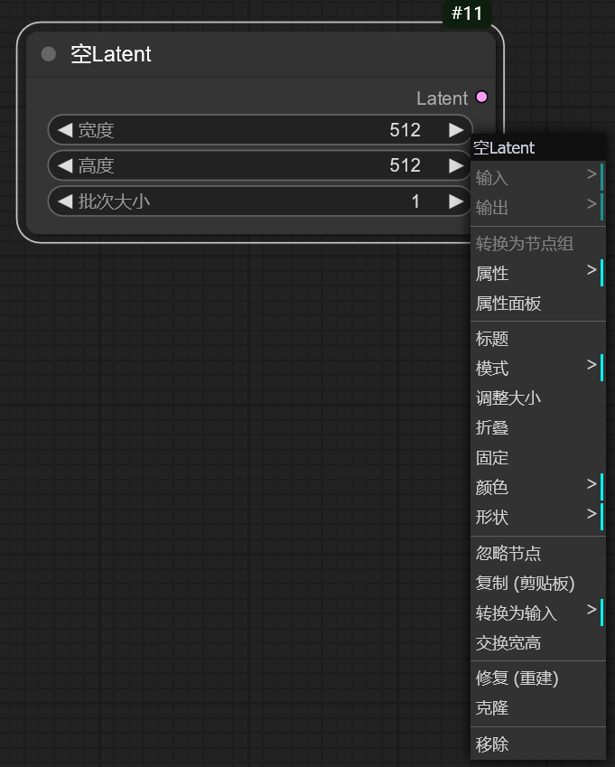


### 工作流运行提示
如果节点未连接必要的输入，在运行工作流是节点将会报错，使用红色圈标记缺少的输入。


此时连上对应的输入即可。

运行工作流时，正在运行的节点将会标记为绿色。

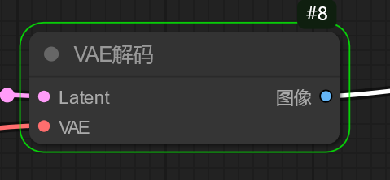

如果某个节点运行出现的错误，此时节点会标记为紫色，此时应该检查该节点和该节点前面的节点是否有参数错误，连接是否有误。

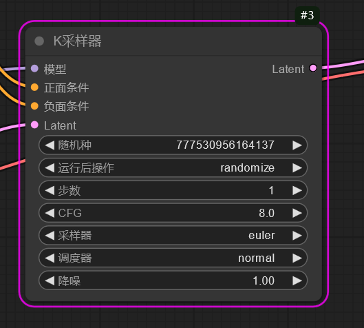

除了将节点标记为紫色，ComfyUI 将弹窗提示报错信息。


点击 Find Issues 可以跳转到 ComfyUI 的 Github Issues 分区中，可以尝试从中找到和自己错误类似的帖子并寻求解决方法，或者发送 Issues 报告这个错误。

点击 Show Report 将显示具体的报错信息，可以根据这个信息在搜索引擎查找对应的解决方法。


### 建立节点组
下面是一个简单的生图工作流，可以看到该工作流有许多节点组成。

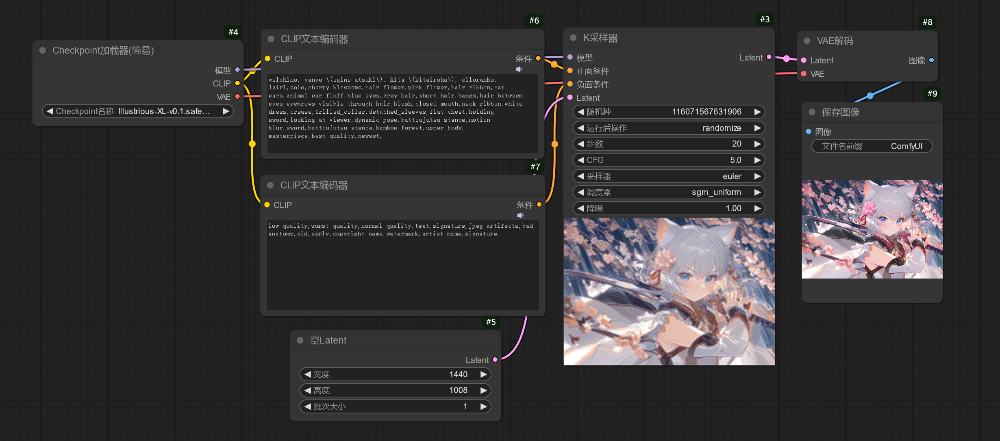

如果觉得一个个节点在调整时很麻烦，可以将这些节点组合成节点组。按住键盘上的 Ctrl 键，使用鼠标选中这些节点，再右键打开菜单，选择**转换为节点组**，此时将弹出节点组命名窗口，输入名称并确定后将创建一个新的节点组。


现在工作流就显得非常整洁了，右键该节点选择**Manage Group Node**可以调整节点组的组件顺序和要显示的组件，但是这样整合功能的节点在出现报错时排查问题会变得困难，当出现报错时需要右键该节点组，选择**转换为节点**将节点组拆分，对错误进行排查。


### 节点分类
当节点过多时，工作流可能就显得很乱，此时就可以通过建立组对节点进行分类。

在 ComfyUI 界面空白处右键打开菜单，点击**新建框**就会创建一个框，创建多个框并调整框的大小后，将节点移动到里面进行分类，这样就可以让工作流的每个部分清晰明了，当拖动框时，框内的节点也会被拖动。

除了通过这种方式创建框进行分类，还可以用 ComfyUI 的快速建框的功能。将几个节点放在一起后，按住 Ctrl 键多选节点，再右键 ComfyUI 界面空白处，选择**并入到框**，此时 ComfyUI 将自动为选中的 ComfyUI 节点创建框。

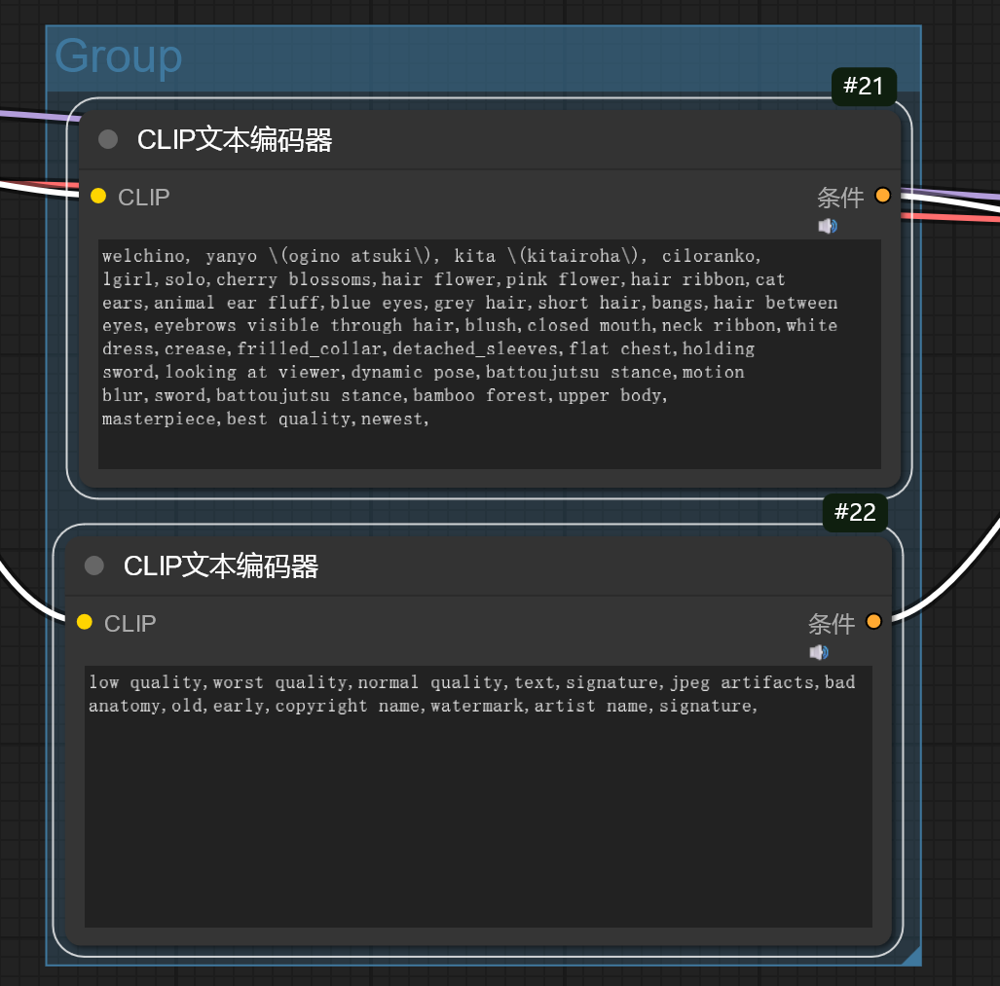


### 节点连线
节点之间连线可以通过按住节点的接口拉出一条线，将线连接到另一个节点上。如果一个节点的输出想要拉出两条线，除了从接口分别拉出两条线这个方法，还可以在有一条线的基础上，按住 Shift 键并点击那条线，此时将快速从该线的端点快速拉出一条线，而不是必须从输出接口拉线。

如果节点之间的连线过长，想要整理连线，可以使用**转接点**节点进行中转。

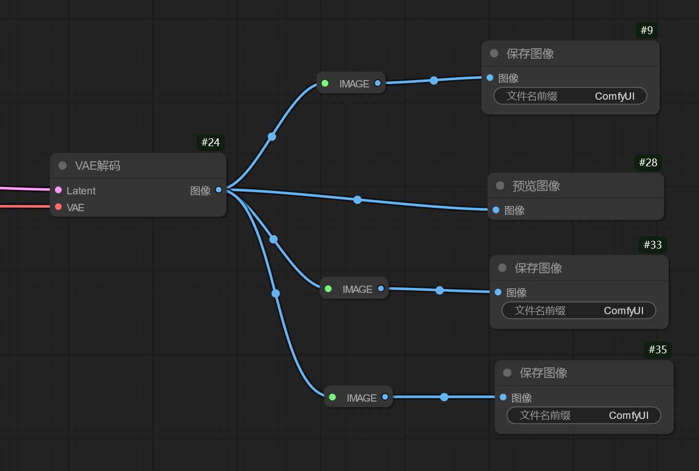

除了使用**转接点**节点，也可以直接在线上突出的点建立转接点。打开 ComfyUI 设置，在**LiteGraph -> Reroute Beta**，将 **Opt-in to the reroute beta test** 启用即可使用该功能。

按住 Alt 键并点击连线上凸起的点，此时点将变大并转换为转接点，按住 Shift 键可以从该转接点拉出线用于连接其他节点。

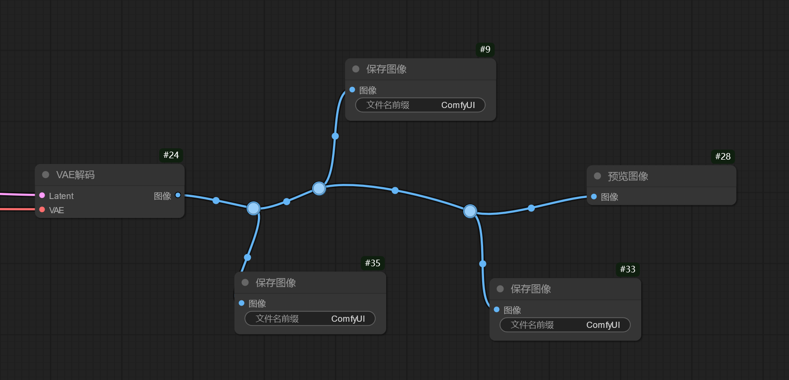


### 重置节点
如果节点的参数调错了导致出图效果不行或者无法正常生成图片，可以右键该节点，选择**修复（重建）**，此时将重置节点的参数为默认值。


### 转换节点输入
节点的参数一般由输入接口和界面组件组成，但界面组件可以转换为输入接口，通过输入接口控制原有界面组件的参数。右键该节点，在**转换为输入**选项中可以选择将想要转换的界面组件转换成输入接口。

|转换前|转换后|
|---|---|
|||

!!!warning
    注意，将界面组件转换成输入接口后必须为该输入接口连接对应的节点，否则将导致该节点报错无法运行，或者右键该节点，在**转换为组件**选项将输入接口转换为界面组件。


### 折叠节点
有些节点的参数不需要展示，并且想要降低节点占用界面的空间，可以点击节点左上角的圆点，此时节点将折叠所有参数，再次点击圆点将恢复。


### 节点批量拖动 / 复制 / 粘贴
按住 Ctrl / Shift 键，使用左键点击节点可以多选节点，按住 Shift 键时拖动被多选中的节点的某一个节点可以同时拖动多个被选中的节点。

使用 Ctrl + C 可以复制节点，再按下 Ctrl + V 可以粘贴节点。


### 节点删除
如果要删除某个节点，选中某个后按下 Backspace / Delete 键即可，或者右键该节点，选择**移除**即可删除节点。


## 工具栏
ComfyUI 的工具栏包含了一些快捷按钮，如 执行队列，这个按钮就类似 Stable Diffusion WebUI 中的生成按钮。

下面是侧边栏的功能。

|按钮|队列|节点库|模型库|工作流|切换主题|设置|
|---|---|---|---|---|---|---|
|界面|||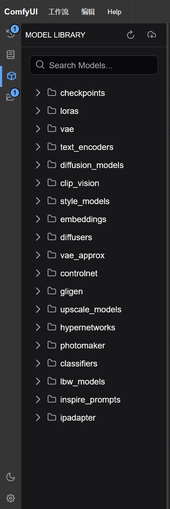||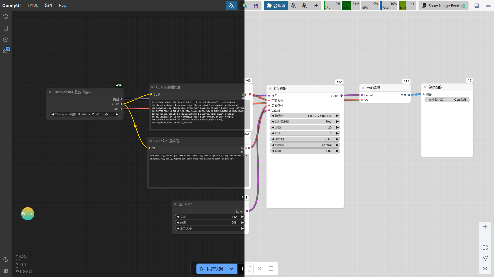|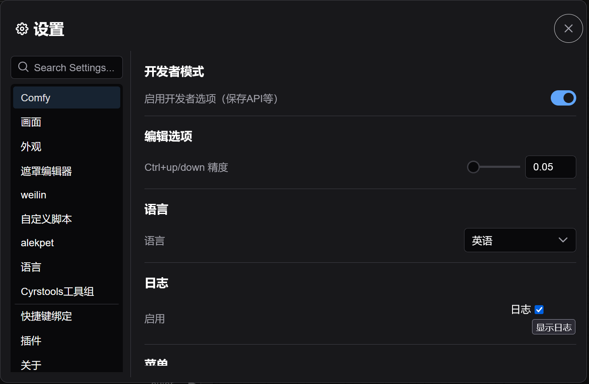|
|作用|显示 ComfyUI 正在执行的工作流队列和已完成的队列。|显示 ComfyUI 中存在的节点列表，可以拖动节点出来放入工作流中。|显示 ComfyUI 中`ComfyUI/models`文件夹里已有的模型，将模型拖动出来将自动创建加载该模型所对应的模型加载节点。|显示 ComfyUI 已保存的工作流和已经打开的工作流。|切换 ComfyUI 界面的主题。|打开 ComfyUi 的设置。|

在 ComfyUI 的顶部栏也包含一些功能。

|按钮|工作流|编辑|帮助|切换底部面板|隐藏菜单|
|---|---|---|---|---|---|
|界面|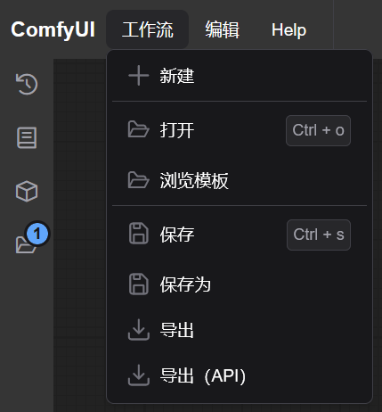||||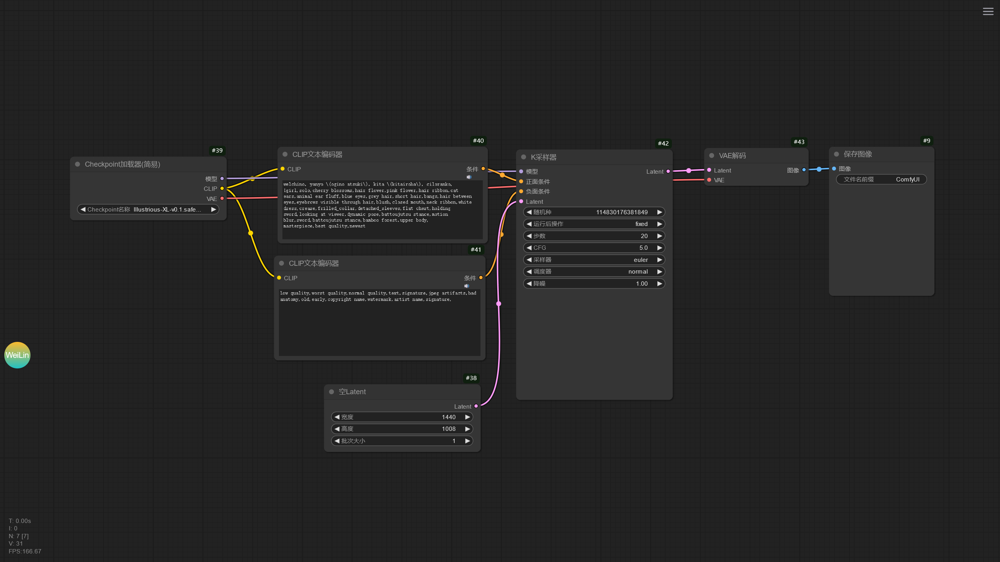|
|作用|显示关于工作流的操作。|显示编辑工作流的功能。|获取 ComfyUI 帮助。|显示 ComfyUI 运行日志。|隐藏 / 显示 ComfyUI 工具栏。|


## 执行队列
ComfyUI 提供一个按钮用于运行工作流。


按住该按钮的最左边可以拖动该按钮的位置。

点击**执行队列**可以运行工作流，多次点击将会创建一个工作流队列，依次运行工作流。在**执行队列**的右边有个向下的箭头，点开后可以看到工作流的工作模式。

**执行队列**模式是在点击该按钮后才运行工作流，**执行队列 立即**模式是一直运行工作流，**执行队列 变动**模式是在修改工作流的某个参数后再运行，但使用该模式时要注意，当工作流中有运行后会发生变动的参数，比如**随机种**，运行工作流后将会发生变化，此时将再次触发工作流的运行，也就会无限运行下去。

假设下面是一个工作流队列。

|(正在运行的工作流)|(待运行的工作流 1)|(待运行的工作流 2)|(待运行的工作流 3)|

点击**执行队列**时将会在队列后面插入新的工作流队列。

|(正在运行的工作流)|(待运行的工作流 1)|(待运行的工作流 2)|(待运行的工作流 3)|(插入的待运行的工作流)|

如果按下 Shift 键再点击**执行队列**，工作流队列将插入在正在运行的工作流和待运行的工作流之间。

|(正在运行的工作流)|(插入的待运行的工作流)|(待运行的工作流 1)|(待运行的工作流 2)|(待运行的工作流 3)|

如果当前已经有几个工作流队列，但是想修改参数后让下次运行的工作流为刚刚修改后的工作流，可以按住 Shift 键，

右边的数字调整运行工作流的批次。

× 按钮为取消当前运行的工作流，而方形按钮将清空所有待运行的工作流队列。


## 扩展管理
安装 ComfyUI-Manager 扩展后，在 ComfyUI 工具栏可以看到**管理器**按钮，点开后可以看到 ComfyUI-Manager 的界面。


ComfyUI-Manager 包含了管理 ComfyUI 的各种功能，以下是不同功能的描述。


- 节点管理

管理 ComfyUI 的扩展，包含安装 / 卸载 / 禁用 / 启用节点，修复节点缺失依赖的功能。


- 安装缺失节点

当导入一个工作流时，如果 ComfyUI 缺少工作流中节点所需要的扩展，ComfyUI 将弹窗提示有节点缺失，这是可以使用该功能扫描工作流需要的节点并安装。


- 模型管理

模型管理可以下载一些节点所需的模型。


- 通过 Git URL 安装

如果将要安装的插件没有节点管理中搜到，但是知道该节点的 Git 仓库地址，可以通过该功能进行安装。


- 更新全部

点击后将更新所有的 ComfyUI 扩展和 ComfyUI 本体。


- 更新 ComfyUI

仅更新 ComfyUI 本体。


- A1111 替代

下载实现 Stable Diffusion WebUI 部分功能的扩展。


ComfyUI-Manager 还有其他实用的功能，如标签显示功能，启用后可以看到节点是来源于哪个扩展。


## 释放显存占用
ComfyUI-Manager 还提供了释放显存的工具，在 ComfyUI-Manager 的**管理器**按钮旁边有 2 个用于释放显存的按钮，点击后将会卸载放置在显存中的模型，释放被占用的显存。


