# ControlNet 应用
在 ControlNet 出现之前，控制图片的生成靠的是提示词，再加上图生图的局部重绘辅助。但在 ControlNet 出现后，控制图片变得简单了，通过图片 + 提示词的方式来更好的控制图片生成。

## ControlNet 插件
如果需要使用 ControlNet，需要安装 sd-webui-controlnet 扩展。

!!!note
    1. sd-webui-controlnet 扩展下载：https://github.com/Mikubill/sd-webui-controlnet。
	2. sd-webui-controlnet 扩展部分预处理器模型文件官方下载地址：https://huggingface.co/lllyasviel/Annotators/tree/main。
	3. sd-webui-controlnet 扩展模型文件官方下载地址：https://github.com/Mikubill/sd-webui-controlnet/wiki/Model-download。
	4. **预处理器模型文件** 用于 **预处理器** 项，**模型文件** 用于 **模型** 项。
	5. sd-webui-controlnet 扩展 **并不会** 主动下载预 处理器模型文件 / 模型文件，默认情况下，您需要主动的去下载模型文件并放置到对应的文件夹。而预处理器文件在首次使用对应预处理器时从网络下载。

如果您打算主动下载预处理器模型文件，请将下载的文件按照以下折叠内容放置到对应的文件夹内。

???点击展开
    stable-diffusion-webui/extensions/sd-webui-controlnet/annotator/downloads/ 
	├anime_face_segment/UNet.pth 
	├clip_vision/clip_g.pth 
	├clip_vision/clip_h.pth 
	├clip_vision/clip_vitl.pth 
	├densepose/densepose_r50_fpn_dl.torchscript 
	├depth_anything/depth_anything_vitl14.pth 
	├hand_refiner/hr16/ControlNet-HandRefiner-pruned/graphormer_hand_state_dict.bin 
	├hand_refiner/hr16/ControlNet-HandRefiner-pruned/hrnetv2_w64_imagenet_pretrained.pth 
	├hed/ControlNetHED.pth 
	├insightface/models/antelopev2/1k3d68.onnx 
	├insightface/models/antelopev2/2d106det.onnx 
	├insightface/models/antelopev2/genderage.onnx 
	├insightface/models/antelopev2/glintr100.onnx 
	├insightface/models/antelopev2/scrfd_10g_bnkps.onnx 
	├insightface/models/buffalo_l/1k3d68.onnx 
	├insightface/models/buffalo_l/2d106det.onnx 
	├insightface/models/buffalo_l/det_10g.onnx 
	├insightface/models/buffalo_l/genderage.onnx 
	├insightface/models/buffalo_l/w600k_r50.onnx 
	├lama/ControlNetLama.pth 
	├leres/latest_net_G.pth 
	├leres/res101.pth 
	├lineart/sk_model.pth 
	├lineart/sk_model2.pth 
	├lineart_anime/netG.pth 
	├manga_line/erika.pth 
	├midas/dpt_hybrid-midas-501f0c75.pt 
	├mlsd/mlsd_large_512_fp32.pth 
	├normal_bae/scannet.pt 
	├normal_dsine/dsine.pt 
	├oneformer/150_16_swin_l_oneformer_coco_100ep.pth 
	├oneformer/250_16_swin_l_oneformer_ade20k_160k.pth 
	├openpose/body_pose_model.pth 
	├openpose/dw-ll_ucoco_384.onnx 
	├openpose/facenet.pth 
	├openpose/hand_pose_model.pth 
	├openpose/rtmpose-m_simcc-ap10k_pt-aic-coco_210e-256x256-7a041aa1_20230206.onnx 
	├openpose/yolox_l.onnx 
	├pidinet/table5_pidinet.pth 
	├TEED/7_model.pth 
	├uniformer/upernet_global_small.pth 
	└zoedepth/ZoeD_M12_N.pt

安装后可在 SD WebUI 左下角的选项找到 ControNet 选项。

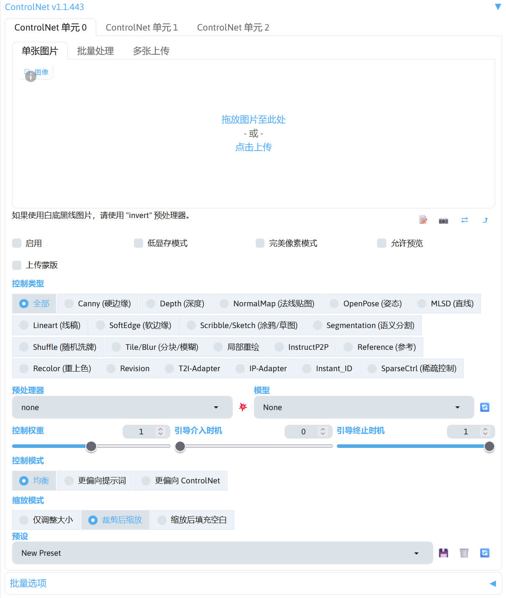

这里简单介绍 ControlNet 扩展的几个选项。

- 上方导入图片的框就是导入作为控制条件的图片。
- 完美像素模式：可解决导入的控制图片和生成图片设置的宽高比例不同的问题。
- 控制类型：调节不同的控制效果，一般选择后 ControlNet 扩展会自动选择相对应的预处理器和模型。
- 预处理器：处理导入的控制图片，使控制图片成为 ControlNet 模型可识别的控制条件。如果导入的控制图片已经经过预处理器处理过，则预处理器应选择无。
- 模型：选择要使用的 ControlNet 模型。
- 中间的爆炸按钮（💥）：点击后可显示预处理器处理后的控制图片。
- 控制权重：调节 ControlNet 控制的强度。
- 引导介入 / 终止时机：调节 ControlNet 介入图片生成过程的时机。
- 控制模式：调节生图时提示词和 ControlNet 这两者所占的控制强度。

- 
## 不同 ControlNet 的作用
下面列出不同 ControlNet 的作用。

|种类|作用|控制图片|处理厚的控制图片|效果图|
|---|---|---|---|---|
|[Canny](https://modelscope.cn/api/v1/models/licyks/controlnet_v1.1/repo?Revision=master&FilePath=control_v11p_sd15_canny_fp16.safetensors)|使用粗略的线条描绘图片中物体的边缘，生成线稿图。生图过程中使用线稿图约束物体的边缘。|||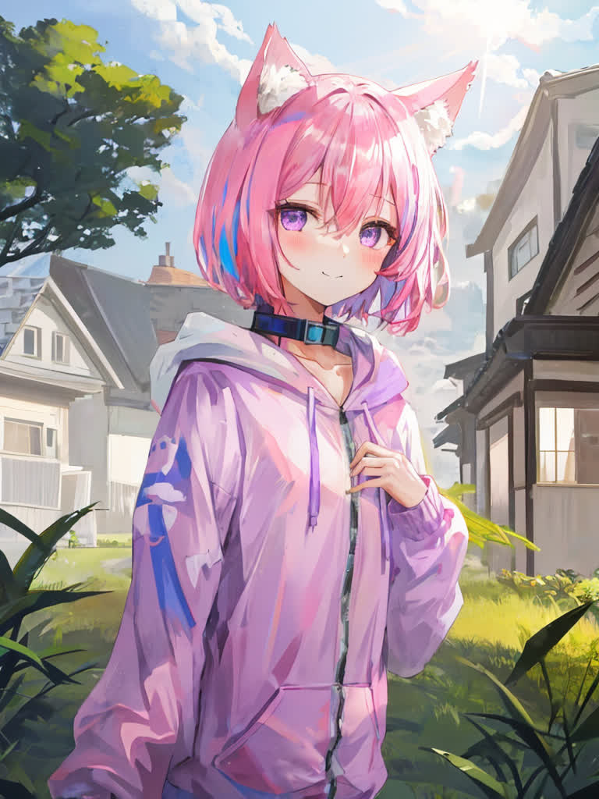|
|[Depth](https://modelscope.cn/api/v1/models/licyks/controlnet_v1.1/repo?Revision=master&FilePath=control_v11f1p_sd15_depth_fp16.safetensors)|生成一个灰度图，通过灰度的深浅描述物品的前后远近关系，指导大模型生成图片时物品的远近关系。||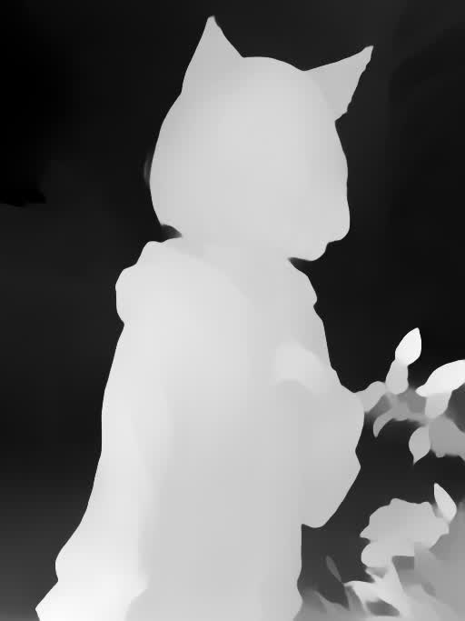||
|[NormalMap](https://modelscope.cn/api/v1/models/licyks/controlnet_v1.1/repo?Revision=master&FilePath=control_v11p_sd15_normalbae_fp16.safetensors)|生成从输入图像派生的基本法线贴图，该图像使用了三种颜色：红色、绿色和蓝色。在 3D 程序领域，这些颜色用于确定物体表面的感知光滑度或凹凸度。每个颜色通道对应于一个特定的方向，例如左 / 右、上 / 下和近 / 远，从而可以在三维环境中模拟复杂的表面特征。||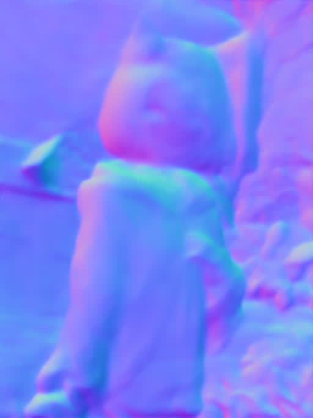||
|[Openpose](https://modelscope.cn/api/v1/models/licyks/controlnet_v1.1/repo?Revision=master&FilePath=control_v11p_sd15_openpose_fp16.safetensors)|将图片中的人物动作分析出来，并生成骨骼图，指导大模型绘制人物时的动作。|||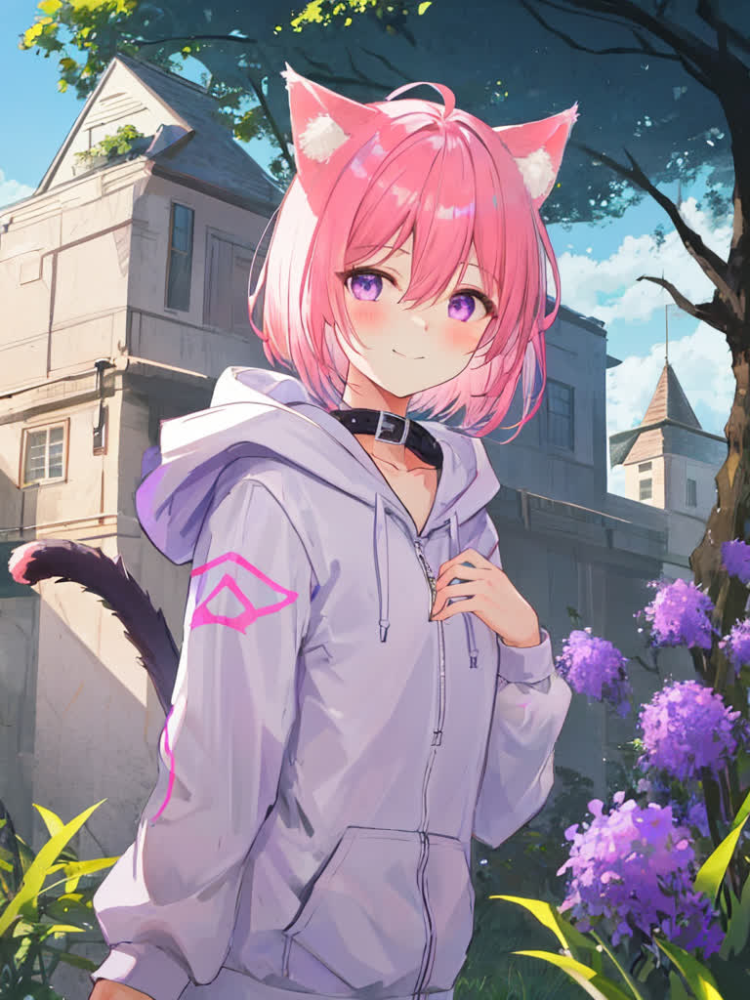|
|[MLSD](https://modelscope.cn/api/v1/models/licyks/controlnet_v1.1/repo?Revision=master&FilePath=control_v11p_sd15_mlsd_fp16.safetensors)|将图片中的场景（不包括人物）使用直线进行轮廓的大致描绘，生成大致的线条结构图。在生图过程通过线条结构图约束场景中大物件的边缘，常用于场景设计。||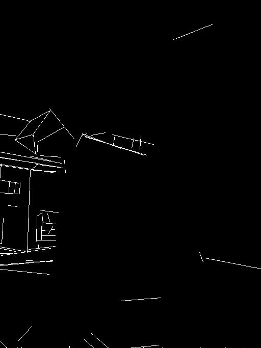||
|[Lineart](https://modelscope.cn/api/v1/models/licyks/controlnet_v1.1/repo?Revision=master&FilePath=control_v11p_sd15s2_lineart_anime_fp16.safetensors)|使用更加精细的线条对图片进行描绘，生成线稿图。在生图过程中通过线稿图约束物体的边缘，常用于比较精细地还原物品的结构，保持构图结构。||||
|[Softedge](https://modelscope.cn/api/v1/models/licyks/controlnet_v1.1/repo?Revision=master&FilePath=control_v11p_sd15_softedge_fp16.safetensors)|将图片中物体的边缘用软边缘线条进行描绘，生成线条图。在生图过程中通过线条图约束物体的边缘，常用于还原物品的大致结构，保持构图结构。||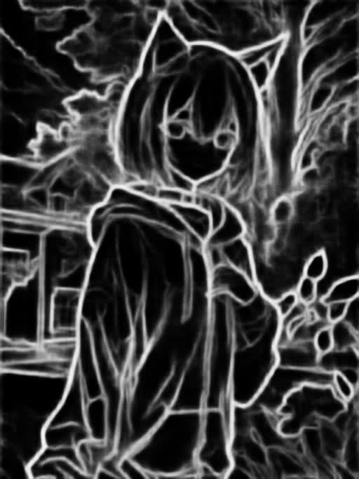|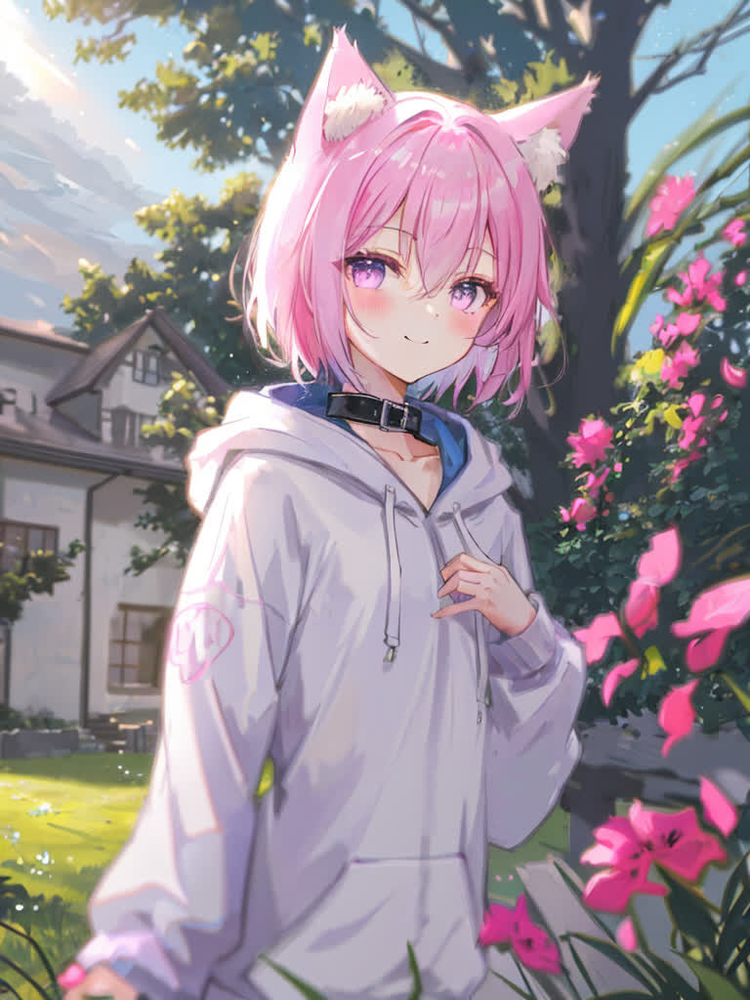|
|[Scribble/Sketch](https://modelscope.cn/api/v1/models/licyks/controlnet_v1.1/repo?Revision=master&FilePath=control_v11p_sd15_scribble_fp16.safetensors)|将图片处理成涂鸦，类似手绘的效果，然后利用生成的涂鸦图片指导大模型生图，常用于自己画一张粗糙的涂鸦，使用该涂鸦来生成一张效果不错的图片。||||
|[Segmentation](https://modelscope.cn/api/v1/models/licyks/controlnet_v1.1/repo?Revision=master&FilePath=control_v11p_sd15_seg_fp16.safetensors)|将图片进行语义分割，将不同的画面元素用不同的颜色进行标注，生成语义分割图。在生图的过程中使用语义分割图指导大模型在对应的区域绘制不同颜色对应的物品，常用于大致规划图片构图。||||
|[Shuffle](https://modelscope.cn/api/v1/models/licyks/controlnet_v1.1/repo?Revision=master&FilePath=control_v11e_sd15_shuffle_fp16.safetensors)|将图片进行随机变换，然后将变换后的图像作为参考，指导图片生成的过程（风格迁移）。||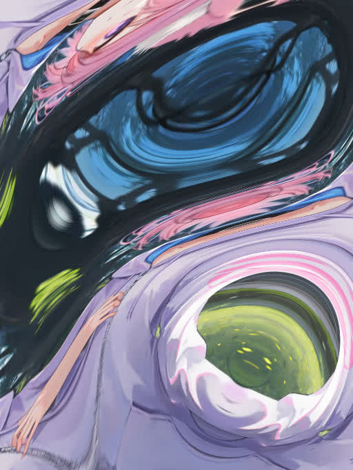|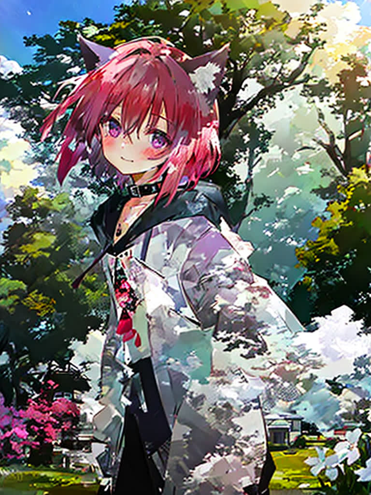|
|[Tile/Blur](https://modelscope.cn/api/v1/models/licyks/controlnet_v1.1/repo?Revision=master&FilePath=control_v11f1e_sd15_tile_fp16.safetensors)|Tile 将图片分割成一个个小区快，在对每个小区快进行重绘。Tile 不仅可以用作图片放大，增加图片的细节，也可以保持图片的整体构图不被改变，可用于风格转换。Blur 将图片进行高斯模糊，用作生成图片的参考，有点类似图生图，但整体构图不会改变太多。||||
|[Inpaint](https://modelscope.cn/api/v1/models/licyks/controlnet_v1.1/repo?Revision=master&FilePath=control_v11p_sd15_inpaint_fp16.safetensors)|重绘画笔涂抹过的区域，和 SD WebUI 自带的局部重绘功能类似，但可以实现更好的效果。||||
|[InstructP2P](https://modelscope.cn/api/v1/models/licyks/controlnet_v1.1/repo?Revision=master&FilePath=control_v11e_sd15_ip2p_fp16.safetensors)|将提示词作为命令，指定修改图片中的元素，但不改变构图。|||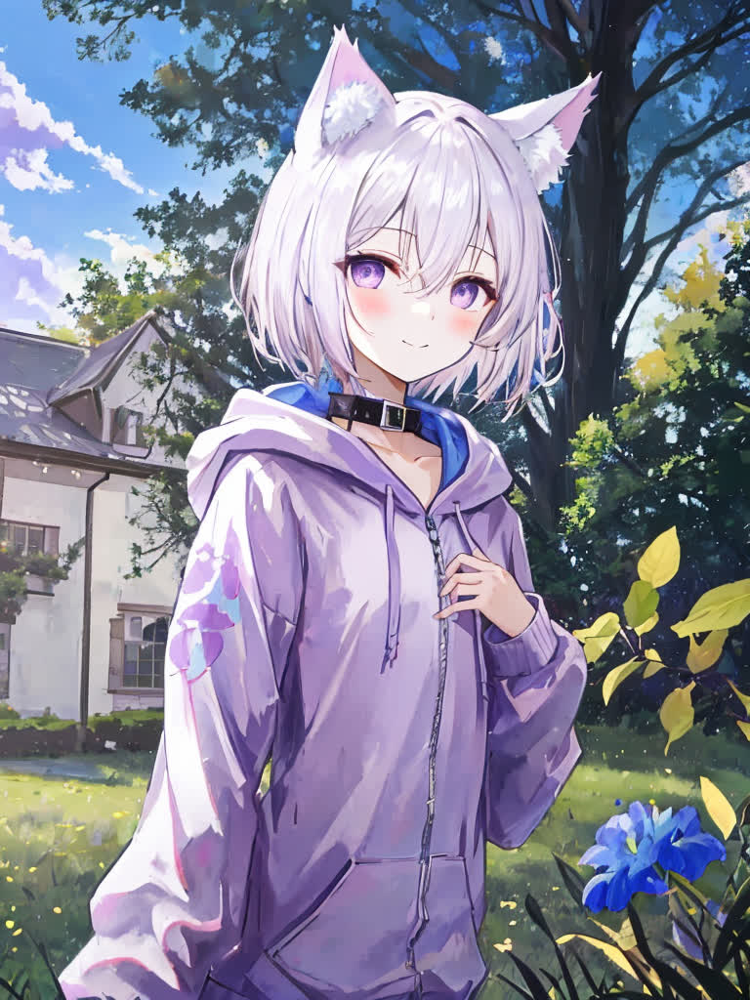|
|Reference|将输入的图片作为参考，有点类似图生图。相对于图生图的效果，画面有着更多样的变化，不会过于呆板，输入图的风格也能迁移到生成出来的图片中。|||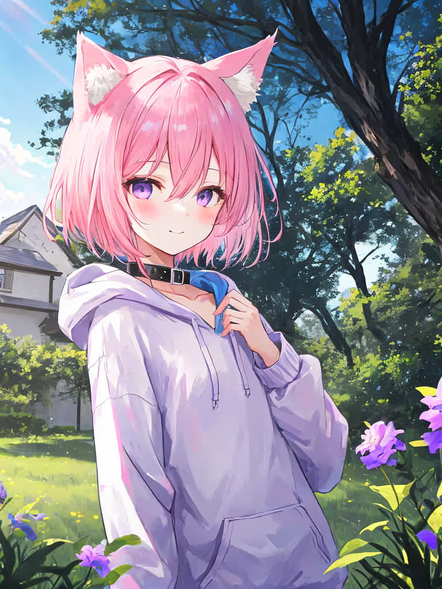|
|[Recolor](https://modelscope.cn/api/v1/models/licyks/controlnet_v1.1/repo?Revision=master&FilePath=ioclab_sd15_recolor.safetensors)|根据提示词的描述，对黑白的图片进行上色|||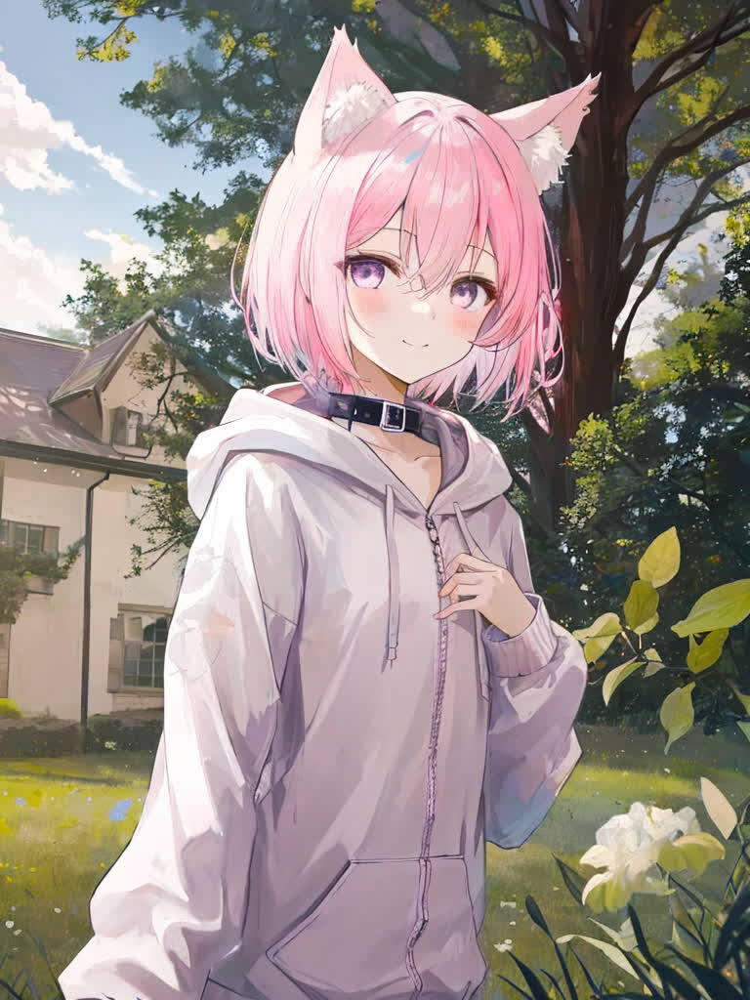|
|Revision|使用 CLIP Vision 分析图片，并指导图片的生成。||||
|[IP-Adapter](https://modelscope.cn/api/v1/models/licyks/controlnet_v1.1/repo?Revision=master&FilePath=ip-adapter_sd15_plus.pth)|使用 CLIP Vision 分析输入图片的信息，并将得出的信息作用于图像的生成过程中，常用于迁移画风，并搭配其他控制构图的 Controlnet 一起使用。||||

!!!note
    点击种类的名称可下载对应的 ControlNet 模型，ControlNet 模型放置在 stable-diffusion-webui/models/ControlNet 路径中

不同的 ControlNet 可组合起来一起使用，实现不同的效果。