# 杂项
这里列出其他在 SD WebUI 里用的功能。


## 图片信息查看
如果想要查看一张由 SD WebUI 生成的图片的参数，可以在 SD WebUI 的 PNG 图片信息里，导入图片后即可查看生图参数。

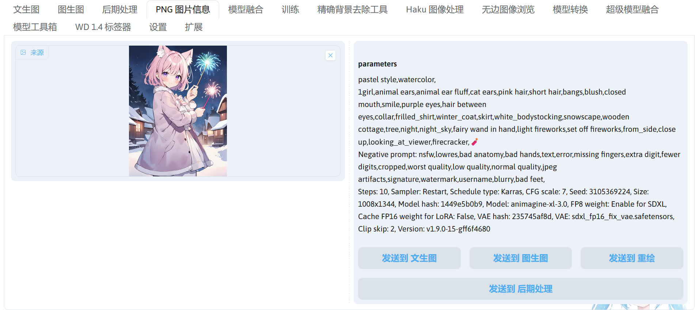

!!!note
    ComfyUI、InvokeAI、NovelAI 等生成的图片也可以查看生图信息，但是要保证图片未被压缩或者被其他图像工具处理过。


## 图片提示词反推
想知道一张图片的提示词怎么写，可以通过 sd-webui-wd14-tagger 扩展将提示词反推出来。将图片导入后扩展将自动反推提示词，反推完成后最好点一下卸载所有反推模型来释放显存。


!!!note
    sd-webui-wd14-tagger 扩展：https://github.com/Akegarasu/sd-webui-wd14-tagger


## 移除背景
想要人物的背景移除，可以使用 stable-diffusion-webui-rembg 扩展。在 SD WebUI 的后期处理中，在下方启用移除背景，移除背景选择其中一个算法，再点击生成就可以把图片的背景移除。

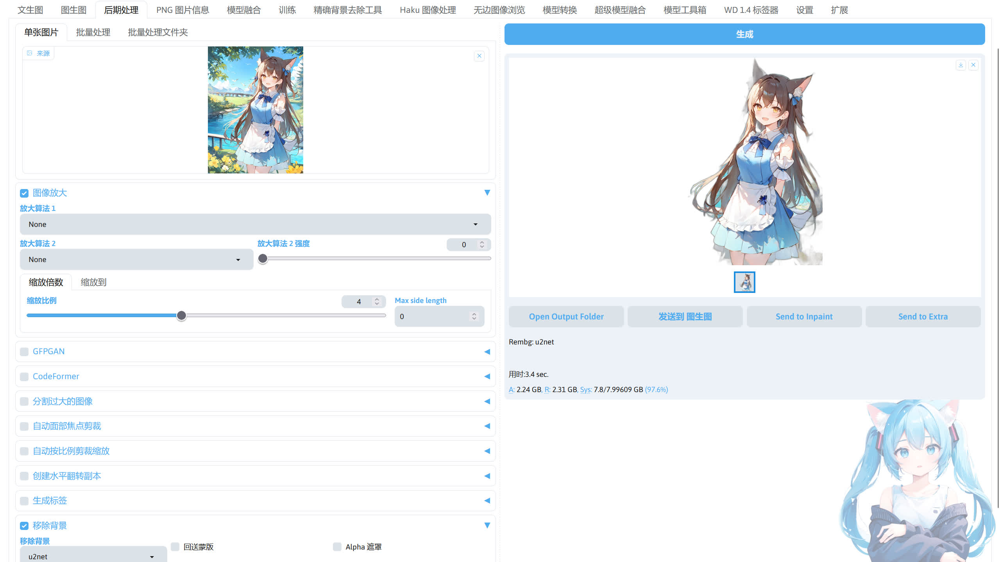

!!!note
    stable-diffusion-webui-rembg 扩展下载：https://github.com/AUTOMATIC1111/stable-diffusion-webui-rembg

如果有生成蒙版的需求，可以使用 PBRemTools 扩展。在精准背景移除工具选项卡中，导入要移除背景的图片，在后期处理的选项中点击启用，再点提交，这样就可以生成一张移除背景的图片和蒙版。

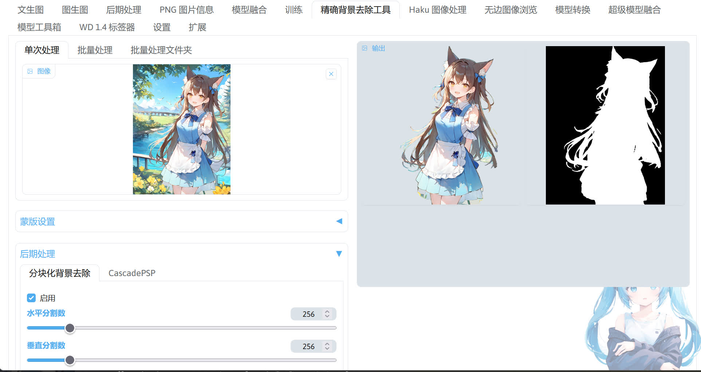

!!!note
    PBRemTools 扩展下载：https://github.com/mattyamonaca/PBRemTools


## 图片处理
a1111-sd-webui-haku-img 扩展可对图像进行一些处理，如提取图片线稿，图片像素化等。

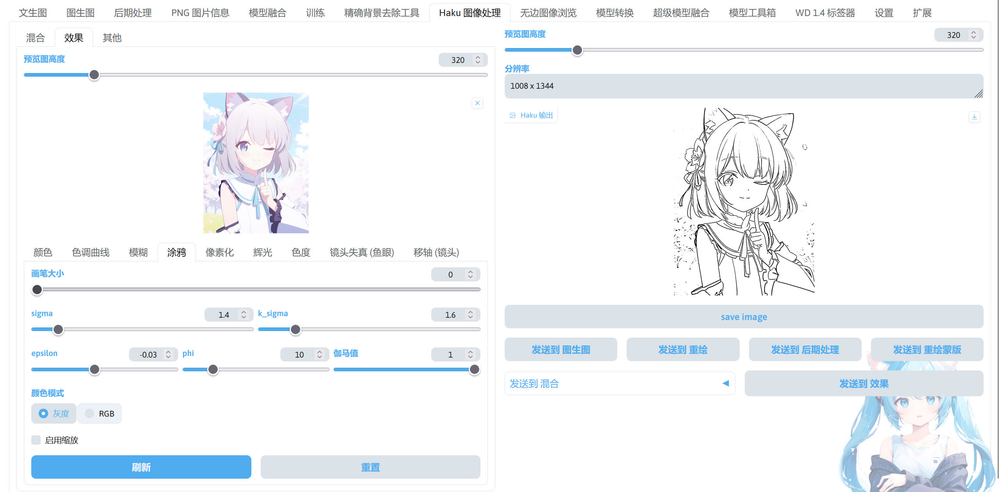

!!!note
    a1111-sd-webui-haku-img 扩展下载：https://github.com/KohakuBlueleaf/a1111-sd-webui-haku-img


## 面部修复
在 SD WebUI 1.6 之后，官方将自带的面部修复移除了，因为效果过差，而 adetailer 扩展可作为替代品。在文生图或者图生图左下角中可以看到该扩展的选项卡，勾选后即可启用面部修复。

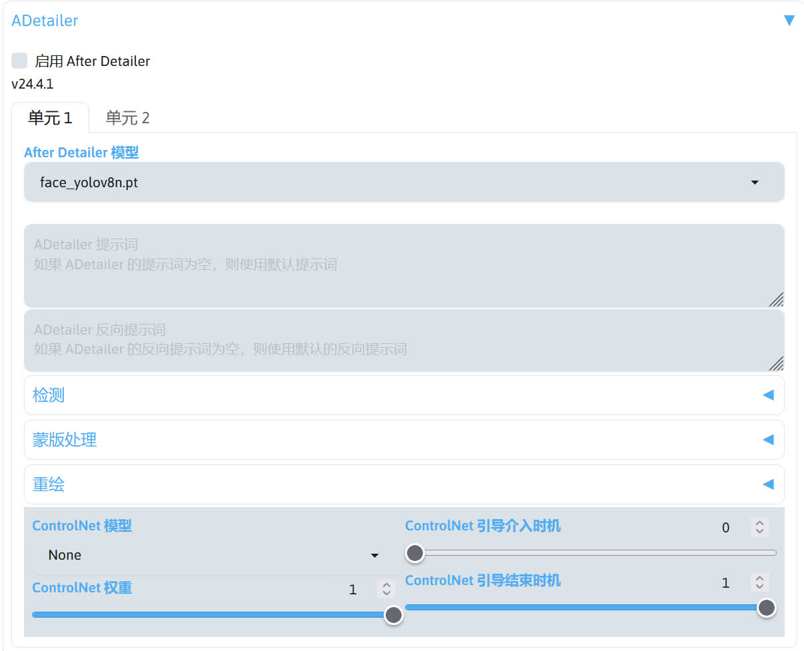

注意，在图生图的局部重绘中该扩展并不会生效，因为这个扩展的本质是自动检测面部位置并进行局部重绘。

!!!note
    adetailer 扩展下载：https://github.com/Bing-su/adetailer


## 恢复保存预设的按钮
SD WebUI 1.6 移除了保存提示词预设按钮，所以只能在生成按钮旁边的画笔按钮来保存预设。可以通过 sd-webui-boomer 扩展来恢复这个按钮。

!!!note
    sd-webui-boomer 扩展下载：https://github.com/Haoming02/sd-webui-boomer


## 图片浏览
sd-webui-infinite-image-browsing 扩展作为图片浏览器非常方便。

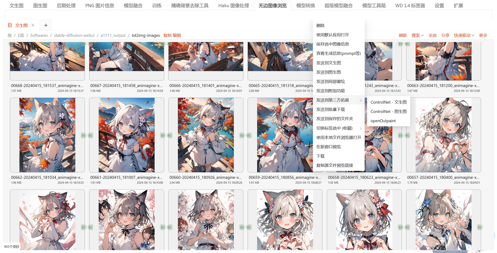

!!!note
    sd-webui-infinite-image-browsing 扩展下载：https://github.com/zanllp/sd-webui-infinite-image-browsing


## 分区绘制
multidiffusion-upscaler-for-automatic1111 扩展除了提供 Tiled VAE，也提供了分区绘制功能，不过要画有多人互动的图片就不太行，可以尝试使用 sd-webui-regional-prompter 扩展或者 stable-diffusion-webui-two-shot 扩展来绘制有多人互动的图片。
!!!note
    sd-webui-regional-prompter 扩展下载：https://github.com/hako-mikan/sd-webui-regional-prompter  
    stable-diffusion-webui-two-shot 扩展下载：https://github.com/ashen-sensored/stable-diffusion-webui-two-shot


## 查找并删除模型里的垃圾数据
SD 1.5 的模型用于生图时只有 2 GB 是有效的数据，但是有许多 SD 1.5 的模型的大小超过了 2 GB。可以通过 stable-diffusion-webui-model-toolkit 扩展查看模型是否有垃圾数据存在。

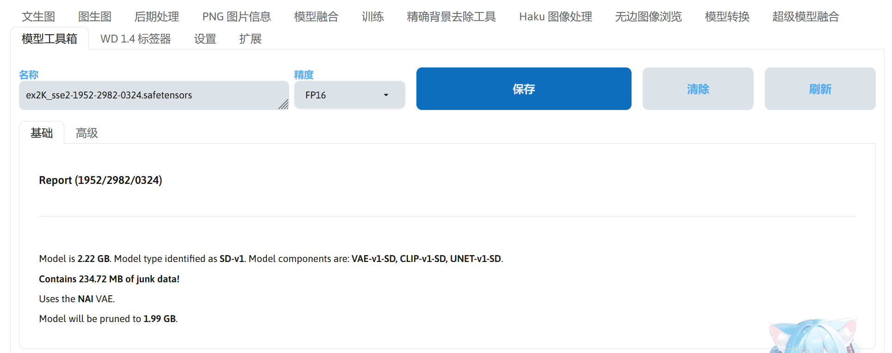

如果模型里有垃圾数据，可以通过 sd-webui-model-converter 扩展删除垃圾数据。在模型转换选项卡中，选择要删除垃圾数据的模型，选择删除 EMA 权重，勾选删除已知垃圾数据，点击运行即可删除模型垃圾数据。

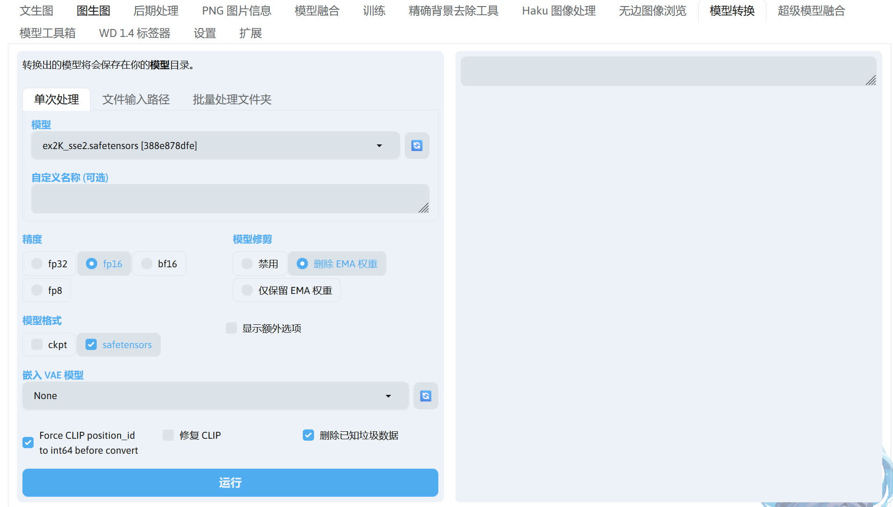

有关模型垃圾数据的哔哩哔哩专栏：[【AI绘画】模型修剪教程：8G模型顶级精细？全是垃圾！嘲笑他人命运，尊重他人命运 - 哔哩哔哩](https://www.bilibili.com/read/cv26279169)

!!!note
    stable-diffusion-webui-model-toolkit 扩展下载：https://github.com/arenasys/stable-diffusion-webui-model-toolkit  
    sd-webui-model-converter 扩展下载：https://github.com/Akegarasu/sd-webui-model-converter


## 模型融合
想要模型融合，就用 sd-webui-supermerger 扩展，不过融模虽然容易，但是要融出一个好模并不简单。

!!!note
    sd-webui-supermerger 扩展下载：https://github.com/hako-mikan/sd-webui-supermerger


## 随机抽卡
如果对提示词不熟悉，但又想抽出比较好的图，可以试试 z-a1111-sd-webui-dtg 扩展，启用后就可以快乐的抽卡了。

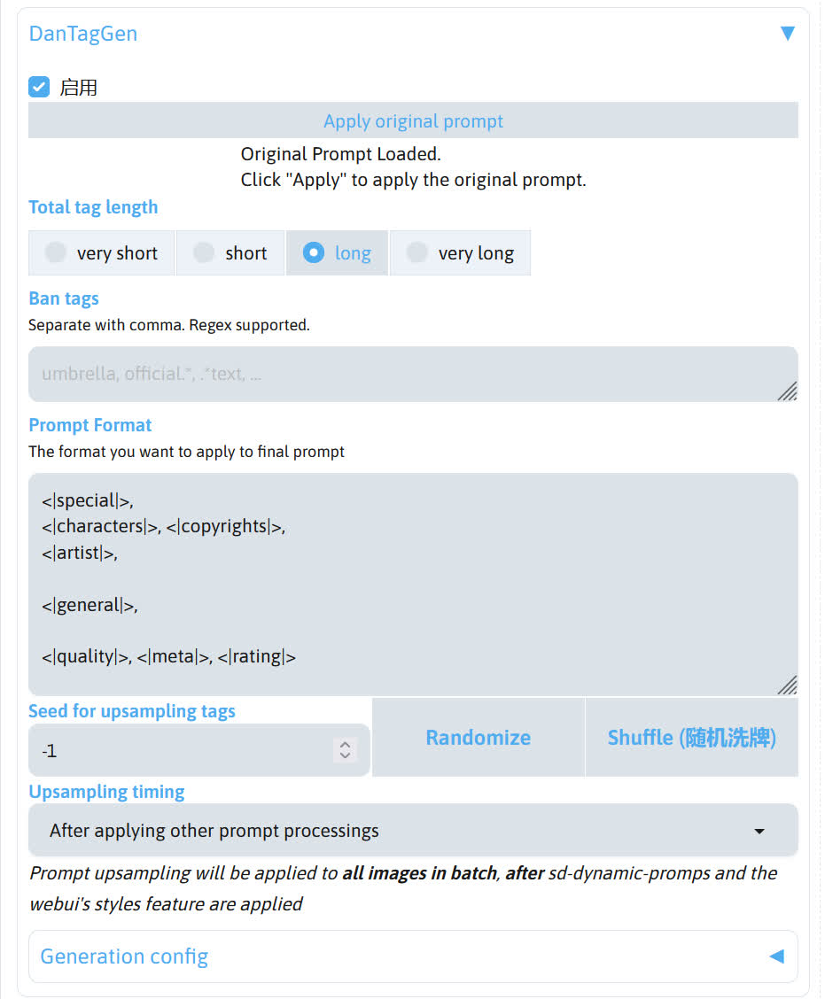

!!!note
    z-a1111-sd-webui-dtg 扩展下载：https://github.com/KohakuBlueleaf/z-a1111-sd-webui-dtg


## 视频生成
用 AI 来生成视频大致分为两类，一种是视频转绘，另一种是直接生成视频，推荐 ebsynth_utility 扩展和 sd-webui-animatediff 扩展。

!!!note
    ebsynth_utility 扩展下载：https://github.com/s9roll7/ebsynth_utility  
    sd-webui-animatediff 扩展下载：https://github.com/continue-revolution/sd-webui-animatediff


## 低显存跑 SDXL 模型
在 SD WebUI 1.8 中支持了 FP8 权重，可以大大降低 SDXL 模型对显存的占用，最低 6 GB显存即可运行 SDXL 模型。  
启用 FP8 前需要 PyTorch 版本大于 2.1，SD WebUI 版本大于或等于 1.8。  
在 SD WebUI 的`设置`->`优化设置`->`FP8 权重`，选择对 SDXL 模型启用，保存设置后即可启用。


## 无限生成图片
右键 SD WebUI 的生成按钮即可看到无限生成 / 停止无限生成的按钮，

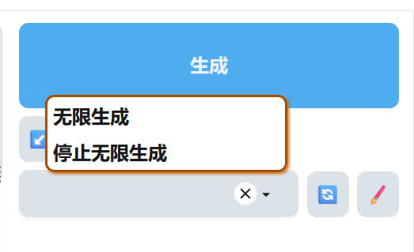


## 使用 SDXL 模型时特定的提示词组会出现鬼图
这个可能和提示词权重有关，在 SD WebUI 的`设置`->`SD`->`强调模式`，选择 No norm 后保存设置。


## SD WebUI 的 LoRA / Embedding 模型展示的规则
在 SD WebUI 1.8 后，引入了模型的防呆机制，防止用户错误地使用不对应版本的 LoRA / Embedding 模型，导致报错或者出鬼图。防呆机制的规则如下：

1. 当加载了 SD 1.5 的大模型时，只显示适用于 SD 1.5 的 LoRA / Embedding 模型
2. 当加载了 SDXL 的大模型：只显示适用于 SDXL 的 LoRA / Embedding 模型

如果要使用适用于 SD 1.5 的 LoRA / Embedding 模型，只需要将大模型切换成 SD 1.5 的，这时候在 SD WebUI 的模型列表中就可以看到 SD 1.5 的 LoRA / Embedding 模型了，要使用 SDXL 的也同理。

如果要关闭这个防呆机制，可以在 SD WebUI 的`设置`->`扩展模型`，将`在 Lora 页面保持显示所有模型 (否则, 将隐藏不兼容当前加载的 Stable Diffusion 模型版本的模型)`选项勾上，并保存 SD WebUI 的设置。


## SD WebUI 不同路径 / 文件的作用
这是 SD WebUI 中不同路径 / 文件的作用。

|路径 / 文件|作用|
|---|---|
|stable-diffusion-webui/models|大部分模型的保存路径|
|stable-diffusion-webui/extensions|扩展路径|
|stable-diffusion-webui/extensions-builtin|SD WebUI 内置扩展路径|
|stable-diffusion-webui/outputs|生成图片的保存路径|
|stable-diffusion-webui/repositories|SD WebUI 内部组件|
|stable-diffusion-webui/cache.json|模型哈希记录文件|
|stable-diffusion-webui/config.json|保存 SD WebUI 设置的文件|
|stable-diffusion-webui/params.txt|保存上一次生图的参数|
|stable-diffusion-webui/styles.csv|提示词预设文件|
|stable-diffusion-webui/ui-config.json|SD WebUI 界面预设文件|

SD WebUI 在使用的时候会把部分模型放置在缓存路径中，路径如下。

|不同启动方式的用户|缓存路径|
|---|---|
|绘世启动器用户|stable-diffusion-webui/.cache|
|使用原生 SD WebUI 启动方式用户|C:/Users/%USERNAME%/.cache|

.cache 为隐藏路径，需要将文件管理器显示隐藏文件的功能打开，参看：[杂项 - 显示隐藏的文件和文件后缀名 - SDNote](../../help/other.md#_4)


## SD WebUI 中不同模型的放置路径
|模型种类|放置路径|
|---|---|
|Stable Diffusion 模型（大模型）|stable-diffusion-webui/models/Stable-diffusion|
|VAE 模型|stable-diffusion-webui/models/VAE|
|VAE-approx 模型|stable-diffusion-webui/models/VAE-approx|
|LoRA 模型|stable-diffusion-webui/models/Lora|
|Lycoris 模型<sup>1</sup>|stable-diffusion-webui/models/Lora </p> stable-diffusion-webui/models/LyCORIS|
|Embedding 模型|stable-diffusion-webui/embeddings|
|Hypernetwork 模型|stable-diffusion-webui/models/hypernetworks|
|高清修复模型|stable-diffusion-webui/models/ESRGAN </p> stable-diffusion-webui/models/RealESRGAN </p> stable-diffusion-webui/models/SwinIR </p> stable-diffusion-webui/models/DAT|
|ControlNet 模型<sup>2</sup>|stable-diffusion-webui/models/ControlNet </p> stable-diffusion-webui/extensions/sd-webui-controlnet/models|
|ControlNet 预处理器模型<sup>3</sup>|stable-diffusion-webui/extensions/sd-webui-controlnet/annotator/downloads|
|AnimateDiff 模型|stable-diffusion-webui/extensions/sd-webui-animatediff/model|
|DanTagGen 模型|stable-diffusion-webui/extensions/z-a1111-sd-webui-dtg/models|

!!!note
    1. SD WebUI 1.5 及以上版本无需扩展即可读取 LyCORIS 文件夹内的 LyCORIS 模型（该文件夹不会自动生成），并显示在 SD WebUI 的 LoRA 栏内。
	2. 两个文件夹皆可放置 ControlNet 模型。
	3. 并非所有的 ControlNet 预处理器模型都存储在 downloads 文件夹（例如： depth_anything 预处理器的部分模型会存储在 .cache 文件夹内）。


## 使用 X/Y/Z 图
如果要对提示词、不同模型、参数等坐对比测试时，可以使用 SD WebUI 的 X/Y/Z 图，在 SD WebUI 左下角的脚本中选择 X/Y/Z Plot 即可使用。

下面举个测试不同提示词和提示词引导系数（CFG Scale）的例子。

- 使用的提示词
```
1girl,(loli:1.2),vampire,silver hair,very long hair,two side up,bat hair ornament,bangs,red eyes,light smile,closed mouth,blush,flat chest,gothic lolita,long sleeves,frills,
looking at viewer,heart hands,
simple background,white background,detail light,chromatic_aberration,sunlight,
close up,upper body,
```

- X/Y/Z 图的参数

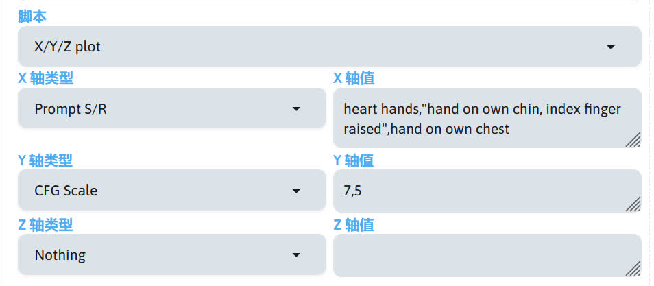

Prompr S/R 为提示词替换，这里我填的是`heart hands,"hand on own chin, index finger raised",hand on own chest`，SD WebUI 将第一个逗号前的提示词作为被替换的对象（也就是`heart hands`），生图时将所写的完整提示词中的`heart hands`替换成`heart hands`、`hand on own chin, index finger raised`、`hand on own chest`。

CFG Scale 为提示词引导系数，在 SD WebUI 的生图参数调整界面中可以看到该选项，生图时将依次设置该值为`7`和`5`。

生图完成后将会得到下面的 X/Y/Z 图。

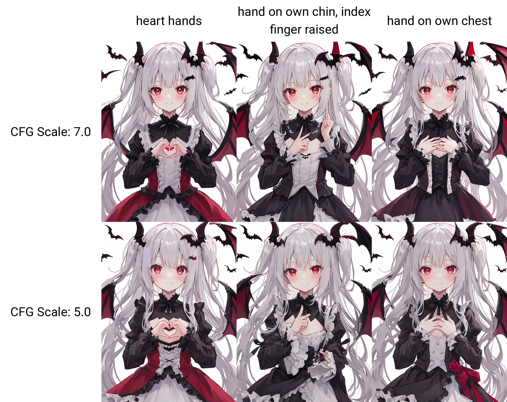

!!!note
    关于 X/Y/Z 图的说明可参看：[Features · AUTOMATIC1111/stable-diffusion-webui Wiki](https://github.com/AUTOMATIC1111/stable-diffusion-webui/wiki/Features#xyz-plot)


## 为 SD WebUI 模型列表中的模型添加预览图
模型在放置在 SD WebUI 的模型目录后，在 SD WebUI 的模型列表中看到模型并没有预览图。

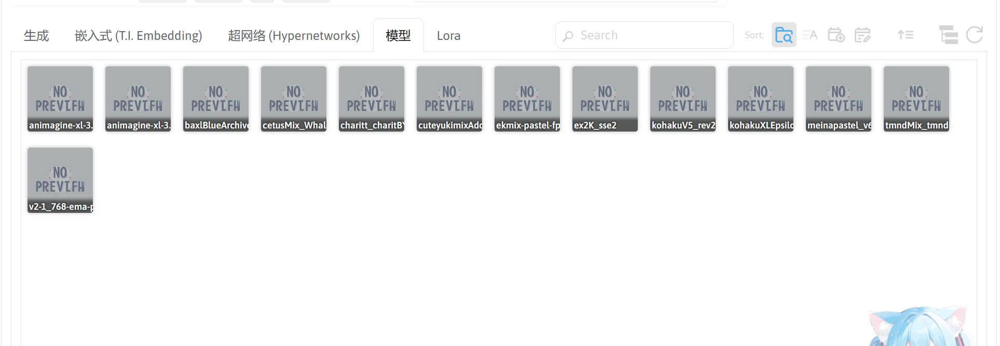

这里有几种方法为模型添加模型预览图：

- 方法 1：使用 SD WebUI 的模型管理功能。

生成一张用于添加模型预览图的图片。


在 SD WebUI 的模型列表找到要添加模型预览图的模型，并点击右上角的设置图标。


在模型信息页面点击下方的替换预览图像，这时模型就有了预览图。


- 方法 2：手动将图片命名成和模型一样的并放至在和模型同一个目录下。

将一张图片的文件名命名成和模型一样的名字，然后放在和模型文件放在一起即可。


- 方法 3：使用扩展（不推荐）。

可以使用的扩展有 [Stable-Diffusion-Webui-Civitai-Helper](https://github.com/butaixianran/Stable-Diffusion-Webui-Civitai-Helper)、[sd-civitai-browser-plus](https://github.com/BlafKing/sd-civitai-browser-plus)，这里就不做详细的介绍了。


## 启用 / 禁用共享显存
在 Nvidia 显卡驱动大于 525 后，允许 SD WebUI 等基于 SD 的软件调用显卡的共享显存，以弥补显卡的专用显存不足的问题。但是在 SD WebUI 调用共享显存后，出图的速度会大大降低，所以可以禁用共享显存来防止这种情况。

!!!note
    在禁用共享显存之前，请确保 Nvidia 显卡驱动的版本大于 536。

- 使用绘世启动器禁用

在绘世启动器的`高级选项`中，`性能设置`一栏有个`使用共享显存`的开关，关闭后即可禁用共享显存。

- 使用 Nvidia 显卡驱动面板

参考 Nvidia 官方文档：https://nvidia.custhelp.com/app/answers/detail/a_id/5490


## 保存 SD WebUI 预设
如果需要在进入 SD WebUI 后自动应用之前的参数，可以将这些参数调整好（建议先刷新一遍 SD WebUI 的网页），然后在 SD WebUI 的`设置`->`默认设置`，点击`应用`将这些参数保存到预设中，这些预设将保存在 ui-config.json 文件中，当点击`重载 UI`后预设将生效。

如果想重置预设，可以在 SD WebUI 的目录下把 ui-config.json 文件删除，并重启 SD WebUI。


## 将当前的生图参数保存成工作流
在 SD WebUI 中可以通过安装 LightDiffusionFlow 扩展实现 ComfyUI 的保存工作流的效果，生图调整好后，在 SD WebUI 右下角看到该扩展的选项卡，点击保存按钮即可将当前的所有生图参数保存在一个工作流文件中。更多的工作流可在该网站查看：https://www.lightflow.ai

!!!note
    LightDiffusionFlow 扩展下载：https://github.com/Tencent/LightDiffusionFlow


## 为提示词补全扩展添加词库和中文翻译
[a1111-sd-webui-tagcomplete](https://github.com/DominikDoom/a1111-sd-webui-tagcomplete) 扩展可以提供提示词补全功能，在 SD WebUI 设置中和该扩展有关的设置中可以更换提示词补全的词库，也可以添加中文翻译，下面是更全的提示词补全词库和对应的中文翻译的下载地址。

[Tag++ 下载](https://modelscope.cn/models/licyks/sdnote/resolve/master/tag/tags%2B%2B.zip)

将这个文件下载到本地并解压后，放进`stable-diffusion-webui/extensions/a1111-sd-webui-tagcomplete/tags`文件夹中，然后在 SD WebUI 的`设置`->`标签自动补全`中，在`选择使用的标签文件名`选择`tag++.csv`，`翻译文件名`选择`tag++_zh.csv`，勾选`翻译文件使用旧的三栏式翻译格式，而不是新的二栏式格式`，再点击上方的保存设置使设置生效。

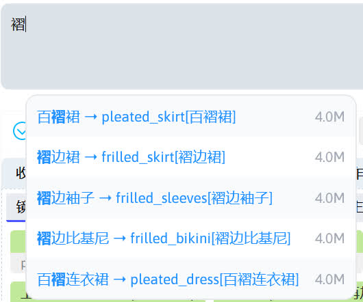

这样不仅可以看补全的提示词对应的翻译，也可以使用中文来触发提示词补全。


## SD WebUI Forge 共享 SD WebUI 模型
[stable-diffusion-webui-forge](https://github.com/lllyasviel/stable-diffusion-webui-forge) 为 [stable-diffusion-webui](https://github.com/AUTOMATIC1111/stable-diffusion-webui) 的其中一个分支，优化了显存占用，并且在某些显卡上拥有更快的速度。

SD WebUI Forge 可以共享 SD WebUI 的模型，如果需要设置共享模型，在绘世启动器的设置里将配置模式调成`高级`，再进入绘世启动器的高级选项，找到`自定义参数选项`，填入以下内容：

```
--forge-ref-a1111-home "SD WebUI 的路径"
```

重新启动 SD WebUI Forge 后即可共享 SD WebUI 的模型。

!!!note
    该自定义参数可参考：[Single cmd arg to reference models in existing A1111 checkout · lllyasviel/stable-diffusion-webui-forge · Discussion #206](https://github.com/lllyasviel/stable-diffusion-webui-forge/discussions/206)。  
    如果想要安装 SD WebUI Forge，可参考该教程：[【AI 绘画】更快？更省显存？支持 FLUX？使用绘世启动器安装 SD WebUI Forge_哔哩哔哩_bilibili](https://www.bilibili.com/video/BV1rNYre4E5B)。


## 外扩图片
在 SD WebUI 的图生图界面的脚本选项包含一个外扩图片的脚本，进入 SD WebUI 的图生图界面后，在左下角的脚本选择 Outpainting mk2 就启用外扩图片功能了。

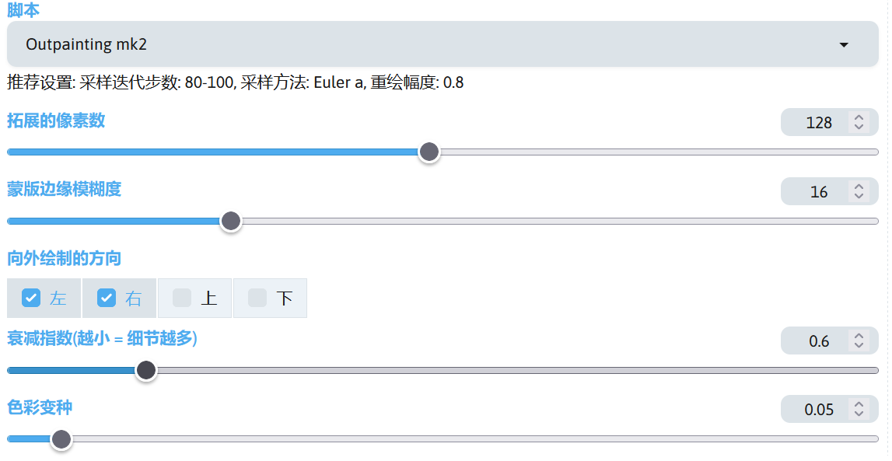

下面是外扩图片脚本的参数功能。

|功能|作用|
|---|---|
|拓展的像素数|向外扩展的像素大小。|
|蒙版边缘模糊度|设置外扩区域和原图区域的边界交融度。|
|向外绘制的方向|设置外扩的方向。|
|衰减指数|在外扩区域，脚本先填充色块，再为外扩区域绘制重绘蒙版。该值用于设置色块的细腻度，值越低，色块越细，外扩时细节更多。|
|色彩变种|调节外扩区域的色块色调。|

下面是我用于外扩图片的参数。

|参数|值|
|---|---|
|拓展的像素数|128|
|蒙版边缘模糊度|16|
|向外绘制的方向|左，右|
|衰减指数|0.6|
|色彩变种|0.05|
|采样器|Restart|
|调度器|SGM Uniform|
|重绘幅度|0.8|

填写合适的提示词后就可以进行图片外扩了。

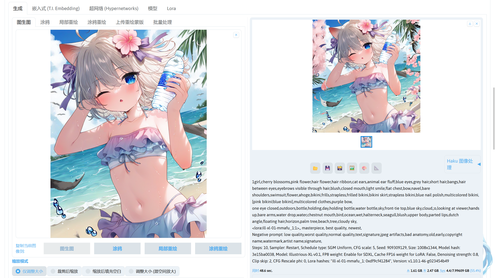

除了 Outpainting mk2 脚本可以进行图片外扩，Poor man's outpainting 脚本也可以进行图片外扩，

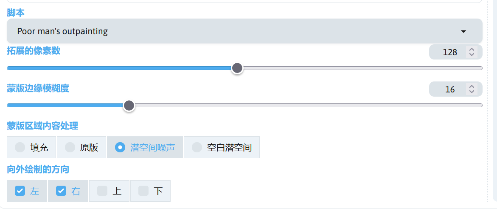

该脚本可以更换蒙版区域内容处理，通过更换蒙版内容处理方式可以更好的达到想要的外扩效果。

外扩图片的效果可能并不怎么好，但可以将外扩好的图片发送回图生图界面中，通过图生图中的涂鸦 / 局部重绘对外扩区域进行调整。


## 图生图回送
在图生图界面中，除了可以通过手动发送图生图的结果回图生图界面再进行图生图，还可以通过图生图界面的回送脚本自动进行这个过程。

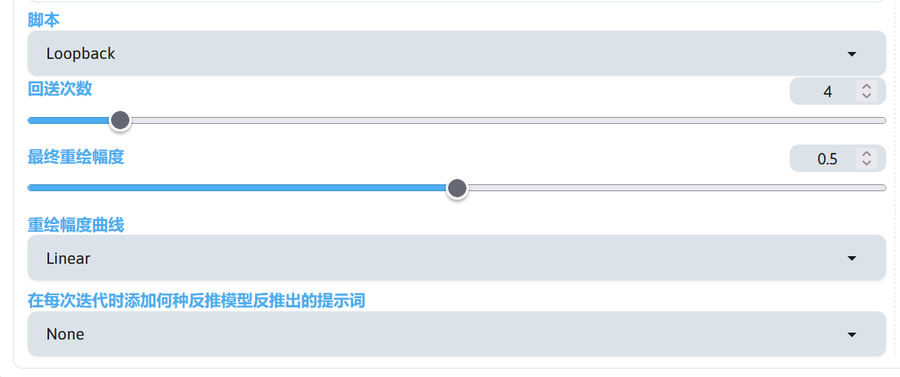


## 提示词矩阵
在 SD WebUI 界面的左下角脚本中，选择 Prompt matrix 即可启用提示词矩阵。

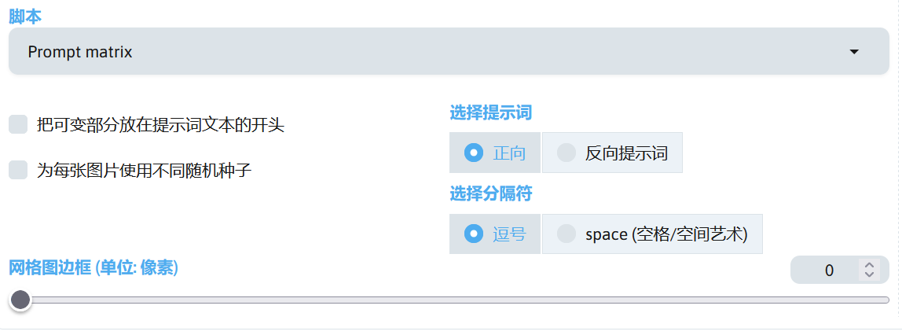

该脚本的功能类似 X/Y/Z 脚本中的 Prompt S/R 功能，通过分隔符对提示词进行组合。

下面是一段使用提示词矩阵的提示词。

```
1girl,solo,cherry blossoms,hair flower,pink flower,hair ribbon,cat ears,animal ear fluff,grey hair,short hair,bangs,blue eyes,hair between eyes,eyebrows visible through hair,blush,neck ribbon,white dress,frilled collar,medium dress,petticoat,detached sleeves,flat chest,
couch,indoors,room,desk,vase,flower,
front view,<lora:ill-xl-01-mmafu_1-000030:1>,
holding pillow,pillow hug,sitting,on couch,looking at viewer,| open mouth,wavy mouth,| tears,teardrop,streaming tears,
```

!!!note
    提示词中的 \<lora:ill-xl-01-mmafu_1-000030:1\> 为画风 LoRA，用于调整画风：[ill-xl-01-mmafu_1-000030.safetensors](https://modelscope.cn/models/licyks/sd-lora/resolve/master/sdxl/style/ill-xl-01-mmafu_1-000030.safetensors)[(Civitai)](https://civitai.com/models/980505/artist-style)。

提示词矩阵脚本根据`|`符号对提示词划分，此时最终会得到 4 组提示词。

提示词组 1：
```
1girl,solo,cherry blossoms,hair flower,pink flower,hair ribbon,cat ears,animal ear fluff,grey hair,short hair,bangs,blue eyes,hair between eyes,eyebrows visible through hair,blush,neck ribbon,white dress,frilled collar,medium dress,petticoat,detached sleeves,flat chest,
couch,indoors,room,desk,vase,flower,
front view,<lora:ill-xl-01-mmafu_1-000030:1>,
holding pillow,pillow hug,sitting,on couch,looking at viewer,
```

提示词组 2：

```
1girl,solo,cherry blossoms,hair flower,pink flower,hair ribbon,cat ears,animal ear fluff,grey hair,short hair,bangs,blue eyes,hair between eyes,eyebrows visible through hair,blush,neck ribbon,white dress,frilled collar,medium dress,petticoat,detached sleeves,flat chest,
couch,indoors,room,desk,vase,flower,
front view,<lora:ill-xl-01-mmafu_1-000030:1>,
holding pillow,pillow hug,sitting,on couch,looking at viewer,, open mouth,wavy mouth, 
```

提示词组 3：

```
1girl,solo,cherry blossoms,hair flower,pink flower,hair ribbon,cat ears,animal ear fluff,grey hair,short hair,bangs,blue eyes,hair between eyes,eyebrows visible through hair,blush,neck ribbon,white dress,frilled collar,medium dress,petticoat,detached sleeves,flat chest,
couch,indoors,room,desk,vase,flower,
front view,<lora:ill-xl-01-mmafu_1-000030:1>,
holding pillow,pillow hug,sitting,on couch,looking at viewer,, tears,teardrop,streaming tears, 
```

提示词组 4：

```
1girl,solo,cherry blossoms,hair flower,pink flower,hair ribbon,cat ears,animal ear fluff,grey hair,short hair,bangs,blue eyes,hair between eyes,eyebrows visible through hair,blush,neck ribbon,white dress,frilled collar,medium dress,petticoat,detached sleeves,flat chest,
couch,indoors,room,desk,vase,flower,
front view,<lora:ill-xl-01-mmafu_1-000030:1>,
holding pillow,pillow hug,sitting,on couch,looking at viewer,, open mouth,wavy mouth, tears,teardrop,streaming tears, 
```

现在对这 4 组提示词简化一下，得到变化的部分。

- `holding pillow,pillow hug,sitting,on couch,looking at viewer,`
- `holding pillow,pillow hug,sitting,on couch,looking at viewer,, open mouth,wavy mouth, `
- `holding pillow,pillow hug,sitting,on couch,looking at viewer,, tears,teardrop,streaming tears, `
- `holding pillow,pillow hug,sitting,on couch,looking at viewer,, open mouth,wavy mouth, tears,teardrop,streaming tears, `

这就是提示词矩阵根据`|`符号对提示词的分割得到的提示词变化，最后的得到的图片如下。


可以通过提示词矩阵简单制作提示词的对比图。

## 在图生图和高分辨率修复使用额外噪声
该选项可以在 SD WebUI 的**设置 -> 图生图 -> 图生图和高分辨率修复的额外噪声倍率**找到，为了便于调整，可以在**设置 -> UI 便捷设置**中，在**文生图设置项**和**图生图设置项**中添加 img2img_extra_noise 这个选项，并保存 SD WebUI 设置。

该选项默认为 0，如果要设置，通常需要结合重绘幅度进行调整，该值需要小于重绘幅度的值。

通过额外的噪声，可以在高分辨率修复或者图生图中为图片添加更多的细节。

下面的图片在图生图中进行放大，放大算法使用 R-ESRGAN 4x+ Anime6B，重绘幅度 设置为 0.4。

|额外噪声倍率|0|0.1|
|---|---|---|
|效果图|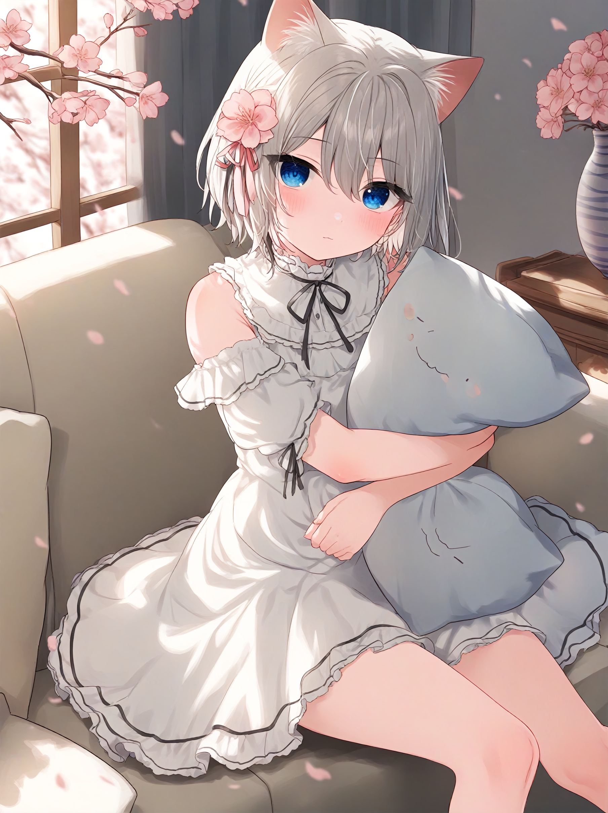||

可以看到使用额外噪声后图片细节有了增加，但该值较高的时候可能会导致细节过多使画面变脏。
