# 图生图
有时候很多人只用了文生图进行生图，很少使用图生图，甚至忽视了这个功能，但图生图可以实现很多单纯文生图做不到的事情。

下面介绍图生图的用法。


## 图生图画布
画布用于导入进行图生图的图片，下面是不同画布的作用。


|模式|作用|
|---|---|
|图生图|使用图片进行作为底图进行生图，通常用于图片放大。|
|涂鸦|在这个模式中将拥有一个可以调色的画笔，可对导入的图片进行涂鸦，再进行图生图。可以导入一张白色图片，在上面进行简单的涂鸦，再通过图生图将涂鸦转换为想要的内容；或者配合局部重绘，先在涂鸦模式下对想要修改的元素进行简单的涂鸦，再将涂鸦后的图片发送到局部重绘中，将涂鸦的部分画上蒙版，通过图生图的方式修改图片中某个地方的元素。SD WebUI 内置的涂鸦功能较为简陋，可使用 PhotoShop、GIMP、Krita 等专业软件在图片上进行涂鸦，涂鸦完成后再导入 SD WebUI 中。|
|局部重绘|该模式中提供一个画笔用于绘制图片蒙版，在进行图生图时就可以选择对蒙版的部分进行图生图或者对蒙版外的部分进行图生图。|
|涂鸦重绘|这是涂鸦模式和局部重绘模式的结合版，该模式下的画笔可绘制出带有颜色的蒙版，在使用该模式的画笔进行绘制时，SD WebUI 先在图片上绘制色块（涂鸦），再对绘制过的地方同时绘制上蒙版，绘制的色块可以调节透明度，通过蒙版透明度参数进行调节。该功能可以方便的对图片的元素进行调整，如更换人物的发色等。|
|上传重绘蒙版|该功能用于上传图片对应的蒙版，对蒙版内或者蒙版外的元素进行图生图。因为 SD WebUI 自带的画布功能不能精准的绘制图片蒙版，此时就可以借助 PhotoShop、GIMP 等专业工具绘制精确的蒙版，或者使用 Segmentation 生成蒙版，再导入 SD WebUI 中。|


## 画布工具
在图生图的画布中提供了不同的工具对导入画布的图片进行处理。

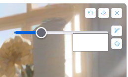

|功能|作用|
|---|---|
|🔄|撤回上一次的更改。|
|◻️|清除所有的更改。|
|🗙|清除画布，包括图片。|
|✏️|画笔大小调节。|
|🎨|画笔颜色调节。|


## 图生图参数
图生图界面提供了不同参数用于调节图生图的效果。


### 缩放模式
调节对图片的大小的调节，以下是对不同缩放模式的介绍。

|模式|作用|
|---|---|
|仅调节大小|仅调节大小只对图片进行缩放操作，不进行其他操作。|
|裁剪后缩放|如果图片的宽高比和重绘尺寸设置的宽高比不一致时，将对图片裁剪成重绘尺寸中设置的宽高比再进行缩放。|
|缩放后填充空白|如果图片的宽高比和重绘尺寸设置的宽高比不一致时，对图片进行缩放后，将调整图片的宽高比并根据空白处的边缘颜色对空白处进行颜色填充。|
|调整大小（潜空间放大）|该模式类似仅调节大小模式，但仅调节大小是在像素空间中进行操作，而调整大小（潜空间放大）在潜空间中进行操作。|

下面导入一张 1344x1008 分辨率的图片，并将重绘尺寸设置为 1544x1008，重绘幅度设置为 0，观察 SD WebUI 对图片的处理。

|模式|原图|仅调节大小|裁剪后缩放|缩放后填充空白|调整大小（潜空间放大）|
|---|---|---|---|---|---|
|效果图||||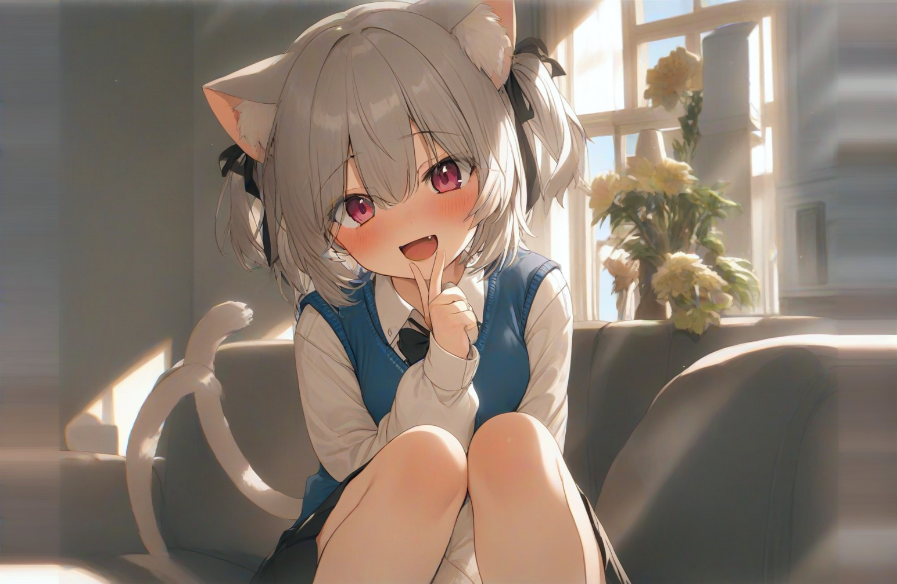||


### 蒙版边缘模糊度
设置重绘区域和原图区域的边界交融度，改变这项参数影响局部重绘区域和原图的融合度。太高的边缘模糊会导致蒙版不精准，范围内未改变或者范围外发生变动，太低会导致衔接生硬。


### 蒙版透明度
设置涂鸦重绘中画笔绘制的色块透明度。使用较低的值时，画笔颜色对蒙版区域的影响度较高，

可以将重绘幅度设置为 0 后观察不同蒙版透明度的效果。

|蒙版透明度：0|蒙版透明度：50|
|---|---|
|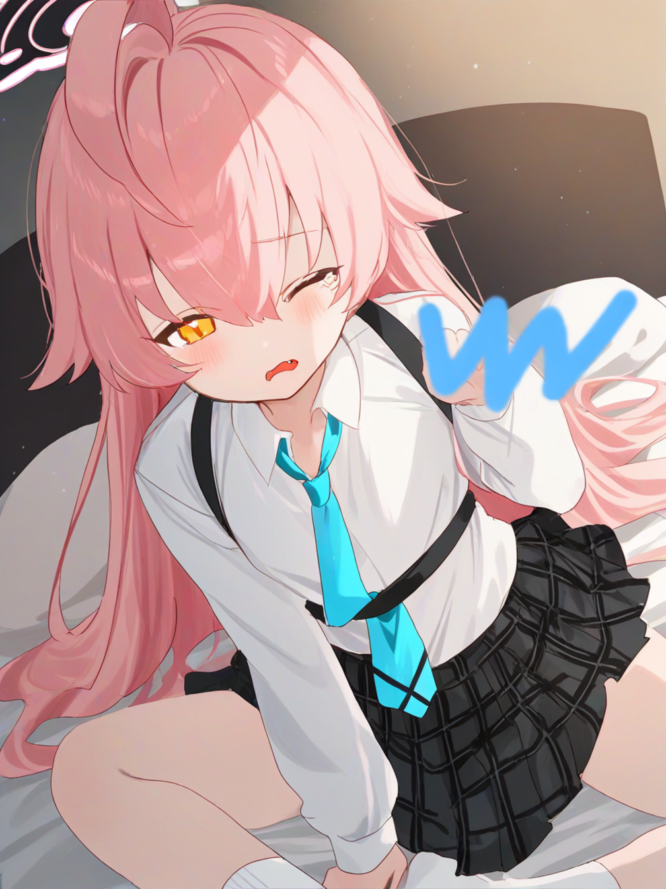||


### 蒙版模式
用于设置进行重绘时是对蒙版部分进行重绘，还是对蒙版之外的部分进行重绘。


### 蒙版区域内容处理
用于设置进行重绘前对蒙版内容的处理方法，下面是不同方法的作用。

|方法|作用|
|---|---|
|原版|不对蒙版内容进行处理。|
|填充|根据蒙版内容的平均颜色对蒙版内容填充色块。|
|潜空间噪声|在潜空间重对蒙版内容加上潜空间噪声。|
|空白潜空间|在潜空间中初始化一个空白的潜空间。|

下面将导入一张图片，把重绘幅度设置为 0 后观察不同蒙版区域内容处理方式的效果。

|处理方法|原版|填充|潜空间噪声|空白潜空间|
|---|---|---|---|---|
|效果图||||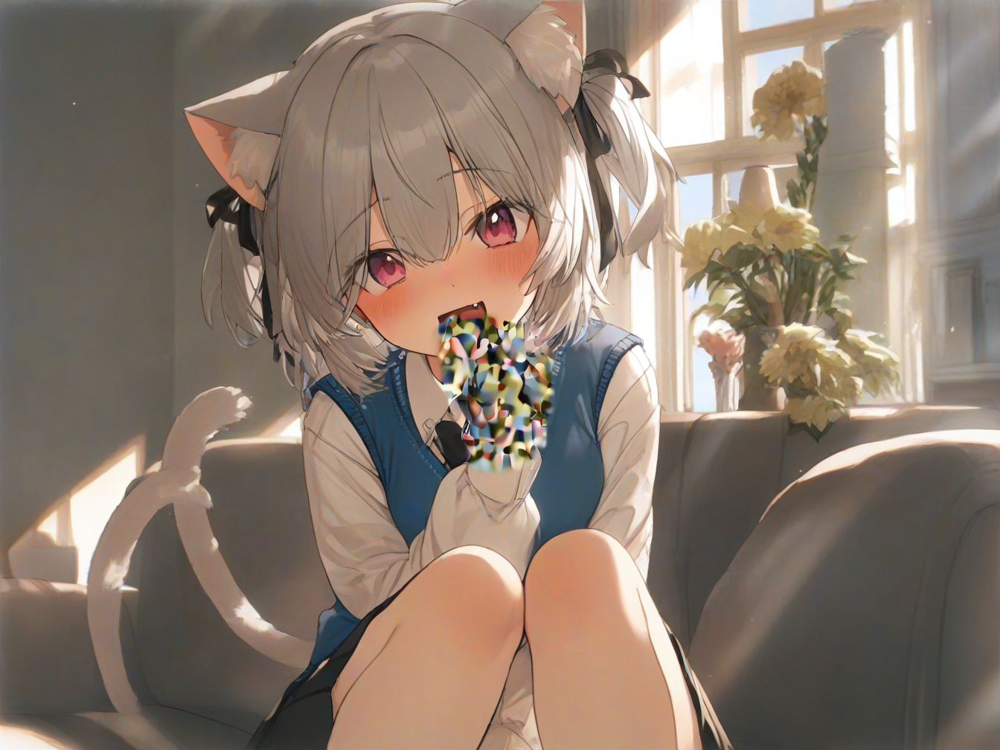||

!!!note
    1. 此部分的图片是潜空间图像经过了 VAE 解码得到的。  
    2. 对于不同的重绘需求，选择不同的蒙版区域内容处理方式可以得到不同的效果。
    3. 除了**原版**处理方式，其他处理方式需要更高的重绘幅度，较低的重绘幅度可能会导致重绘部分的内容和非重绘部分的内容之间的融合度低，使图片质量变差。

使用**潜空间噪声**或者**空白潜空间**时，局部重绘的结果更加倾向于填满整个蒙版，下面对一张图片进行重绘，重绘幅度设置为 0.85 进行测试。

|处理方法|原版|填充|潜空间噪声|空白潜空间|
|---|---|---|---|---|
|效果图||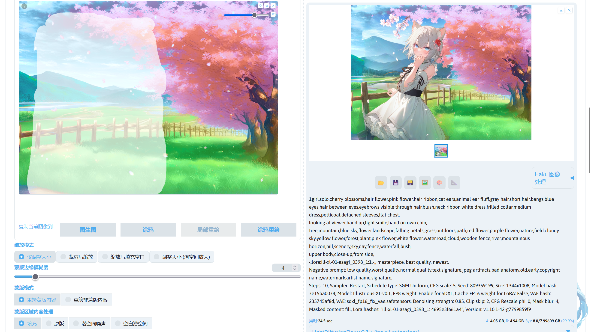|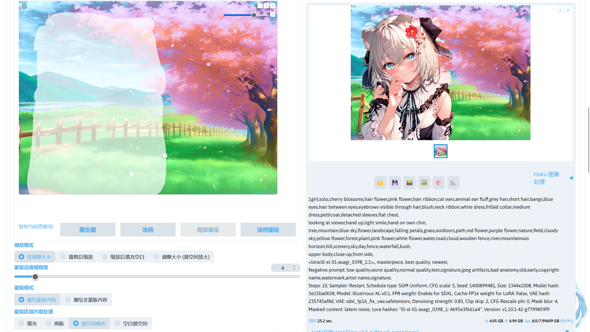|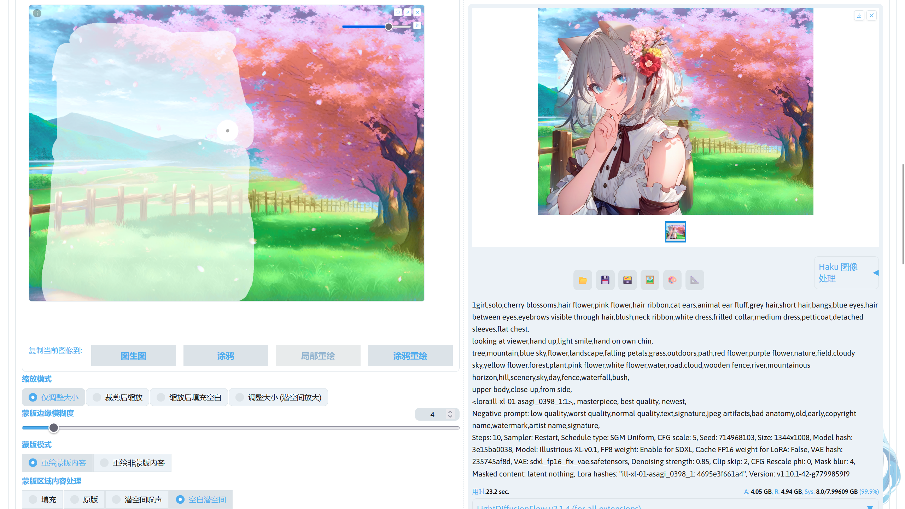|


### 重绘区域
用于设置重绘时是对整张图片进行采样还是对图片部分区域进行采样。

仅蒙版区域时，SD WebUI 将会把包含蒙版部分的区域裁剪下来进行图生图，再将图片拼接回去，因为 AI 参考的图片部分由图片的整体变为了局部，可能会导致重绘部分和非重绘部分的衔接不是很好。而且使用仅蒙版区域时描写图片的提示词需要改写成描写蒙版部分而不是整张图片，不然可能会导致重绘区域出现不好的效果。但是使用仅蒙版区域时，对图片中人物的眼睛，手之类的区域会有更好的效果。

整张图片时，将使用整张图片进行图生图，重绘的部分将根据参考整张图片的内容进行重绘。如果导入的图片分辨率过大，可能会导致重绘时消耗的显存过大。可以通过缩小图片后再进行重绘或者切换成仅蒙版区域模式。


### 仅蒙版区域下边缘预留像素
将重绘区域设置为仅蒙版区域时，蒙版部分的图片会被裁切下来，而设置仅蒙版区域下边缘预留像素后蒙版之外的部分像素也会被裁切下来。这个值越高，裁切下来的图片分辨率越大。


### 柔和重绘
解决重绘部分和非重绘部分之间的融合问题，使重绘部分和原版内容无缝融合。推荐搭配高蒙版边缘模糊度值一起使用。

下面是柔和重绘的不同参数。

|参数|作用|
|---|---|
|Schedule bias|降噪过程中, 原始画面保留比例随采样迭代步数变化的调度函数偏离量。确保降噪器和原始内容保留在每个步骤中的大致平衡。 可以使用此参数调整平衡，控制是早期还是后期步骤具有更强的保留。低于 1 时，后期步骤的保留性更强；大于 1 时，前期步骤的保留性更强；设置为 1 时则为平衡模式。|
|Preservation strength|部分蒙版内容应被保留的强度。设置倾向于保留部分蒙版图像区域的原内容或者重绘后的内容。 这可能需要根据 Schedule bias、提示词引导系数、提示词和降噪强度进行调整。|
|Transition contrast boost|增强在部分蒙版区域中可能减弱的对比度。此参数控制原始潜在向量和去噪潜在向量的插值方式。 值越高，生成的混合向量的幅度将更接近两个插值向量的最大值。 这可以防止线性插值中发生的对比度损失。设置为较低的值时，混合更柔和，细节可能会淡化；设置为较高的值时，对比度更强，但可能会过度饱和颜色。|
|Mask influence|原始蒙版偏离差异阈值的程度。设置为 0 时，忽略蒙版，只考虑图像内容中的差异。设置为 1 时，即使图像内容发生变化，也要紧密遵循蒙版。|
|Difference threshold|一个图像区域在原始像素不再混合之前可以改变的程度。此值表示原始像素的透明度将低于50%的差异。使用较低的值时，两个图像块必须几乎相同才能保留原始像素；使用较高的值时，两个图像块可以非常不同但仍保留原始像素。|
|Difference contrast|混合与非混合之间的过渡尖锐程度。使用较低的值时，混合将更渐进，过渡更长，但可能会导致鬼影。使用较高的值时，鬼影将不太常见，但过渡可能会非常突然。|


### 迭代步数
图生图的迭代步数和文生图的迭代步数存在细微差别，在图生图中，实际迭代步数为**设置的迭代步数 x 重绘幅度 + 1**。如果要使实际的迭代步数等于设置的迭代步数，可以在 SD WebUI 的**设置 -> 图生图**，将**图生图时，准确执行滑块指定的迭代步数 (正常情况下越小的重绘幅度需要的迭代步数更少)**这个选项勾选并保存 SD WebUI 设置。


### 重绘尺寸 / 重绘尺寸倍数
设置图生图时图片的分辨率，使用 📐 可以自动设置重绘尺寸的宽度和高度为导入图生图中的图片宽度和高度。


### 重绘幅度
设置图生图对图片的改变幅度。进行图生图时，根据重绘幅度的大小，对图片加上噪声，值越高，加噪的强度越高，加载完成后图片将在潜空间中进行降噪。较低的值对原图的改变较小，较高的值对原图的改变交大。


## 图生图的理论
1. Stable Diffusion 模型对于画面占比越大的事物越容易画好，反之占比越小就越画不好，举个例子，中远景人物崩脸的概率显著高于特写，另一个例子是，以画不好手出名的 AI，在强调手的提示词下，例如 beckoning 之类，出好手的概率顿时暴增，这是由Stable Diffusion 本身的性质决定的，而我们可以顺应这种特性。例如，将手部裁剪下来，这不就是一张手部特写图了吗？再请 AI 重绘，抽卡难度瞬间下降。同理，AI 画大的事物清晰，小的不清晰，同样将小的物品转化为大物品经过重绘再放回原图，就可
以保证处处清晰。

2. 图生图也是需要提示词的，虽然在多维度约束下，提示词对于 AI 的参考意义一定程度上被削弱，但这仍然是参考的主要成分。提示词可以反推，但相比反推模型，一定是你的眼睛分辨更加精准，只有传递给模型正确的指引——至少不要和重绘内容打架，才能抽卡出好的结果。图生图使用的提示词应该是希望 AI 画成的内容，比如说，图生图更换风格，那么你就需要描述画面中不希望改动的内容，并且加上风格词，甚至还需要加权；再比方说，将车局部重绘成马，那么你的提示词就应该是有关马的详细描述；最好，当你发现局部重绘的对象丧失了与全图的关联，那么你还需要适当描述一点蒙版以外的内容，便于模型理解。

3.  图生图修图的本质是施加多维约束。试想，当你写上提示词生图的时候、当你涂上蒙版重绘的时候，你究竟告诉了 AI 多少信息？这些信息能够唯一的锁定你要的东西吗？显然不是的，一个很简单的道理，如果你不告诉画师更具体的要求，那么他就只能猜来猜去，当你所给信息较少，那么实际上只是在挤眉弄眼的暗示，怎么可能一发命中呢。所以越强的约束操控者的自主性越强，相应的，AI的发散性就越差。如果你不满 AI 的天马行空了，那就应该有色蒙版 / PS / ConntrolNet 结合着灵魂画技给它比划，总好过使眼色对吧。

4. 图生图需要将原图反推为潜空间数据，因此占用会比文生图更高，并且参考图尺寸越大占用越高。对于局部重绘，占用会比单纯图生图再略高，但这并不意味着低显存就不能局部重绘，实际上只要采用将重绘区域裁剪下来的方法就可以实现低显存重绘。并且由于图生图会经过两次 VAE，在使用 VAE 异常的模型时，每次重绘都会导致画面变得更灰，反复迭代将灰到不能看，最好保持外挂 VAE。 

5. 图生图的模型选择要符合参考图画风，或者至少接近、不矛盾。例如你不能用 Stable Diffusion 1.5 官方模型来重绘一张纸片人图。但不代表就必须要一模一样，相反用截然不同的模型来出图和重绘，偶尔还能做出风格交融的效果。

6. 用图生图的方法应该具有一种阶段性的思想，即：不强求一次成图，可以分别抽出好的背景、好的人物、好的构图、好的姿势，通过图生图将它们有机结合在一起。而且也并非只能出全图，比如可以让AI产生某些素材，用来贴进画面。最后，实际上模型的能力也是有限的。当模型中根本就没有相关数据，那么这就是不可能画出来的，比如某些特殊视角、构图。那么此时，就只有通过手中的笔了。


## 图生图应用
下面介绍图生图的一些实际应用。

### 细节修复
下面我使用下面的提示词生成一张图片。

```
1girl,solo,cat ears,animal ear fluff,hair ribbon,pink eyes,grey hair,short hair,two side up,bangs,hair between eyes,eyebrows visible through hair,blush,fang,long sleeves,bow,white shirt,puffy sleeves,collared shirt,sleeves past wrists,black bow,puffy long sleeves,blue vest,sweater vest,pleated skirt,black skirt,cat tail,
looking at viewer,smile,open mouth,:d,sitting,knees up,hand up,index finger raised,hand on own chin,arm between legs,
indoors,sofa,window,light rays,blue sky,living room,vase,flower,
upper body,
<lora:ill-xl-01-KonYa666_4:1>, masterpiece, best quality, newest,
```

这里抽了一张细节有问题的图片用于演示。


!!!note
    这里我使用的模型：  
    [Illustrious-XL-v0.1](https://modelscope.cn/models/licyks/sd-model/resolve/master/sdxl_1.0/Illustrious-XL-v0.1.safetensors)[(Civitai)](https://civitai.com/models/795765/illustrious-xl)，模型放在`stable-diffusion-webui/models/Stable-diffusion`。  
    [ill-xl-01-KonYa666_4](https://modelscope.cn/models/licyks/sd-lora/resolve/master/sdxl/style/ill-xl-01-KonYa666_4-000036.safetensors)[(Civitai)](https://civitai.com/models/696384/artist-style)，模型放在`stable-diffusion-webui/models/Lora`。

这里可以看到人物的尾巴和手出现了问题，此时可以靠图生图进行修复。

进入图生图界面后，在画布部分选择涂鸦，把图片导入画布中。现在需要对有问题的部分进行涂鸦，点击右上角画布工具中的画笔颜色调节按钮，根据要修复有问题部分的颜色进行调节，调节后使用画笔对图片进行简单涂鸦。

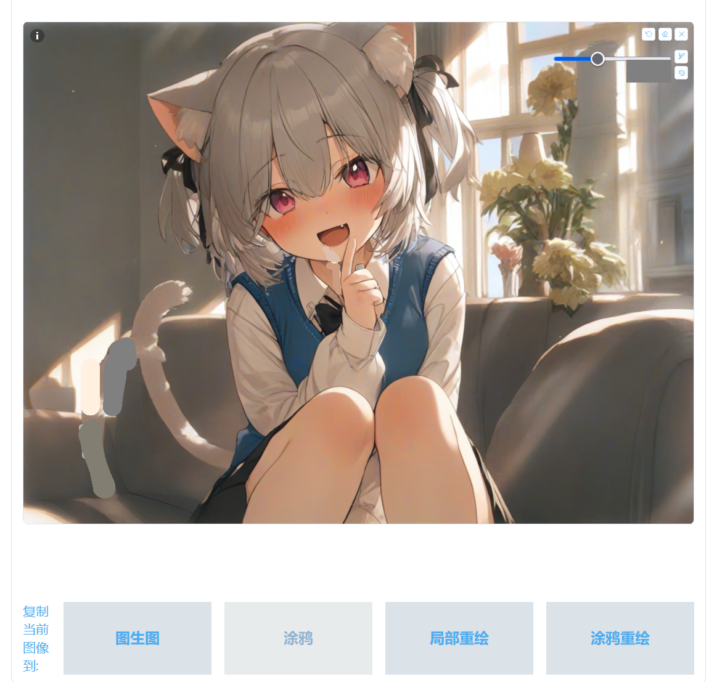

!!!note
    这步可以在 PhotoShop 之类的图片编辑软件中进行。

涂鸦完成后，点击下方按钮复制当前图像到局部重绘。现在使用画笔对涂鸦的部分进行蒙版绘制。


绘制蒙版后，提示词写上对整张图片的描述（可以直接使用上面文生图的提示词），重绘幅度调低一些，启用柔和重绘，接下来就可以进行图生图了。

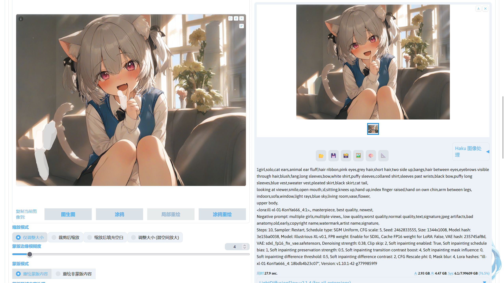

现在手部的细节可以提高一下，所以在图生图的结果展示界面点击 🖼️ 将图生图后的图片发送回图生图中，此时图片将出现在图生图画布中，点击下方复制当前图像发送到局部重绘中，对手部绘制蒙版。

因为是为了提升蒙版部分的细节，所以将**重绘区域**设置为**仅蒙版区域**，提示词改为描写蒙版区域的提示词。

```
hand,index finger raised,
<lora:ill-xl-01-KonYa666_4:1>, masterpiece, best quality, newest,
```

重绘幅度设置为比较低的值，如 0.35，就可以进行图生图了。


!!!note
    这步用于提升图片细节的方法就是 [adetailer](https://github.com/Bing-su/adetailer) 扩展的原理，只不过 adetailer 扩展是自动对图片进行局部重绘。


### 添加元素
现在想在刚刚修复好细节的图片上添加元素，比如在人物头上添加一朵樱花，可以通过**涂鸦** + **局部重绘**进行添加，也可以使用**涂鸦重绘**进行添加，

将刚刚的图片导入涂鸦重绘画布中，使用画笔在人物的头上简单绘制一个樱花，绘制好后勾选一下柔和重绘，使用较低的重绘幅度，如 0.5，再进行图生图。

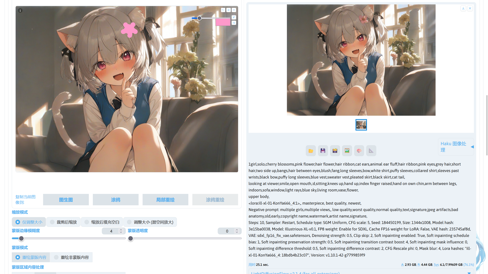

现在可以看到刚刚画上去的樱花添加到人物的头上了。


### 删除元素
现在图片上的某些元素不想要了，可以通过局部重绘进行删除。

这里想要将窗边的花瓶移除，则把图片导入局部重绘中，在花瓶的位置绘制蒙版，将**蒙版区域内容处理**设置为**填充**，重绘幅度设置比较高的值，如 0.5，再修改一下提示词。

```
1girl,solo,cherry blossoms,pink flower,hair flower,hair ribbon,cat ears,animal ear fluff,hair ribbon,pink eyes,grey hair,short hair,two side up,bangs,hair between eyes,blush,fang,long sleeves,bow,white shirt,puffy sleeves,collared shirt,sleeves past wrists,black bow,puffy long sleeves,blue vest,sweater vest,pleated skirt,black skirt,cat tail,
looking at viewer,smile,open mouth,:d,sitting,knees up,hand up,index finger raised,hand on own chin,arm between legs,
indoors,sofa,window,light rays,blue sky,living room,
upper body,
<lora:ill-xl-01-KonYa666_4:1>,
```

现在就可以进行图生图了。

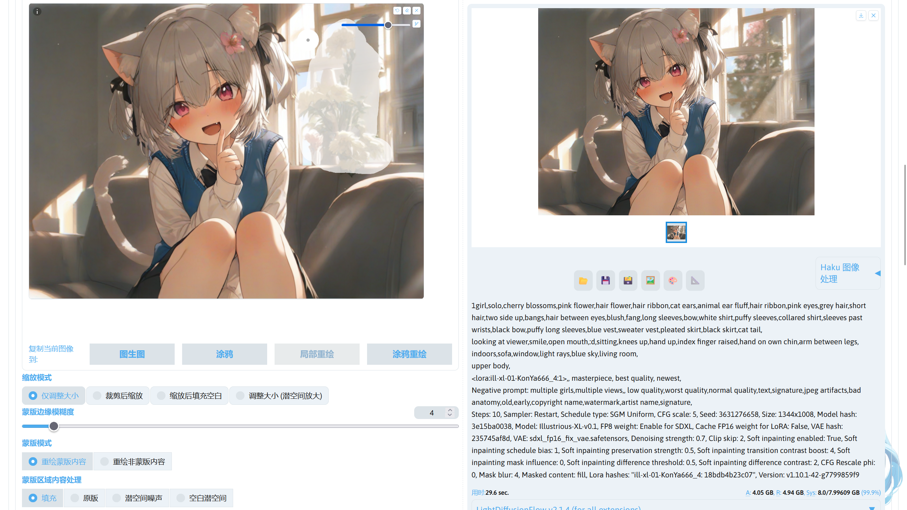

现在图片中的花瓶被移除了。


### 修改元素
这是一张使用文生图生成的图片，使用的提示词。

```
1girl,solo,cherry blossoms,hair flower,pink flower,hair ribbon,cat ears,animal ear fluff,grey hair,short hair,bangs,blue eyes,hair between eyes,eyebrows visible through hair,blush,neck ribbon,white dress,frilled collar,medium dress,petticoat,detached sleeves,flat chest,legs,
sitting on bench,looking at viewer,light smile,
outdoors,landscape,park,tree,bench,falling petals,path,blue sky,grass,flower,path,
<lora:ill-xl-01-kagawayusaku_1:1>,
```

!!!note
    使用的 LoRA 模型：[ill-xl-01-kagawayusaku_1](https://modelscope.cn/models/licyks/sd-lora/resolve/master/sdxl/style/ill-xl-01-kagawayusaku_1-000034.safetensors)[(Civitai)](https://civitai.com/models/865757/artist-style)，模型放在`stable-diffusion-webui/models/Lora`。

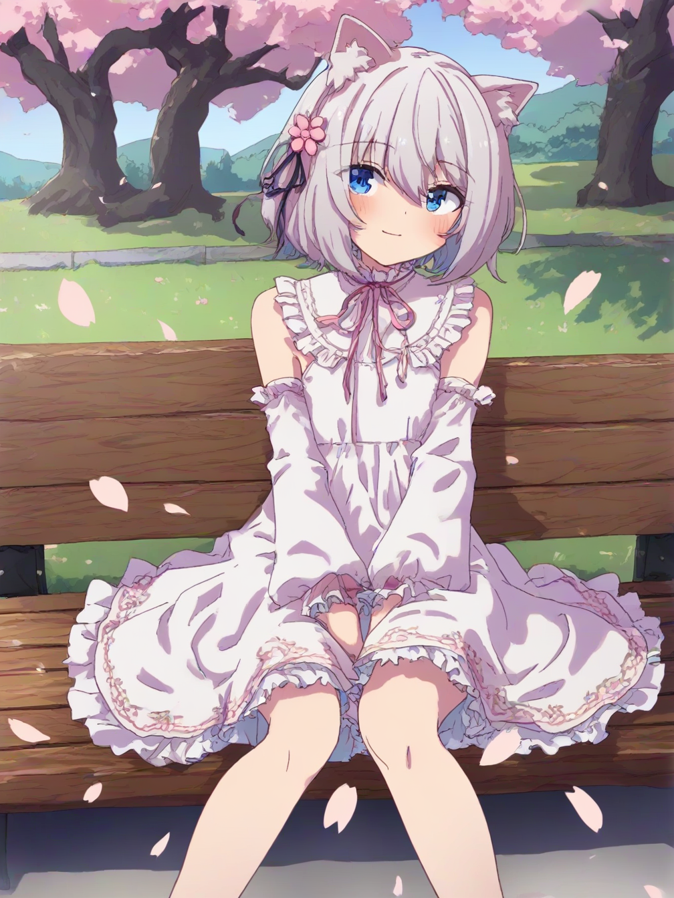

现在想修改图片中人物的动作，让人物对镜头比个耶，所以在图生图中将这张图片导入进涂鸦画布中，使用涂鸦对人物的动作进行简单的绘制。

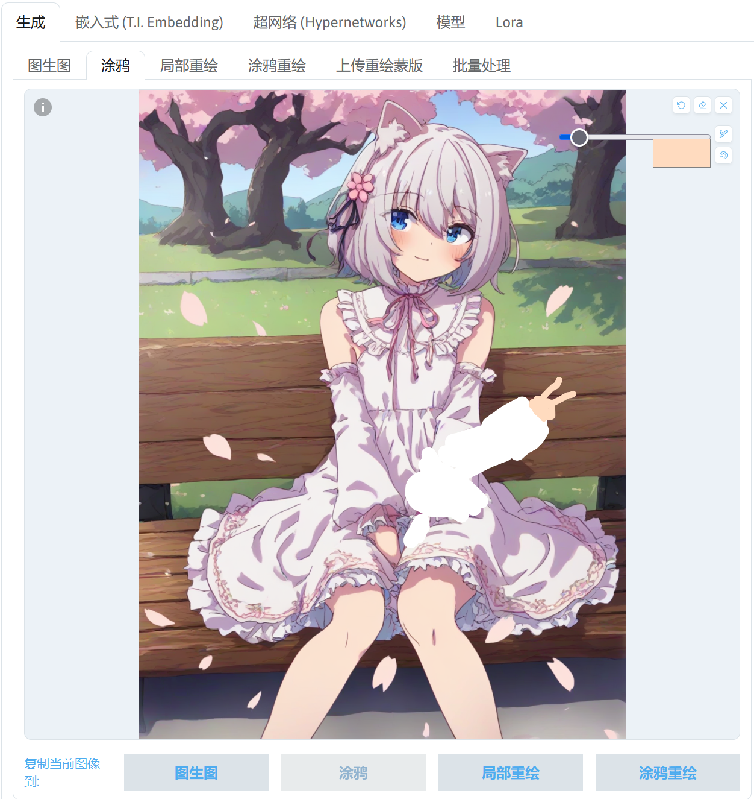

再点击画布下面的按钮复制当前图像到局部重绘中，将涂鸦部分绘制蒙版，**蒙版区域内容处理**选择**原版**，重绘幅度设置为比较高的值，如 0.7，再启用柔和重绘，就可以进行图生图了。

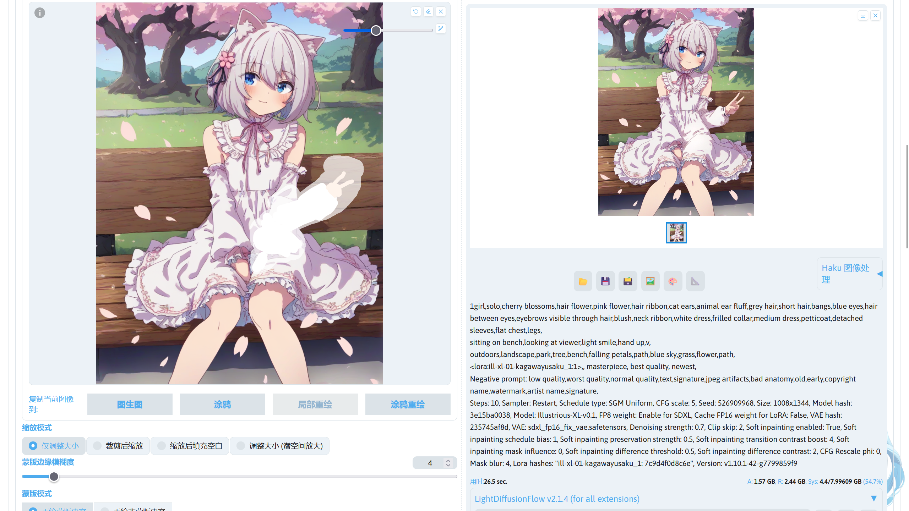

现在人物的动作就修改好了。

### 从涂鸦到壁纸
除了使用文生图得到一张好看的壁纸，也可以通过图生图的方式将一张涂鸦制作成一张好看的壁纸。

这里使用灵魂画技画出一张涂鸦。

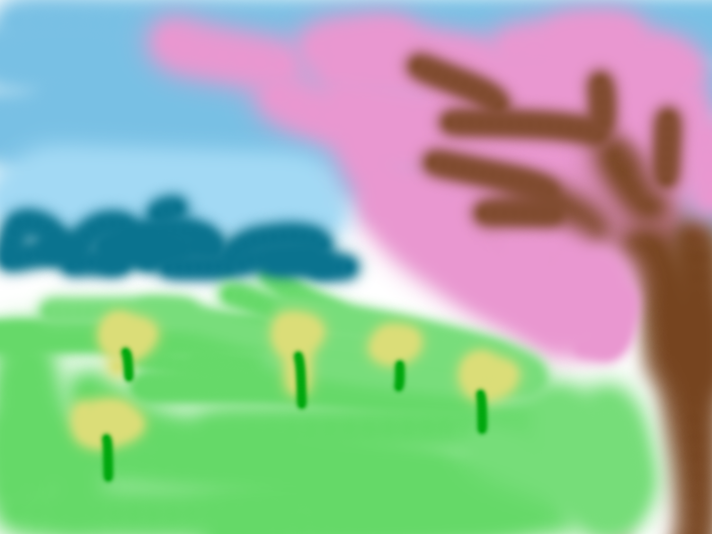

将这张涂鸦导入图生图中，填写相应的提示词描述画面。

```
no humans,cherry blossoms,tree,mountain,blue sky,flower,landscape,falling petals,grass,outdoors,path,red flower,purple flower,nature,field,cloudy sky,yellow flower,forest,plant,pink flower,white flower,water,road,cloud,wooden fence,river,mountainous horizon,hill,scenery,sky,day,fence,waterfall,bush,<lora:ill-xl-01-asagi_0398_1:1>,, masterpiece, best quality, newest,
```

!!!note
    提示词中的画风 LoRA：[ill-xl-01-asagi_0398_1](https://modelscope.cn/models/licyks/sd-lora/resolve/master/sdxl/style/ill-xl-01-asagi_0398_1-000036.safetensors)[(Civitai)](https://civitai.com/models/629526/artist-style)，模型放在`stable-diffusion-webui/models/Lora`。

因为需要将涂鸦转换为一张壁纸，需要对涂鸦做大改动，所以重绘幅度设置为比较高的值，如 0.85，设置完后进行一次图生图。

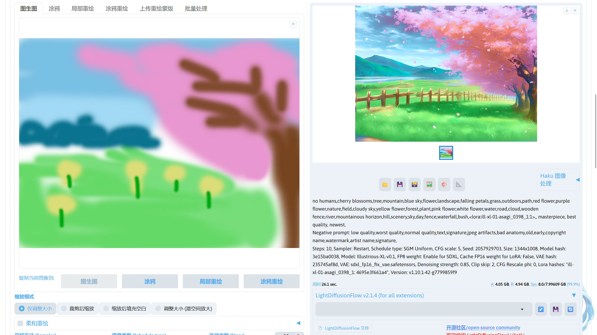

这里涂鸦已经变成一张比较好看的图片，但是想对图片添加一些元素，就可以点击图片预览界面下方的 🖼️ 将生成的图片发送值图生图，在图生图画布下面点击复制当前图像到局部重绘。

使用画笔对绘制图片的蒙版，为图片添加一个人物。因为要无中生有一个人物，所以建议将**蒙版区域内容处理**设置为**潜空间噪声**或者**空白潜空间**。如果不使用**潜空间噪声**或者**空白潜空间**，需要在图片上进行涂鸦，画出人物的轮廓。

现在在对人物进行描述，修改原来的提示词。

```
1girl,solo,cherry blossoms,hair flower,pink flower,hair ribbon,cat ears,animal ear fluff,grey hair,short hair,bangs,blue eyes,hair between eyes,eyebrows visible through hair,blush,neck ribbon,white dress,frilled collar,medium dress,petticoat,detached sleeves,flat chest,
looking at viewer,hand up,light smile,hand on own chin,
tree,mountain,blue sky,flower,landscape,falling petals,grass,outdoors,path,red flower,purple flower,nature,field,cloudy sky,yellow flower,forest,plant,pink flower,white flower,water,road,cloud,wooden fence,river,mountainous horizon,hill,scenery,sky,day,fence,waterfall,bush,
upper body,close-up,from side,
<lora:ill-xl-01-asagi_0398_1:1>,, masterpiece, best quality, newest,
```

修改后再进行一次图生图。

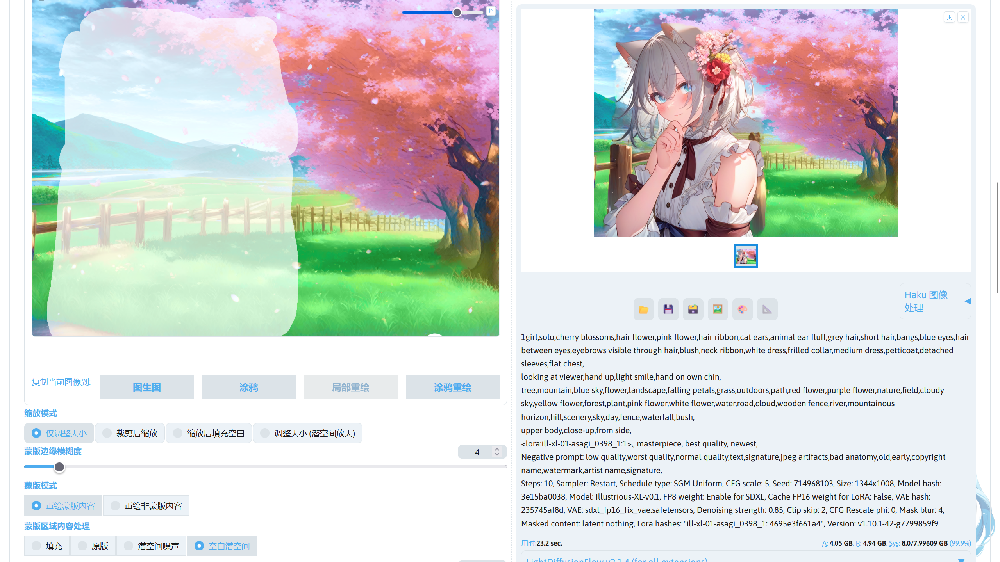

!!!note
    如果绘制出来的图片出现的偏色，如刚刚添加进去的人物发绿，看起来受到背景的影响，如：  
      
    这可能是因为图生图的颜色校正功能影响的重绘之后的画面，可通过**设置 -> 图生图**，将**对图生图结果应用颜色校正以匹配原始颜色**禁用后再试。

现在人物添加到了图片中，但是重绘部分的原版内容的衔接有些问题，此时可以通过局部重绘继续修复。

使用之前的方法将图片发送回局部重绘画布中，对图片周围衔接不好的地方绘制蒙版，将**蒙版区域内容处理**设置为**原版**，启用柔和重绘，再将重绘幅度稍微降低，如降到 0.7，再进行图生图，反复这个步骤修复图片中衔接不好的地方。

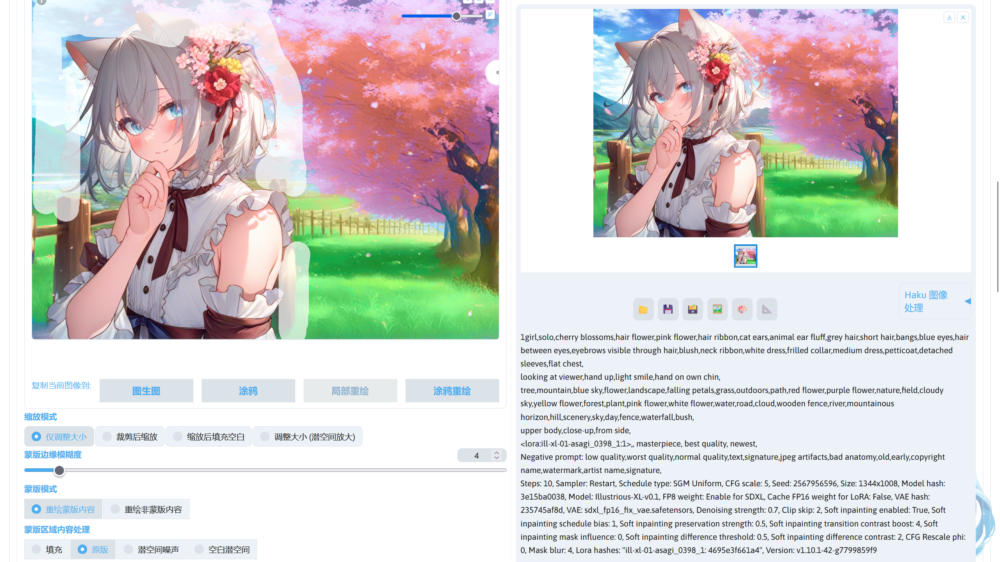

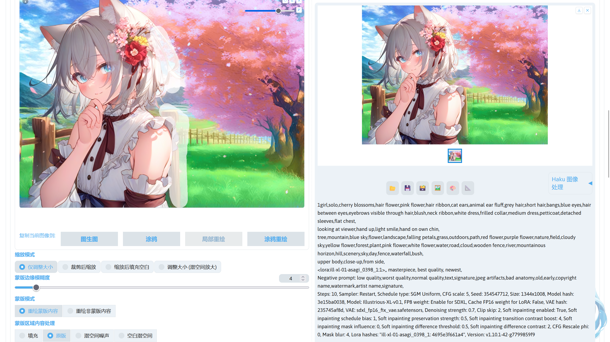

现在一张好看的壁纸就制作出来了。


### 图片放大
如果图片的清晰度不够高，可以通过图生图进行放大。

这里推荐修改一下 SD WebUI 的图生图界面，在**设置 -> UI 便捷设置 -> 图生图设置项**，将 upscaler_for_img2img、 img2img_color_correction、img2img_fix_steps 添加进去，保存 SD WebUI 设置后点击重载 UI 使修改后的界面生效，重载完成后，在图生图界面就可以看到**图生图放大算法**、**对图生图结果应用颜色校正以匹配原始颜色**、**图生图时，准确执行滑块指定的迭代步数**三个选项。

将图片导入图生图画布后，提示词描述要放大的图片内容，图生图放大算法选择一个合适的算法，这里推荐 Lanczos、4x-UltraSharp、DAT_x4、4x_NMKD-Superscale-SP_178000_G、R-ESRGAN 4x+ Anime6B。

!!!note
    4x-UltraSharp 下载：[4x-UltraSharp.pth](https://modelscope.cn/models/licyks/sd-upscaler-models/resolve/master/ESRGAN/4x-UltraSharp.pth)，模型放在`stable-diffusion-webui/models/ESRGAN`。  
    DAT_x4 下载：[DAT_x4.pth](https://modelscope.cn/models/licyks/sd-upscaler-models/resolve/master/DAT/DAT_x4.pth)，模型放在`stable-diffusion-webui/models/DAT`。  
    4x_NMKD-Superscale-SP_178000_G 下载：[4x_NMKD-Superscale-SP_178000_G.pth](https://modelscope.cn/models/licyks/sd-upscaler-models/resolve/master/ESRGAN/4x_NMKD-Superscale-SP_178000_G.pth)，模型放在`stable-diffusion-webui/models/ESRGAN`。  
    R-ESRGAN 4x+ Anime6B 下载：[RealESRGAN_x4plus_anime_6B.pth](https://modelscope.cn/models/licyks/sd-upscaler-models/resolve/master/RealESRGAN/RealESRGAN_x4plus_anime_6B.pth)，模型放在`stable-diffusion-webui/models/RealESRGAN`。

重绘幅度推荐 0.2~0.4，重绘尺寸倍数设置要放大到的倍数。如果想要防止放大后偏色，可以启用**对图生图结果应用颜色校正以匹配原始颜色**。如果想要放大时执行的迭代步数和设置的迭代步数相同，可以启用**图生图时，准确执行滑块指定的迭代步数**。

在图生图放大算法中没有看到在文生图高分辨率修复 Latent 放大算法，但实际上可以通过另一种方式来实现。在**缩放模式**选择**调整大小 (潜空间放大)**后放大算法就变成了 Latent 放大算法，此时需要的重绘幅度要大于 0.55。

!!!note
    使用了**调整大小 (潜空间放大)**后，**图生图放大算法**设置的选项将失效。


## 其他图生图使用参考
下面的文档详细的讲解了图生图的用法，作为本文章的内容补充。

-   :fontawesome-solid-file-pdf:{ .lg .middle } __重绘学派法术绪论1.2__

    ---

    [:octicons-arrow-right-24: 前往文档](https://docs.qq.com/pdf/DR2pJcWdTRXVpWEty)
