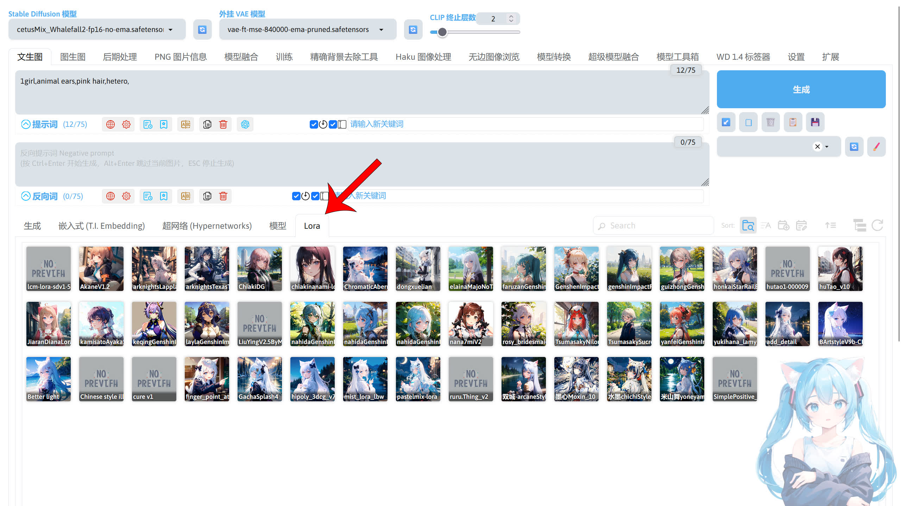
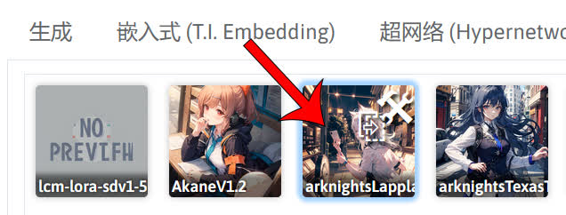
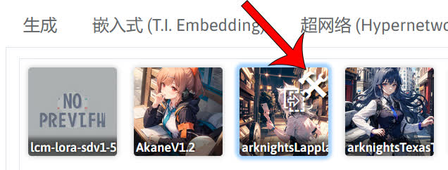
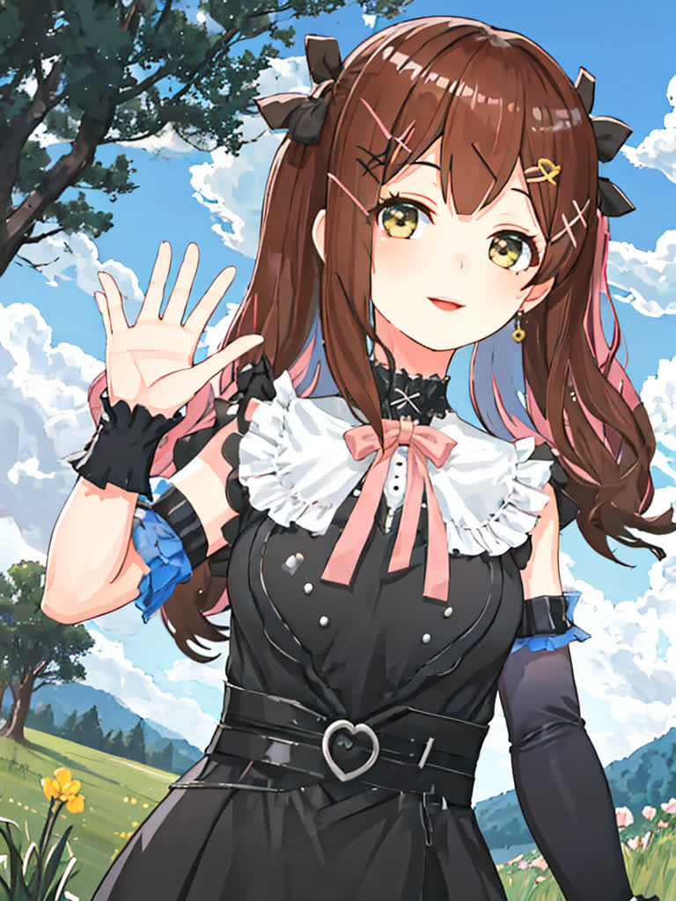
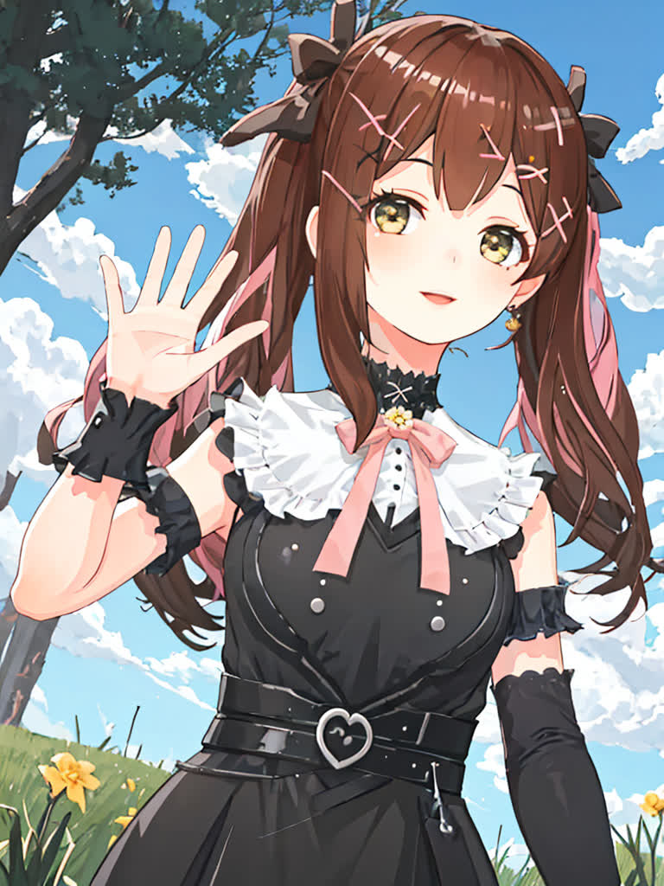

# LoRA 应用
在大模型无法直接实现一些效果时，这时候可以使用 LoRA 来实现。

在模型下载站中，可以看到除了 LoRA 模型，还有 LyCORIS LyCORIS 模型的作用和 LoRA 模型的作用基本相同，使用方法和 LoRA 模型一致。

!!!note
	演示界面包含外置扩展，您的界面可能与我的有一定的区别。


## 如何使用
LoRA 模型可使用提示词进行调用，格式如下：
```
<lora:LoRA 模型的名字:权重>
```

在 SD WebUI 的界面中，我们可以使用 LoRA 选项卡快速填写 LoRA 模型的触发提示词。点击 LoRA 打开选项卡，如果你在 stable-diffusion-webui/models/LoRA 路径放有 LoRA 模型，且 LoRA 模型与大模型的版本相匹配时，在下面的界面中就会显示你的 LoRA 模型。



!!!note
    如果你发现你的 LoRA 模型没有显示出来，这是因为 SD WebUI 的防呆机制在起作用，隐藏了不兼容当前加载的 Stable Diffusion 模型版本的模型。

    该机制可在 SD WebUI 的`设置` -> `扩展模型`，勾选`在 LoRA 页面保持显示所有模型`选项后关闭（不建议）。

如果你需要使用某个 LoRA 模型时，点击 LoRA 模型的卡片。



这是就可以看到 LoRA 模型的触发词就添加到提示词框中。默认的 LoRA 权重为 1，但这个权重可能不是最佳值（有可能是 0.75），所以你需要参看 LoRA 模型的说明，一般作者会说明 LoRA 模型的最佳使用权重，和 LoRA 模型要搭配的其他提示词。


不过你可能会发现 LoRA 模型的名字不是 LoRA 模型的文件名，这是因为 SD WebUI 使用了 LoRA 模型文件里保存的 LoRA 模型名称（大多数情况和文件名不同）。LoRA 模型名称可以在 LoRA 模型信息展示卡中查看，点击 LoRA 模型的卡片上的扳手图标。



这里可以看到 LoRA 模型的信息，输出名称就是 SD WebUI 作为触发 LoRA 模型的名称了。


如果你想更改成使用 LoRA 模型文件名作为 LoRA 模型的触发词，可以点击 SD WebUI 的`设置` -> `扩展模型` -> `将扩展模型添加到提示词时，通过以下格式提及lora`，将`从文件读取别名`改成`文件名`并保存设置。


## 触发词
有些 LoRA 需要使用触发词，而有些 LoRA 不需要使用触发词，这由 LoRA 作者在训练 LoRA 时对训练集打标的处理方式决定。

在 LoRA 模型的说明中，如果作者说明 LoRA 必须使用触发词，则使用 LoRA 时必须使用触发词才能达到比较好的效果。


## LoRA 模型的功能
根据 LoRA 模型可实现的效果，可大致分为以下四种。

|角色|动作|画风|概念|
|---|---|---|---|
|||||


## LoRA 分层
LoRA 模型在使用的时候，可能因为一些权重问题导致 LoRA 的表现效果不行，这时候这时候可以使用 sd-webui-lora-block-weight 扩展细调 LoRA 模型的权重来提高 LoRA 模型的表现效果。

!!!note
    sd-webui-lora-block-weight 扩展：https://github.com/hako-mikan/sd-webui-lora-block-weight

sd-webui-lora-block-weight 扩展的选项可在 SD WebUI 左下角找到。


使用 LoRA 分层需要使用提示词调用，以下两种方式都可以。
```
<lora:LoRA 模型的名称:权重:lbw=1,1,1,1,1,1,1,1,1,1,1,1,1,1,1,1,1>
<lora:LoRA 模型的名称:权重:lbw=LoRA 分层权重预设>
```

lbw 后面的数字代表了 LoRA 模型在不同 UNet 层控制的权重。调节这些权重可使 LoRA 模型的表现效果更好。

!!!note
    1. 对于不同的 LoRA 模型（如 Lycoris，Loha 等），其控制的 UNet 层数不同，所以`lbw`后面总共要写的权重数量也不同，具体请阅读 sd-webui-lora-block-weight 扩展的说明：https://github.com/hako-mikan/sd-webui-lora-block-weight?tab=readme-ov-file#weights-setting
	2. 推荐使用 [nihedon](https://github.com/nihedon) 用户编写的 [sd-webui-weight-helper](https://github.com/nihedon/sd-webui-weight-helper) 扩展来辅助调整sd-webui-lora-block-weight扩展的参数。

以下为使用 LoRA 分层前后的效果。

|启用状态|提示词|效果图|
|---|---|---|
|启用前|\<lora:nana7miV2:0.75\>||
|启用后|\<lora:nana7miV2:0.75:lbw=1,0.5,0.5,0.5,1,1,1,1,1,1,1,1,1,1,1,1,1\>||

具体的权重如何调需要自己实践得出，因为不同的 LoRA 模型需要的分层权重不一定相同。