# 概述
下面介绍在 SD WebUI Forge 中常用的功能。

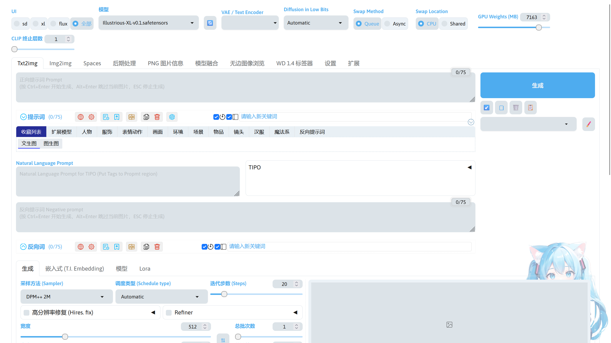

这是 SD WebUI Forge 的界面，因为前基于 SD WebUI，界面操作和 SD WebUI 很相似，使用方法也和 SD WebUI 基本相同，可结合前面的 SD WebUI 教程学习使用。

<!-- TODO: 需要添加从 SD WebUI 教程的引用 -->

!!!note
    SD WebUI Forge 界面使用的翻译扩展：[stable-diffusion-webui-localization-zh_Hans](https://github.com/hanamizuki-ai/stable-diffusion-webui-localization-zh_Hans)


## SD WebUI Forge 共享 SD WebUI 模型
SD WebUI Forge 可以共享 SD WebUI 的模型，如果需要设置共享模型，在绘世启动器的设置里将配置模式调成`高级`，再进入绘世启动器的高级选项，找到`自定义参数选项`，填入以下内容：

```
--forge-ref-a1111-home "SD WebUI 的路径"
```

重新启动 SD WebUI Forge 后即可共享 SD WebUI 的模型。

!!!note
    该自定义参数可参考：[Single cmd arg to reference models in existing A1111 checkout · lllyasviel/stable-diffusion-webui-forge · Discussion #206](https://github.com/lllyasviel/stable-diffusion-webui-forge/discussions/206)。


## 文生图
SD WebUI Forge 顶部的模型选项用于选择 Stable Diffusion 模型，VAE / Text Encoder 用于选择 VAE 模型和文本编码器模型，顶部的其他功能在本章节暂不进行说明。

这里就跟着本章节进行选择，UI 选择 xl，模型选择 Illustrious-XL-v0.1.safetensors，其他选项保持默认即可。

!!!note
    Illustrious XL v0.1 模型下载：[Illustrious-XL-v0.1.safetensors](https://modelscope.cn/models/licyks/sd-model/resolve/master/sdxl_1.0/Illustrious-XL-v0.1.safetensors)。  
    模型下载好后放在`stable-diffusion-webui-forge/models/Stable-diffusion`路径中。

正向提示词描述想要模型画出来的内容，负面提示词描述不想让模型画出来的内容。

这里我的正向提示词描写了画风，人物，环境，镜头和模型支持的质量提示词。

```
fuzichoco,torino aqua,rurudo,qys3,azuuru,miyase mahiro,tsunako,
1girl,solo,very long hair,green hair,ahoge,bangs,hair ornament,four-leaf clover hair ornament,shirt,braid,brown eyes,long sleeves,jacket,white shirt,bow,dress shirt,open clothes,sleeves past wrists,necktie,collared shirt,hood,open jacket,black necktie,hooded jacket,brown jacket,hood down,plaid skirt,pleated skirt,skirt,brown skirt,plaid,
light smile,looking at viewer,closed mouth,holding star,head tilt,reaching out,on roof,
outdoors,night,sky,starry sky,night sky,star \(sky\),glowing,wind,wind lift,landscape,city,building,rooftop,
front view,upper body,close up,
masterpiece,best quality,newest,
```

负面提示词描写不想让模型画出来的内容，下面的负面提示词在大部分情况下都使用，可根据自己的需求进行修改。

```
low quality,worst quality,normal quality,text,signature,jpeg artifacts,bad anatomy,old,early,copyright name,watermark,artist name,signature,
```

!!!note
    Natural Language Prompt 选项框由 [z-tipo-extension](https://github.com/KohakuBlueleaf/z-tipo-extension) 提供，该扩展用于对提示词进行扩写，增强模型的出图效果，在本章节不进行说明。

采样方法和调度类型用于设置生成图片时降噪的方法，不同的采样方法和调度类型搭配存在一些出图效果的区别，可自行测试。这里的采样方法选择 Restatt，调度类型选择 SGM Uniform。

迭代步数用于设置生图过程进行的采样次数，不同的采样方法和调度类型组合需要不同的迭代步数，也需要自行测试。这里的迭代步数设置为 10。

高分辨率修复用于增加图片的分辨率，生成的图片质量，本章节暂不进行说明。

宽度和高度用于设置生成图片时使用的分辨率，这里的宽度和高度分别设置为 1008 和 1344。

提示词引导系数用于设置模型对提示词和图像的匹配程度，不同的模型需要的值都不一样，过高的值可能会导致出图质量下降。这里我设置为 5。

随机数种子用于设置在进行采样前初始噪声的样子，当其他参数不变时，同样的种子将生成同样的噪声，最后生成出来的图将会几乎相同（在像素层面可能存在不同）。这里保持 -1 即可。

参数调整完成后就可以点击右上角的生成，生成结束后在右下方可以看到生成好的图片。


## LoRA 使用
在 Stable Diffusion 模型无法直接实现某些效果时，就可以通过 LoRA 模型来实现。

这里我选择使用 Style: Blue Archive Flat Color 这个 LoRA 调整画风。

!!!note
    Style: Blue Archive Flat Color 下载：[ill-xl-01-aaaki_6-000032.safetensors](https://modelscope.cn/models/licyks/sd-lora/resolve/master/sdxl/character/ill-xl-01-aaaki_6-000032.safetensors)([Civitai](https://civitai.com/models/642656/style-blue-archive-flat-color))。  
    模型下载好后放在`stable-diffusion-webui-forge/models/Lora`路径中。

把 LoRA 模型下载到 SD WebUI Forge 后，点击 LoRA 选项卡并点右上角的刷新按钮后就可以看到刚刚放进去的 LoRA 模型，点击这个 LoRA 模型的选项卡就会把调用 LoRA 的提示词写在正面提示词中。


下面是正面提示词。

```
1girl,solo,very long hair,green hair,ahoge,bangs,hair ornament,four-leaf clover hair ornament,shirt,braid,brown eyes,long sleeves,jacket,white shirt,bow,dress shirt,open clothes,sleeves past wrists,necktie,collared shirt,hood,open jacket,black necktie,hooded jacket,brown jacket,hood down,plaid skirt,pleated skirt,skirt,brown skirt,plaid,
light smile,looking at viewer,closed mouth,holding star,head tilt,reaching out,on roof,
outdoors,night,sky,starry sky,night sky,star \(sky\),glowing,wind,wind lift,landscape,city,building,rooftop,
front view,upper body,close up,
masterpiece,best quality,newest,
<lora:ill-xl-01-Blue_Archive_Official_3:1>,
```

!!!note
    提示词中因为要使用画风 LoRA 的画风，所以把提示词第一行的画风提示词删去。在提示词的最后一行为调用 LoRA 的提示词。

调整好后可以点击生成了，生成完成后可以看到生成图片的画风变成 LoRA 的画风。

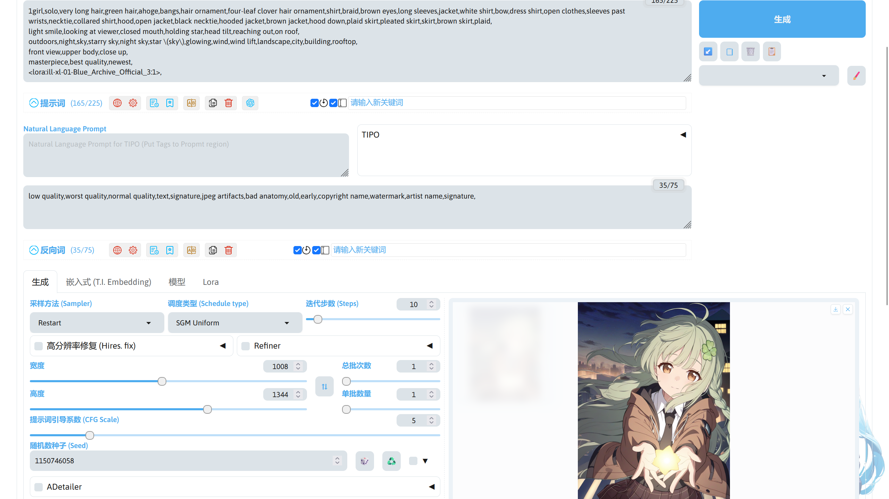

有些 LoRA 模型在使用时需要触发词，这里使用 Character: aaaki 这个人物 LoRA 进行演示。

!!!note
    Character: aaaki 模型下载：[ill-xl-01-aaaki_6-000032.safetensors](https://modelscope.cn/models/licyks/sd-lora/resolve/master/sdxl/character/ill-xl-01-aaaki_6-000032.safetensors)([Civitai](https://civitai.com/models/890177/character-aaaki))。
    模型下载好后放在`stable-diffusion-webui-forge/models/Lora`路径中。  
    在 Civitai 上模型的说明信息中该 LoRA 的触发词为`aaaki`，并且推荐加上`cat ears,animal ears,animal ear fluff,blonde hair,low twintails,twintails,long hair,bow,hair bow,bow hairband,hairclip,round eyewear,glasses,blue eyes,hair ornament,cardigan,breasts,pink dress,pom pom \(clothes\),`这些提示词来提升还原效果。

下载好后按之前的方法调用 LoRA，并且根据 LoRA 模型说明修改提示词。这是修改后的正面提示词。

```
1girl,aaaki,
cat ears,animal ears,animal ear fluff,blonde hair,twintails,blue eyes,low twintails,cardigan,breasts,long hair,bow,hair bow,bow hairband,hairclip,round eyewear,glasses,hair ornament,
holding pillow,pillow hug,sitting,on couch,looking at viewer,light smile,open mouth,one eye closed,head tilt,::3,
couch,indoors,room,desk,vase,flower,light rays,window,curtains,
close up,upper body,
masterpiece,best quality,newest,
<lora:ill-xl-01-aaaki_6:0.6>,<lora:ill-xl-01-Blue_Archive_Official_3>,
```

!!!note
    在第一行中添加了 LoRA 模型要求的`aaaki`触发词，最后一行为该 LoRA 的调用提示词。通常可以使用多个 LoRA 调整 Stable Diffusion 模型的出图效果，比如现在将 Character: aaaki 和 Style: Blue Archive Flat Color 同时使用。

调整好参数后就可以进行图片生成，生成结束后可以看到 2 个 LoRA 可以共同起作用调整出图效果。


## ControlNet 使用
除了使用提示词控制图片的生成，还可以借助 ControlNet 将图片也作为控制图片的条件，和提示词共同控制图片的生成。

提示词写好后，在左下角找到 ControlNet Integrated 选项，勾选一个 ControlNet 单元，在图片导入处可导入用于作为控制条件的图片，这里我使用 ControlNet 的线稿模式控制图片生成，导入一张图片后，控制类型选择 Lineart（线稿），此时预处理器将自动选择成对应线稿的预处理器，ControlNet 模型也会选择对应控制类型的模型，如果没有自动选择，需要点击右侧的刷新，再手动选择对应的 ControlNet 模型。

预处理器用于将导入的图片转换为 ControlNet 模型能够识别的图片，点击 💥 按钮将使用预处理器将导入的图片处理为 ControlNet 可识别的控制图片，处理完整后可以在右侧看到处理好的控制图片。使用不同的预处理器得到的控制图片都不一样，根据需要的效果进行选择。

控制权重用于设置 ControlNet 控制图片生成的强度，该值越高，控制效果越强。Timestep Range 用于设置控制时机，也就是设置 ControlNet 在生图的哪个过程进行控制，

Resolution 设置预处理器处理图片时使用的分辨率，较低的值可能效果不太好，可根据出图时使用的分辨率，适当调高该值，或者使用完美像素模式，此时将根据出图使用的分辨率自动设置 Resolution 为最佳值。

缩放模式用于调整预处理器在处理图片时如何对图片进行缩放。

控制模型设置提示词和 ControlNet 的控制权重。当启用 ControlNet 后，控制图片生成的条件变成了提示词和 ControlNet，根据自己的需求进行选择。

设置完成后，就可以点击生成进行生图了。

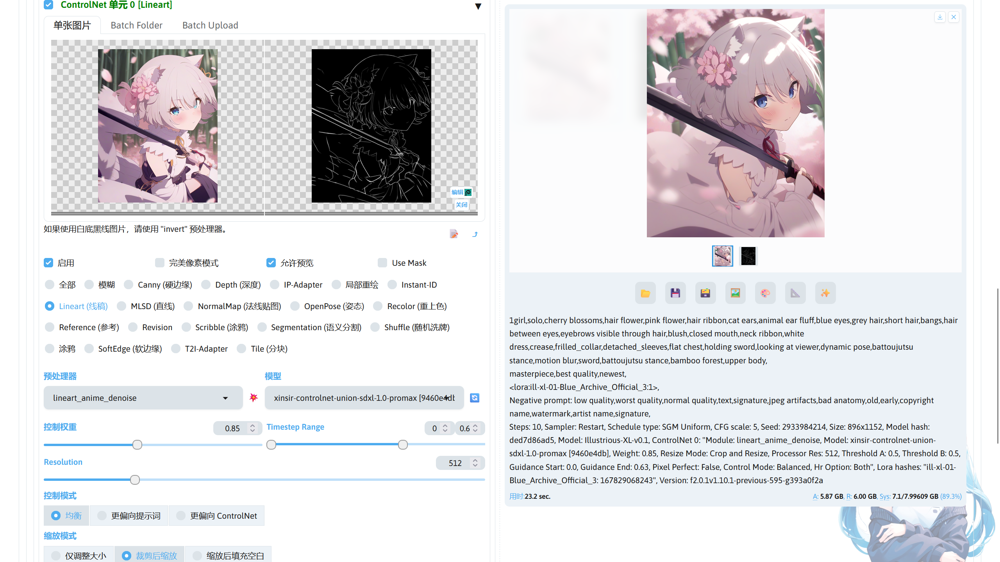


## 图生图
文生图生成的图片可能有需要修改瑕疵的地方，或者想要在原图的基础上修改某些元素，这时候就可以使用图生图来实现。

在图生图界面分有以下几种画布。

- 图生图
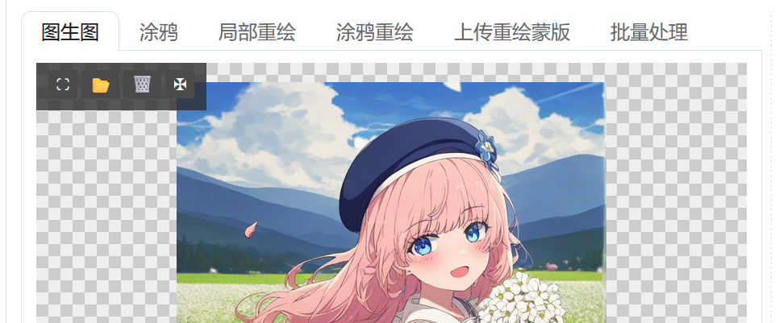

- 涂鸦
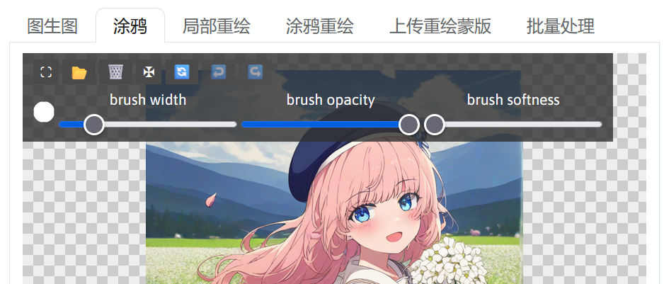

- 局部重绘


- 涂鸦重绘
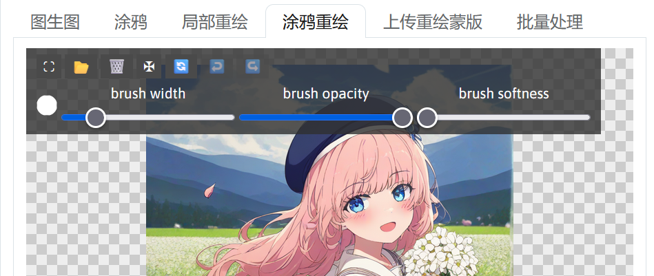

- 上传重绘蒙版


当鼠标在画布上时，画布顶部将显示工具栏，工具栏的功能如下。

|功能|作用|
|---|---|
|⛶|全屏画布|
|📂|选择图片文件上传到画布|
|🗑️|清除画布|
|✠|重置画布位置|
|🔄|重置所有更改|
|↩️|撤销更改|
|↪️|重做更改|
|brush width|画笔的大小，值越高，画笔越大|
|brush opacity|画笔的不透明度，值越高，画笔画的颜色的透明程度更高|
|brush softness|画笔柔软度，值越高，画笔的笔触边缘越柔软|

画布的下方用于设置出图的参数，宽度和高度的比值需要保持和原图宽度和高度的比值相同，如果要快速调整宽度和高度与导入的图片的宽度和高度相同，可以点击 📐 按钮，这将自动设置和导入的图片相同的宽度和高度。

!!!note
    SD WebUI Forge 使用了 Gradio 4 作为前端框架，改善了图生图的画布界面操作等，详见：[Major Update #1: Gradio 4 Engine · lllyasviel/stable-diffusion-webui-forge · Discussion #853](https://github.com/lllyasviel/stable-diffusion-webui-forge/discussions/853)

### 图片放大
在图生图模式下想要放大图片，推荐使用尺寸倍数调整缩放后的分辨率，重绘幅度调整为 0.2~0.4 之间的值。在 SD WebUI Forge 的设置 -> 放大 -> 图生图放大算法中选择合适的放大算法，如 R-ESRGAN 4x+ Anime6B。设置完成后就可以进行图片放大了。

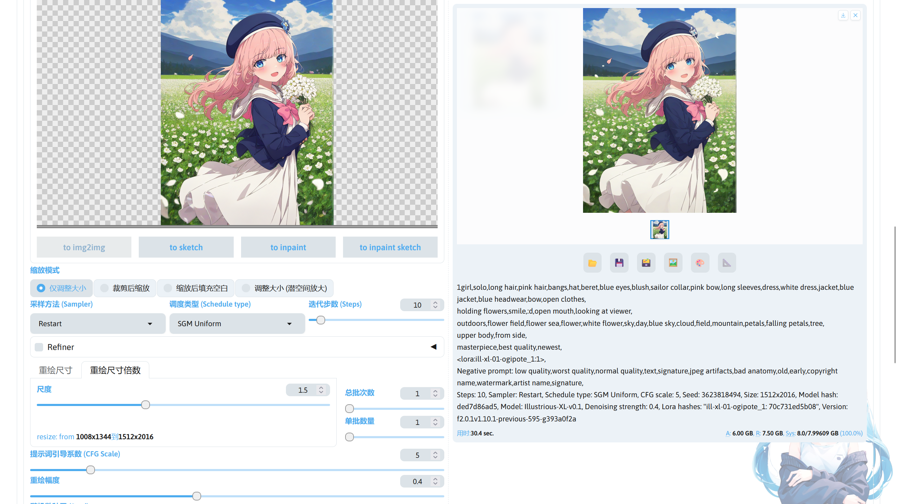

### 局部重绘
如果需要对图片部分内容进行修改，如修手，可以使用局部重绘或者涂鸦 + 局部重绘的方式进行修改，这里演示使用涂鸦 + 局部重绘进行修手。

进入涂鸦画布中，导入一张想要修复手指的图片，这张图片的手存在一些问题，所以可以通过简单的涂鸦进行修改。

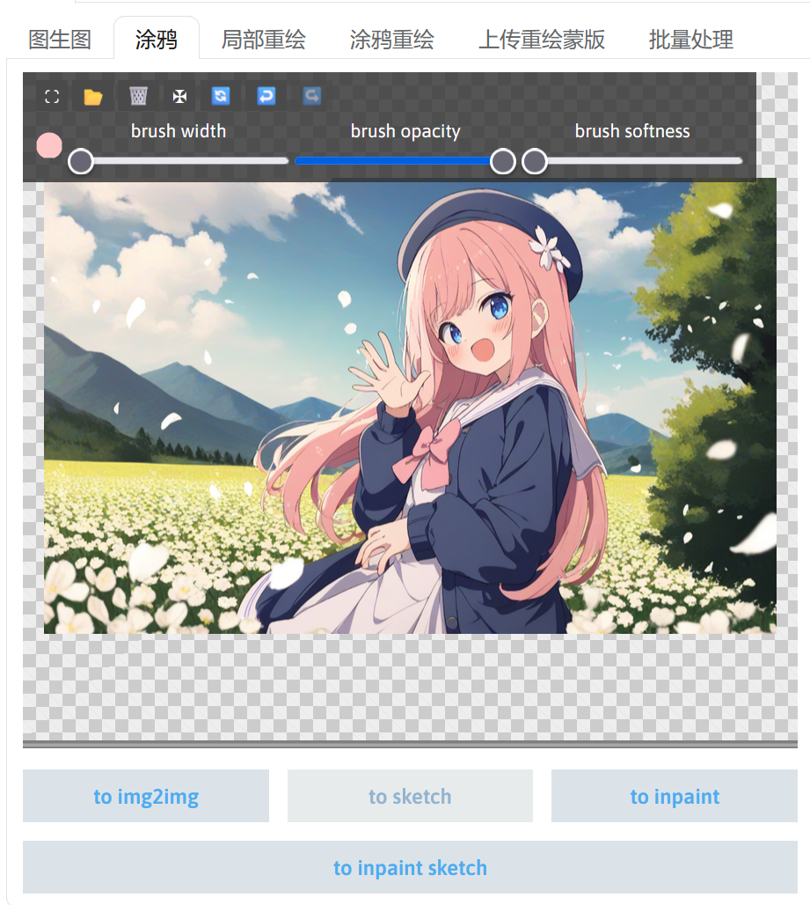

在画布工具栏左上角点击最左边的圆形按钮可以进入画笔颜色调整功能。

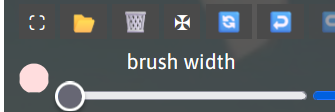

在画笔颜色调整界面中可以根据自己的需求选择画笔的颜色，选择完成后点击确定应用画笔颜色。

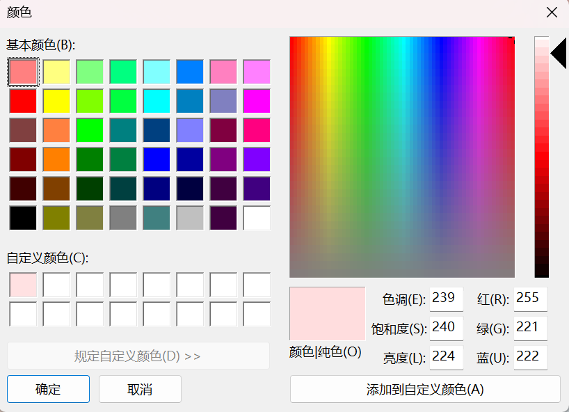

使用画笔对需要修改的地方进行简单的涂鸦，可以不需要很精细，因为在对图片进行图生图时 AI 将参考原图进行图片生成（需要合适的重绘幅度），涂鸦完成后可以点击 to inpaint 将涂鸦好的图片发送至局部重绘画布。

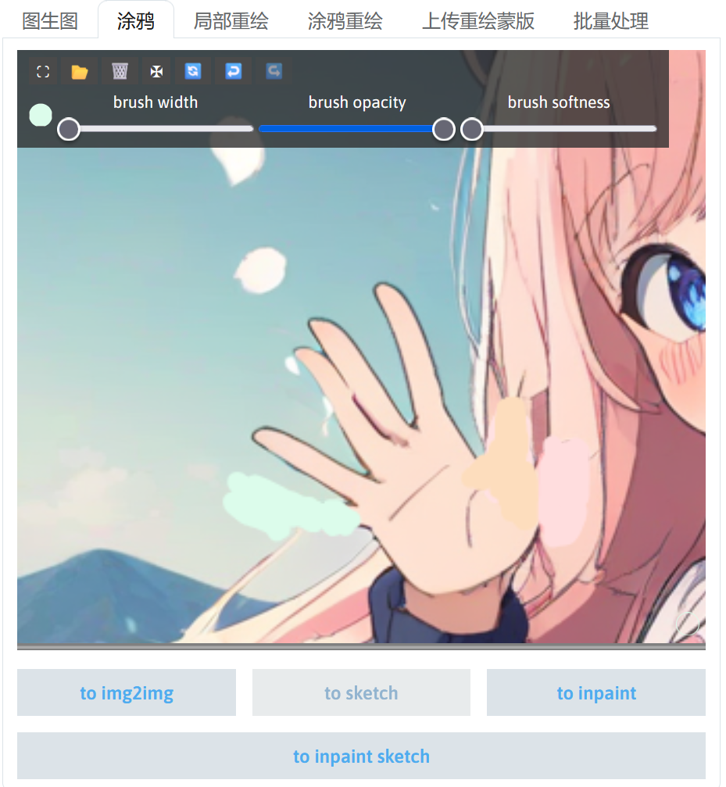

在局部重绘画布中，使用画笔为刚刚涂鸦的部分涂上蒙版。


提示词写上对图片内容的描述，蒙版模式选择重绘蒙版内容后可以点击生成进行图片重绘。

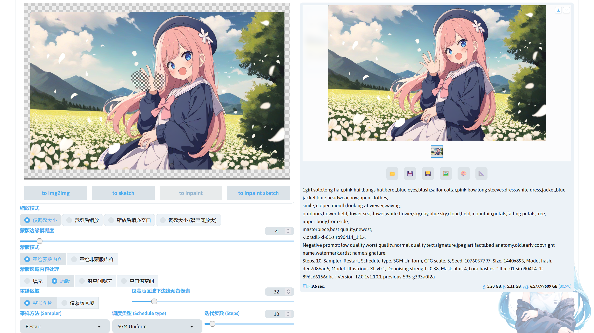

### 使用蒙版图片
蒙版除了可以通过局部重绘画布进行绘制，还可以直接使用蒙版图片，

这里我准备了要进行重绘的图片和蒙版图片，蒙版图片可通过插件或者图片编辑软件进行制作，计划将人物的背景进行重绘，进入上传重绘蒙版功能，将进行重绘的图片和蒙版图片分别导入。


提示词描写人物和要重绘成的背景，在蒙版模式选择重绘非蒙版内容，就可以点击生成对图片背景进行重绘。

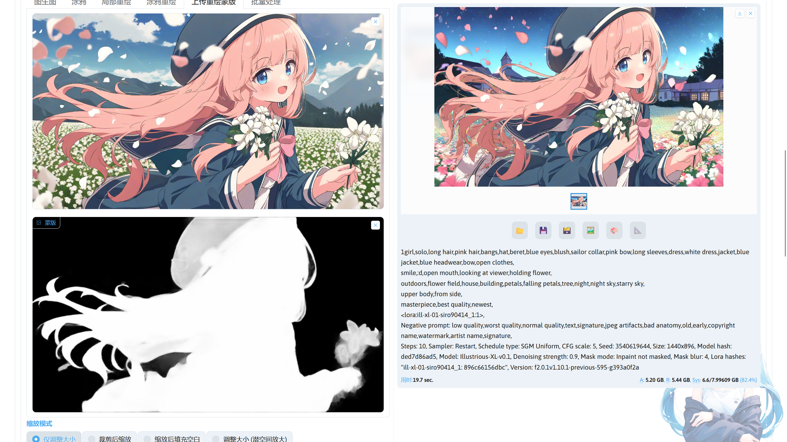