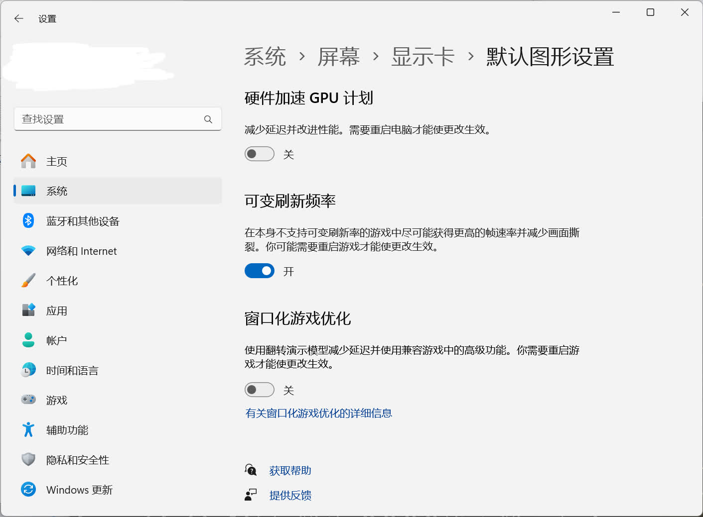

# 杂项
这里是其他的教程。


## 安装 Linux 系统
参考该教程：[Linux系统安装原来这么容易？还能与Windows系统共存？手把手教你安装_哔哩哔哩_bilibili](https://www.bilibili.com/video/BV1Dj421X7XZ)

***

## 重装 Windows 系统
1. 前往 [Windows 11](https://www.microsoft.com/zh-cn/software-download/windows11) 系统官网下载系统镜像。
2. 下载完成后右键镜像文件，选择挂载。
3. 在挂载好的镜像中找到 setup 程序，双击打开。
4. 根据安装程序的提示进行重装系统。

***

## 解决 Windows 系统出现程序乱码
这可能是 Windows 系统中启用了 UTF 8 编码，但是部分比较老的程序并不支持 UTF 8，所以导致的乱码，可以按照下列方法解决。

1. 按下`Win + R`键，输入`control`后回车启动控制面板。
2. 点击`时钟和区域`->`区域`
3. 在弹出的区域设置窗口中点击顶部的`管理`，再点击`更改系统区域设置`.
4. 在弹出的窗口中将`使用 Unicode UTF-8 提供全球语言支持`取消勾选，然后一直点击确定保存设置，并重启电脑。

***

## 激活 Windows 系统
1. 按下`Win + R`键，输入`powershell`后回车启动 PowerShell。
2. 输入下面的命令启动 [Microsoft-Activation-Scripts](https://github.com/massgravel/Microsoft-Activation-Scripts)。
```
irm https://get.activated.win | iex
```
3. 在 Microsoft-Activation-Scripts 启动完成后将弹出一个窗口，这时候按下键盘的 1 使用 HWID 激活方法
4. 激活完成后将显示绿色的提醒，这时候就是激活完成了，显示 press any key to Go back ... 时就可以把窗口关闭。

***

## 查看跑图时显卡的占用
使用 Nvidia 显卡跑图时，任务管理器显示的显卡占用信息并不准确，这时需要将占用信息显示改成 CUDA。


如果没有看到这个选项，则需要在 Windows 设置中关闭硬件加速 GPU 计划。



!!!note
    关闭硬件加速 GPU 计划后将无法使用 DLSS 3 技术提升游戏画面体验。

***

## 调整虚拟内存
1. 按下`Win + R`快捷键，输入`sysdm.cpl`，回车运行，打开`高级系统设置`
2. 在打开的窗口中，点击`高级`选项卡下`性能`选项组的`设置`按钮
3. 打开性能选项窗口后，点击`高级`选项卡中的`更改`按钮
4. 在打开的窗口中，首先取消勾选`自动管理所有驱动器的分页文件大小`
5. 接下来选择`自定义大小`，然后手动设置初始大小以及最大值，建议初始值为 10240，最大值为 30720（或者更高的值，但不能超过系统可设置的最大虚拟内存的值）。设置完后，先点`设置`，然后点击`确定`按钮保存设置，设置好后重启电脑。

!!!note
	虚拟内存速度远低于物理内存，如果条（钱）件（包）允许，请优先考虑升级物理内存容量。

***

## 显示隐藏的文件和文件后缀名
在文件管理器中点击`查看`->`显示`，勾选`文件扩展名`和`隐藏的项目`。


***

## 浏览器推荐
- Microsoft Edge：https://www.microsoft.com/zh-cn/edge/download
- Chrome：https://www.google.cn/chrome
- Firefox：https://www.mozilla.org/zh-CN/firefox/all/#product-desktop-release

***

## 解压缩软件推荐
- 7-Zip：https://7-zip.org
- Bandizip：https://www.bandisoft.com/bandizip

***

## Microsoft Visual C++ 库
有些软件需要安装 Microsoft Visual C++ 库才能正常运行，所以需要在 [Microsoft Visual C++ 官网](https://learn.microsoft.com/zh-CN/cpp/windows/latest-supported-vc-redist?view=msvc-170)下载 [Microsoft Visual C++](https://aka.ms/vs/17/release/vc_redist.x64.exe) 运行库。

***

## 安装 Visual Studio 生成工具
有些软件包的安装需要编译后才能安装，所以需要安装编译工具（生成工具）。这里介绍如何安装  Visual Studio 生成工具。

1. 前往 [Visual Studio](https://visualstudio.microsoft.com/zh-hans/downloads/) 官网，在`所有下载`中展开`用于 Visual Studio 的工具`选项，找到`Visual Studio 2022 生成工具`后点击旁边的下载。
2. 双击打开下载好的安装包，在弹出的窗口中选择继续，等待 Visual Studio Installer 安装完成。
3. Visual Studio Installer 安装完成后将弹出安装生成工具的选项，勾选`使用 C++ 的桌面开发`，再点击右下角的安装，等待安装完成。

***

## 设置 Pip 镜像源
打开终端，输入下面的命令。

```bash
pip config set global.index-url "https://mirrors.cloud.tencent.com/pypi/simple"
pip config set global.find-links "https://mirror.sjtu.edu.cn/pytorch-wheels/torch_stable.html"
```

***

## 更新显卡驱动
根据自己的显卡型号进入对应的显卡驱动官网，下载并安装驱动。

Nvidia 驱动下载：https://www.nvidia.cn/geforce/drivers  
AMD 驱动下载：https://www.amd.com/zh-hans/support  
Intel 驱动下载：https://www.intel.cn/content/www/cn/zh/download-center/home.html

视频版教程：[一看就会，教你更新Intel、AMD、Nvidia驱动_哔哩哔哩_bilibili](https://www.bilibili.com/video/BV1Mq4y197yZ)

***

## 在终端中设置代理
在终端中设置代理需要知道代理协议、IP、端口，再组成`<代理协议>://<IP>:<端口>`这个代理地址格式。

IP 一般为`127.0.0.1`，而代理协议和端口可在代理软件中查看。

得到代理地址后，比如`http://127.0.0.1:10809`，就可以根据不同的终端设置代理。

- CMD

```
set HTTP_PROXY=http://127.0.0.1:10809
set HTTPS_PROXY=http://127.0.0.1:10809
set no_proxy=localhost,127.0.0.1,::1
```

- PowerShell

```
$env:HTTP_PROXY="http://127.0.0.1:10809"
$env:HTTPS_PROXY="http://127.0.0.1:10809"
$env:NO_PROXY="localhost,127.0.0.1,::1"
```

- Bash / Zsh / \<Other UNIX Shell\>

```
export http_proxy="http://127.0.0.1:10809"
export https_proxy="http://127.0.0.1:10809"
export no_proxy="localhost,127.0.0.1,::1"
```

!!!note
    设置 no_proxy 变量是为了避免本地的 IP 也使用代理。

