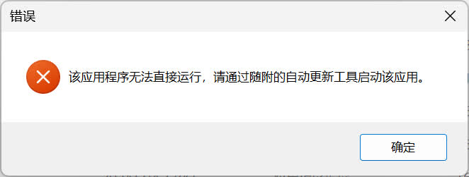
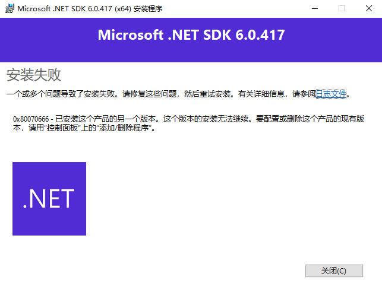

# 绘世启动器
这里是有关绘世启动器的报错收集，建议阅读绘世启动器的启动流程，有助于解决一些报错问题。

!!!notice
    绘世启动器的启动流程：[简述 - 绘世启动器 - SD Note](../sd_launcher/index.md#_3)

## You must install .NET Desktop Runtime to run this application

这是因为系统中未安装绘世启动器需要的 .NET 6.0 依赖（或已安装但低于要求的版本），点击弹窗提示的`是`可跳转到绘世启动器的依赖下载地址，下载并安装依赖后重新打开绘世启动器。

***

## 绘世启动器无法打开
这是因为 Intel 核显驱动的问题导致绘世启动器崩溃。可选择以下其中一种解决方法。

1. 将 Intel 核显驱动更新到3月27的版本(31.0.101.5382)
2. 将绘世启动器的文件名中的中文名删去
3. 开启独显直连
4. 禁用 Intel 核显驱动

参考：[记 Intel 的 31.0.101.5186 版本驱动带崩 WPF 程序](https://blog.lindexi.com/post/%E8%AE%B0-Intel-%E7%9A%84-31.0.101.5186-%E7%89%88%E6%9C%AC%E9%A9%B1%E5%8A%A8%E5%B8%A6%E5%B4%A9-WPF-%E7%A8%8B%E5%BA%8F.html)

***

## 打开绘世启动器时显示更新失败

网络问题，将绘世启动器的更新窗口关闭，并重新打开绘世启动器，可多尝试几次。或者尝试开启代理软件，再打开绘世启动器。

***

## 检测到无效配置，提示未安装任何版本的 PyTorch 软件包

前往绘世启动器的`高级选项`->`环境维护`->`安装 PyTorch`，安装对应版本的 PyTorch。参看[环境维护 - 安装 PyTorch - SD Notes](../sd_launcher/advance/env.md#pytorch)。

***

## 您的 Windows 未启用长路径支持

直接点`是`。

!!!note
    Windows 10 家庭版 可能无法通过点击`是`正确的解决该问题。

***

## 启动器已检测到内核文件，但无法找到与之对应的版本信息

整合包损坏了，请重新解压。

***

## 需要安装核心组件，提示无法找到启动所需的 Python 组件

这是因为缺少了 Python，点击下列其中一个选项安装 Python。

***

## 扩展安装失败

检查你的网络是否正常，如果正常，可尝试配置绘世启动器的代理。

***

## 配置绘世启动器的代理
代理可用于解决因为无法访问 HuggingFace 等地址导致报错的问题，但在配置代理前，请确保你有一个可以使用的代理。

根据代理软件的代理模式，大致分为两种配置代理的方式，一种是有`TUN模式/虚拟网卡模式`这种的代理软件，另一种是不带这种模式的代理软件，所以需要根据不同的模式来配置启动器的代理。

这是某个代理软件的部分界面，可以看到这个代理软件的代理端口，并且这个代理软件支持使用 TUN 模式，所以支持两种方式来配置绘世启动器的代理，接下来根据这个代理软件来配置代理。

!!!note
    不同的代理软件所使用的代理端口和是否支持 TUN 模式的情况都不同，所以配置代理的方式和某些参数并不一样。

### 有 TUN 模式 / 虚拟网卡模式的代理软件

打开代理软件的开关后，把 TUN 模式打开（在上面的软件为`启用 Tun 模式`）。

!!!note
    有些代理软件的模式默认是虚拟网卡模式，这种模式可以让所有软件都走代理，所以启用代理软件后无需调整代理软件的其他设置。而 TUN 模式实际上就类似虚拟网卡模式，只不过需要手动打开。

然后打开绘世启动器的设置，把 PyPI 国内镜像、Git 国内镜像、Huggingface 国内镜像、替换扩展列表链接这 4 个按钮关上。

配置好后的设置如下。

!!!note
    有 TUN 模式 / 虚拟网卡模式的代理软件也可以用下面的方法来配置绘世启动器的代理。如果该方法无法配置代理，请使用下面的方法来配置代理。

### 无 TUN 模式 / 虚拟网卡模式的代理软件
打开代理软件的开关并启用代理软件的系统代理模式（在上面的软件中是在系统代理选项选择自动配置系统代理）后，打开绘世启动器的`设置` -> `代理设置`，这时候就可以看到代理服务器地址自动填上了，把将代理应用到 Git、将代理应用到 Pip、将代理应用到环境变量、将代理应用到模型下载这 4 个按钮打开。

!!!note
    这里的代理服务器地址为`http://127.0.0.1:10809`，这个地址的代理协议和代理端口和上面的代理软件的截图一致。如果不一致时，可以点击代理服务器地址输入框右侧的`x`按钮将代理服务器地址清空，这时绘世启动器将重新读取代理服务器地址。

再把 PyPI 国内镜像、Git 国内镜像、Huggingface 国内镜像、替换扩展列表链接这 4 个按钮关上。

配置好后的设置如下。

### 取消配置绘世启动器代理
打开绘世启动器的`设置` -> `代理设置`，把将代理应用到 Git、将代理应用到 Pip、将代理应用到环境变量、将代理应用到模型下载这 4 个按钮关闭，再把 PyPI 国内镜像、Git 国内镜像、Huggingface 国内镜像、替换扩展列表链接这 4 个按钮打开。

配置好后的设置如下。

!!!note
    哔哩哔哩专栏版教程：[网络错误？下载失败？配置绘世启动器的代理服务器！ - 哔哩哔哩](https://www.bilibili.com/read/cv33230985)

有关绘世启动器的代理设置说明：[启动器设置 - 代理设置 - SDNote](../sd_launcher/other/setting.md#_5)

!!!note
    绘世启动器的代理设置需要和代理软件相互配合，所以当代理软件关闭后，需要将绘世启动器的代理设置关闭，否则将出现绘世启动器无法连接网络的问题。

***

## 当前 Python 环境被设置到了 PATH 环境变量中，这可能导致环境意外损坏
在打开绘世启动器的高级选项后，在绘世启动器的顶部看到`当前 Python 环境被设置到了 PATH 环境变量中，这可能导致环境意外损坏`这个警告。

这是因为绘世启动器检测到当前使用的 Python 被添加到环境变量中，需要根据下面的方法消除这个提示。

1. 按下 Win + R 快捷键，在弹出的窗口输入`sysdm.cpl`，点击`确定`启动`系统属性`
2. 在弹出的系统属性窗口中，点击顶栏的`高级`，再点击下方的`环境变量`进入环境变量编辑界面。在这个界面中可以看到用户变量和系统变量，而且都有一个叫`Path`的环境变量，双击这个`Path`就可以进入 PATH 环境变量的编辑界面。

3. 我的绘世启动器放在`D:\Downloads\sd-webui-aki-v4.6`这个路径里，所以需要在两个`Path`里寻找这个路径（根据自己的路径来找）。

这里找到了`D:\Downloads\sd-webui-aki-v4.6\python`和`D:\Downloads\sd-webui-aki-v4.6\python\Scripts`两个路径，点击选中这个路径，再点击旁边的删除，依次把这两个路径删掉。删完后一直点确定来保存设置。删除完成后重启绘世启动器，此时这个警告消息就消失了。

!!!note
    哔哩哔哩专栏版教程：[用绘世启动器时提示Python被添加到PATH？如何解决？ - 哔哩哔哩](https://www.bilibili.com/read/cv33232734)。

***

## 使用绘世启动器修复损坏的 SD WebUI / ComfyUI / ... 环境
当 SD WebUI / ComfyUI / ... 遇到比较严重的环境问题导致无法正常启动时，这时可以通过绘世启动器的功能来重建环境，避免重新部署新的 SD WebUI / ComfyUI / ... 并迁移文件的步骤。

### 使用绘世启动器部署的

1. 打开绘世启动器，点击`高级选项` -> `环境维护` -> `原生组件管理`，这里可以看到 Python、Git、Ffmpeg，将 Python 和 Git 卸载，卸载完成后不要关闭绘世启动器。

2. 在绘世启动器所在目录中，找到`.ext`文件夹，进入这个文件夹后将`Lib`文件夹删除。

!!!note
    如果没有看到`.ext`文件夹，需要将 Windows 文件管理器的显示隐藏文件功能打开。  
    Windows 11：点击文件管理器上方工具栏的`查看` -> `显示`，勾选`隐藏的项目`
    Windows 10：点击文件管理器上方工具栏的`查看`，勾选`隐藏的项目`

3. 回到绘世启动器的原生组件管理，将 Python 和 Git 重新安装。
4. 安装完成后，点击环境维护的安装 PyTorch，重新安装 PyTorch，PyTorch 版本如何选择可以参考：[环境维护 - 安装 PyTorch - SD Note](../sd_launcher/advance/env.md#pytorch)

### 使用整合包部署的

1. 打开绘世启动器，点击`高级选项` -> `环境维护` -> `原生组件管理`，留着备用（不要关）。
2. 在绘世启动器的所在目录中找到`python`（早期的整合包为`py310`）和`git`文件夹并删除。
3. 回到绘世启动器的原生组件管理，安装 Python 和 Git。
4. 安装完成后，点击环境维护的安装 PyTorch，重新安装 PyTorch，PyTorch 版本如何选择可以参考：[环境维护 - 安装 PyTorch - SD Note](../sd_launcher/advance/env.md#pytorch)

!!!note
    1. 修复环境完成后的第一次启动需要一定时间，这是正常现象。
    2. 整合包部署的 SD WebUI / ComfyUI / ... 按照上面的步骤修复完成后，其运行环境就和绘世启动器部署的一样了，如果之后需要再次修复，需要按照绘世启动器部署的修复方法来操作。

!!!note
    哔哩哔哩专栏版教程：[SD-WebUI、ComfyUI环境坏了，启动不了，绘世启动器来帮你修复 - 哔哩哔哩](https://www.bilibili.com/read/cv32989957)

***

## 端口已被占用

请先检查您是否已经启动 SD WebUI，如果没有可选择[前往高级选项更改监听端口](../sd_launcher/advance/index.md#_12)，或者尝试终止占用端口的进程。

***

## 由于找不到 zlib.dll，无法继续执行代码

如果您是整合包用户，请前往绘世启动器的`高级选项`->`环境维护`->`原生组件管理`，将 Python 卸载，并重启绘世启动器。

该弹窗也可以忽略，这并不会影响正常使用。

!!!note
    关于原生组件的介绍：[环境维护 - 原生组件管理 - SD Notes](../sd_launcher/advance/env.md#_3)。

***

## 该应用程序无法直接运行，请通过随附的自动更工具启动该应用

这是因为你在绘世启动器的数据文件夹`.launcher`中运行绘世启动器，请使用`.launcher`文件夹外的绘世启动器来运行。

***

## 安装绘世启动器的依赖时显示已安装这个产品的另一个版本
在安装绘世启动器的依赖（.NET SDk）时显示安装失败，提示已安装这个产品的另一个版本，

这说明你不再需要安装绘世启动器的依赖了。因为在 Windows 系统中已存在绘世启动器的依赖，所以可直接打开绘世启动器并使用。

***

## 打开绘世启动器时出现未知错误，报错显示'The process cannot access the file because it is being used by another process'
这是因为你多次点击绘世启动器的图标，导致同时启动了多个绘世启动器，造成绘世启动器的某个文件被同时占用，导致绘世启动器崩溃。

这个问题只需要通过双击鼠标左键来打开绘世启动器就行，不要多次点击绘世启动器图标。如果要多开多个绘世启动器，请等待第一个绘世启动器完全启动后再打开第二个绘世启动器。

***

## 绘世启动器提示体验降级，显示'启动器无法加载增强体验模块...你可能正在使用不收完整支持的 Python 组件结构'
在绘世启动器的高级选项中提示“启动器无法加载增强体验模块，这将导致如默认浏览器指定、Huggingface 镜像及环境完整性检测等部分功能无法正常工作，你可能正在使用不收完整支持的 Python 组件结构”。

这是因为使用了嵌入式 Python 而不是完整的 Python，这个问题常出现在 ComfyUI 官方整合包中，如果要解决这个问题，请使用秋葉aaaki制作的 ComfyUI 整合包或者使用绘世启动器部署 ComfyUI。
