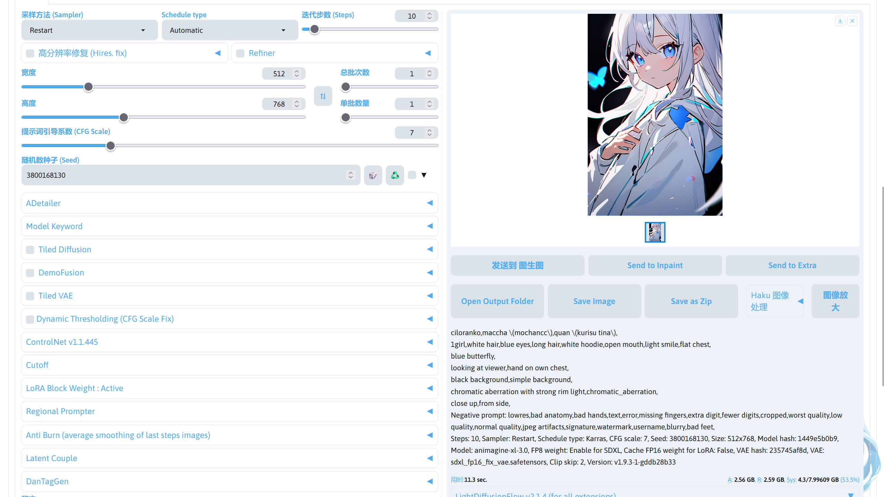
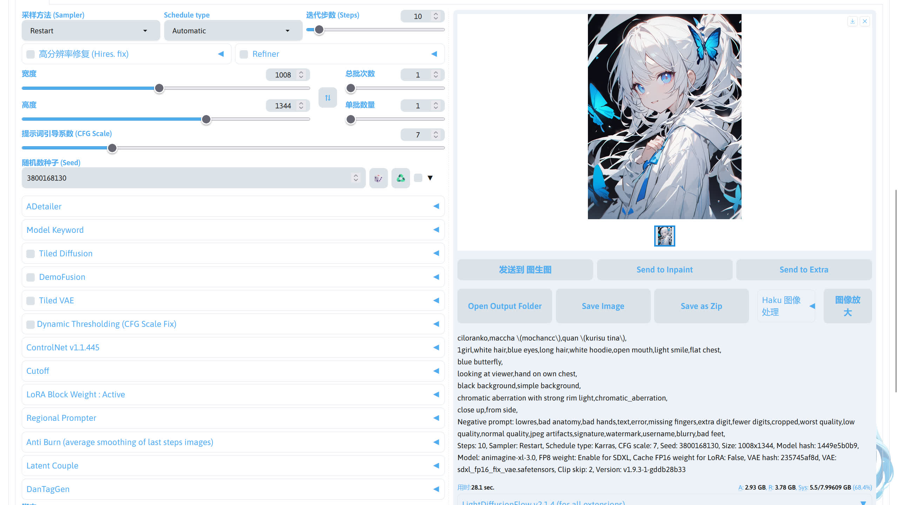
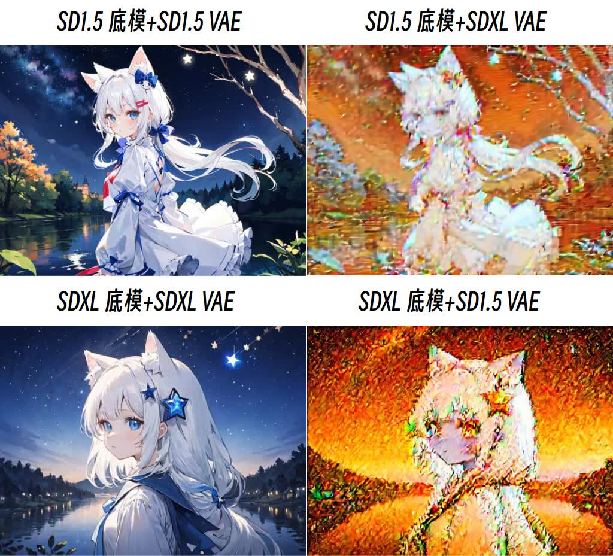
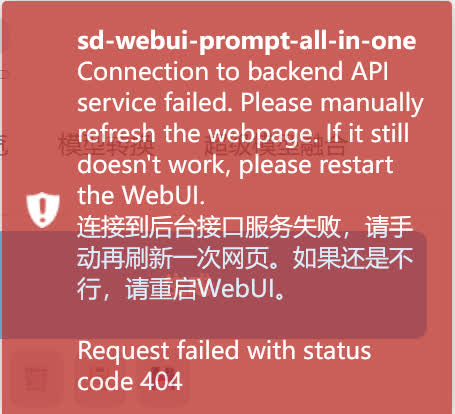
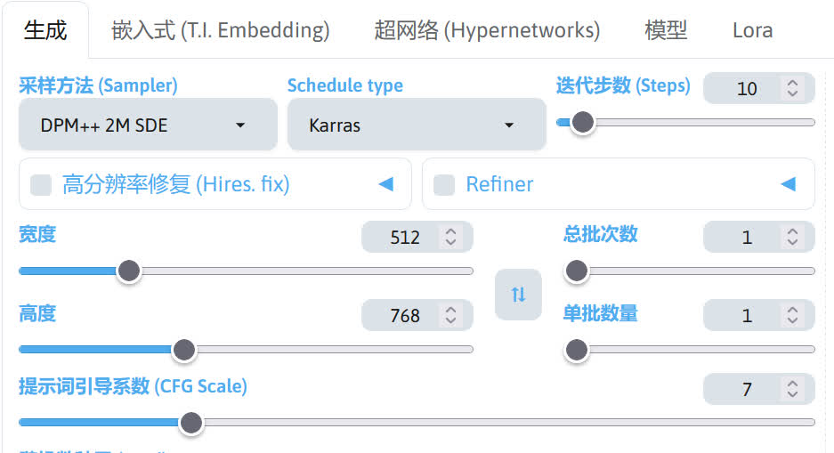
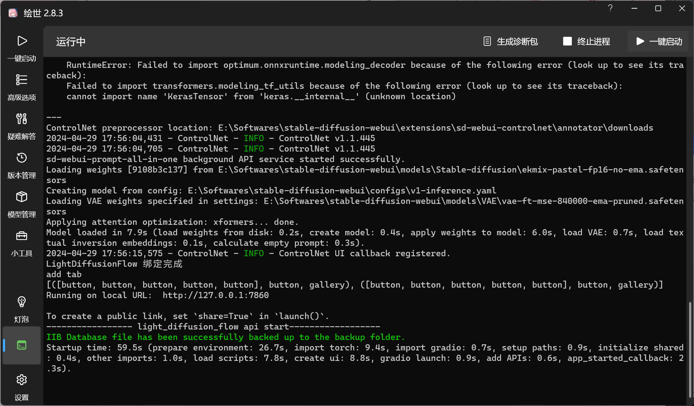

# SD WebUI
这里是有关 SD WebUI 的报错收集。

## 部署
如果还没有安装 SD WebUI，请根据下面的文档进行安装。

- [绘画指南 - 部署 - Windows 平台](../guide/install/index.md)


## 版本区分
很多人不知道 4.8，2.8.3，1.9.3，1.5，XL 这些版本哪个是最新的，下面做个简单的解释。

- 整合包 sd-webui-aki-v4.x

4.8 指的是秋葉整合包的版本，像之前的4.7，4.6也是属于整合包的版本。

- 绘世启动器 2.8.x

在打开绘世启动器后，左上角显示的 绘世 2.8.3 为绘世启动器的版本。在使用整合包时，或者使用绘世启动器部署的环境时，只有绘世启动器是自动更新的

- SD WebUI 1.9.x

平时跑图时所看到的界面是 SD WebUI 提供的，而 1.9.3 指的是 SD WebUI 的版本，在绘世启动器的`版本管理`->`内核`所看的 1.9.3 指的也是 SD WebUI 的版本。

- Stable Diffusion 1.5 / XL

平常下载模型的时候总会看到 1.5、XL 这些版本，这里指的是模型基于 Stable Diffusion 1.5 / XL 模型进行训练 / 融合。在跑图的时候，使用的大模型就是 Stable Diffusion 模型。

这里把 Stable Diffusion 简称 SD，[Stability AI](https://stability.ai) 目前推出的 SD 版本有 1.4、1.5、2.0、2.1、XL，在之后将会发布 SD 3，


## 整合包、绘世启动器、SD、SD WebUI 的关系
整合包就是将 SD WebUI（内核），SD 模型、绘世启动器（作为启动 SD WebUI 的工具）和一些常用的扩展打包在一起，实现开箱即用。

SD WebUI 是基于 SD 进行制作的 WebUI 界面，用于方便的使用 SD 这个模型。

而绘世启动器是管理、启动 SD WebUI 的工具，在进行跑图的所使用的界面是 SD WebUI 而不是 绘世启动器。

!!!note
    绘世启动器和 SD WebUI 的关系可以看作 PCL2 启动器和 Minecraft 的关系，所以绘世启动器 ≠ SD WebUI。


## 为 SD WebUI 安装扩展
为 SD WebUI 安装扩展有几种方式。

1. 使用绘世启动器的版本管理：在绘世启动器的`版本管理`->`安装新扩展`，在扩展列表中选择扩展安装或者输入扩展地址进行安装。
2. 使用 SD WebUI 的扩展管理：在 SD WebUI 的扩展选项中安装。
3. 使用 Git 命令：在 stable-diffusion-webui/extensions 目录下使用`git clone 扩展地址`命令安装。
4. 手动从 Github 下载压缩包：在 Github 扩展项目中下载扩展的压缩包并解压到 stable-diffusion-webui/extensions 目录中。（极不推荐！！！）

在安装和使用扩展前，请仔细阅读扩展作者的说明文档，并按照扩展作者的说明进行操作！！！

***

## CUDA kernel errors might be asynchronously reported at some other API call,so the stacktrace below might be incorrect
如果报错信息中有 Out Of Memory，那就是炸显存了，重新调整参数后再试。如果没有，可尝试以下方法解决。

1. 重装 PyTorch
2. 重装显卡驱动
3. 重装对应显卡版本的整合包

如果以上方法都试过了，可能显卡出现了问题。


## Can't send data when our state is ERROR
刷新浏览器网页即可。


## CUDA Out Of Memory
显存炸了，尝试启用 Tiled VAE，或者将生图的分辨率降低。如果使用 ControlNet 扩展，可以在 ControlNet 的选项卡勾上低显存模式。


## RuntimeError Sizes of tensors must match
图像的分辨率不是 8 的倍数，需重新调整。


## ModuleNotFoundError: No module named 'tqdm.auto'
1、启动器的`版本管理`->`扩展`，卸载 Temporalkit 扩展。

2、启动器的`高级选项`，点右上角的`启动命令提示符`。

3、依次输入下面两条命令。
```bash
python -m pip uninstall tqdm -y
python -m pip install tqdm
```
4、重启 SD WebUI


## Cannot connect to proxy
前往绘世启动器的`设置`->`代理设置`，检查代理服务器地址是否和代理软件的地址对应，如果无误，检查代理软件是否打开，或者代理软件的节点是否可用。

!!!note
    部分代理软件内默认显示的端口号为socks5协议的端口号，一般情况下http协议端口号为socks5端口号+1。


## Connection timed out / Connection was Reset
网络不稳定，尝试更换其他网络，或者配置代理。

!!!note
    有些报错也和网络问题有关，比如报错中有`Internet`、`connection`、`ConnectTimeout`这些关键词，或者是`由于目标计算机积极拒绝，无法连接` / `信号灯超时时间已到`，就有可能是网络问题。配置绘世启动器的代理参看：[绘世启动器 - 配置绘世启动器的代理 - SD Note](../help/sd_launcher.md#_6)


## 提示词输入框不见了


确认这个按钮是否勾上了。


## 生成按钮下面的保存预设按钮不见了
在 SD WebUI 1.6 之后，这个功能被移到旁边的画笔按钮中，如果想恢复按钮，可以尝试安装 [sd-webui-boomer](../guide/use/extra.md#_7) 扩展。


## 图片颜色变得奇怪
可能是提示词 / 分辨率 / 使用的 LoRA 模型有问题，尝试调整后再生图。

这里用 [Animagine XL 3](https://huggingface.co/cagliostrolab/animagine-xl-3.0) 举例。

- 使用不合适的分辨率



- 使用合适的分辨率




## 预览图是正常的，但是出图后图片变花
这是你的大模型和 VAE 模型不匹配，将 VAE 模型改成对应大模型版本的模型，或者 VAE 模型选择无。



!!!note
    对应版本的 VAE 模型下载：  
    SD 1.5：[vae-ft-mse-840000-ema-pruned.safetensors](https://modelscope.cn/api/v1/models/licyks/sd-vae/repo?Revision=master&FilePath=sd_1.5%2Fvae-ft-mse-840000-ema-pruned.safetensors)  
    SDXL：[sdxl_fp16_fix_vae.safetensors](https://modelscope.cn/api/v1/models/licyks/sd-vae/repo?Revision=master&FilePath=sdxl_1.0%2Fsdxl_fp16_fix_vae.safetensors)


## stderr: fatal: ambiguous argument 'HEAD': unknown revision or path not in the working tree
`repositories`里的文件出现损坏，将 SD WebUI 下的`repositories`文件夹删掉后重启 SD WebUI。


## modules.sysinfo has no attribute format_exception
尝试下载最新的整合包并部署。


## [WinError 10054]远程主机强迫关闭了一个现有的连接
网络问题，尝试配置代理，或者检查代理是否配置正确。

!!!note
    配置绘世启动器的代理参看：[绘世启动器 - 配置绘世启动器的代理 - SD Note](../help/sd_launcher.md#_6)


## Error! in sd webui 1.5, composable-lora not support with sd-webui-lycoris extension
请卸载 a1111-sd-webui-lycoris 扩展（如果安装了 a1111-sd-webui-locon 扩展，也卸载），该扩展会导致 SD WebUI 出图速度变慢。

有关该扩展的说明：https://www.bilibili.com/opus/900927097529171969


## [Errno 2] No such file or directory
可能你填写的路径有误导致无法找到文件，请检查后路径是否正确后再重试。


## ModuleNotFondError: no module named '_socket'
在使用旧版整合包 + 某些扩展就会出现这个问题，尝试下载最新的整合包并部署。


## A tensor with all NaNs was produced in Unet / VAE
这是因为当前的生图参数（提示词 / 分辨率 / 种子 / ...）匹配上了一张无法表示的图，所以造成了黑图。可尝试调整生图参数再次进行生图。

如果经常出现黑图，可以前往绘世启动器的高级选项，在[计算精度设置](../sd_launcher/advance/index.md#_5)中关闭对应的半精度优化，但这只是缓解措施，并且会显著增加显存的占用。

最好的方法是使用排除法找出出现问题的模型，并更换掉。

1. 检查是否使用了 LoRA，如果用了，尝试去除后是否解决问题。
2. 问题未解决，检查是否 ControlNet，并尝试关闭。如果问题解决，说明 ControlNet 模型出问题，需要重新下载 ControlNet 模型。
3. 如果问题还是没有解决，则尝试更换大模型 / VAE，如果更换后解决了问题，则说明是大模型 / VAE 的问题。

## Expected all tensors to be on the same device, but found at least two devices, cpu and cuda:0!
尝试重启 SD WebUI，如果未解决，尝试禁用一些扩展。


## The size of tensor a (96) must match the size of tensor b(250) at non-sinaleton dimension 3
可能有以下原因。

1. Lora 模型和大模型版本不匹配。
2. 扩展和 SD WeUI 未更到最新版本，请在绘世启动器的版本管理中进行更新。


## Torch is not able to use GPU
PyTorch 未正确安装 / 版本和显卡不对应，或者显卡驱动未更到最新版本。尝试重新安装 PyTorch 和更新驱动。


## DefaultCPUAllocator: not enough memory
内存不足，尝试增加虚拟内存。

!!!note
    调整虚拟内存的方法参看：[杂项 - 调整虚拟内存 - SD Note](../help/other.md#_3)


## mat1 and mat2 shapes cannot be multiplied
ControlNet 模型和大模型（SD）的版本不匹配，ControlNet 1.5 的模型需要搭配 SD 1.5 模型，ControlNet XL 的模型需要搭配 SDXL 模型。

ControlNet 模型下载：https://modelscope.cn/models/licyks/controlnet_v1.1

## could not convert string to float
输入的字符可能存在中文逗号，请使用英文逗号。


## \<urlopen error [ SSL: WRONG_VERSION_NUMBER] wrong version number (_ssl.c:1007)\>
网络不稳定，尝试更换其他网络，或者配置代理。

!!!note
    配置绘世启动器的代理参看：[绘世启动器 - 配置绘世启动器的代理 - SD Note](../help/sd_launcher.md#_6)


## 系统退出代码名称：IN_PAGE_ERROR
虚拟内存不足，尝试增大虚拟内存。

!!!note
    调整虚拟内存的方法参看：[杂项 - 调整虚拟内存 - SD Note](../help/other.md#_3)


## 系统退出代码名称：ACCESS VIOLATION
内存不足导致崩溃，尝试增大虚拟内存，或者重装 SD WebUI。如果问题未解决，检查 Windows 系统是否有文件损坏，或者尝试增加内存条扩大物理内存。有时候内存超频可能会导致系统不稳定，可以尝试关闭后再试。

!!!note
    调整虚拟内存的方法参看：[杂项 - 调整虚拟内存 - SD Note](../help/other.md#_3)


## 提示词扩展无法翻译，右上角提示 ’NoneType‘ object has no attribute 'group'
提示词翻译扩展的翻译 API 出现了问题，请更换。


## SD WebUI 右上角显示“连接到后台接口服务失败”


刷新浏览器网页即可。


## 训练“预处理”选项卡不见了
参考该教程：[【AI绘画】训练“预处理”选项卡不见了？挪位置了！ - 哔哩哔哩](https://www.bilibili.com/read/cv29917364)


## 停止使用 sd-webui-additional-networks 扩展
[sd-webui-additional-networks](https://github.com/kohya-ss/sd-webui-additional-networks) 扩展仅支持 SD 1.5 的 LoRA 模型，并且已经停止更新，而在新版的 SD WebUI 中已经原生支持 LoRA 模型，请卸载 sd-webui-additional-networks 扩展，并使用原生方式使用 LoRA 模型，参看：[【AI绘画】停止使用LoRA插件，请使用WebUI内置原生LoRA - 哔哩哔哩](https://www.bilibili.com/read/cv26261691)


## 绘世启动器打开后界面白屏
参考该教程：[【AI绘画】绘世启动器打开全白/全黑 显示错误 - 哔哩哔哩](https://www.bilibili.com/read/cv27627914)


## 备份 SD WebUI 提示词预设
参考该教程：[【AI绘画】SD-WebUI里保存的tag模板换整合包怎么移动/备份？ - 哔哩哔哩](https://www.bilibili.com/read/cv19511011)


## 网页显示不正常，界面挤在一起
参考该教程：[【AI绘画】webui疑难杂症：网页显示不正常，挤在一起了 - 哔哩哔哩](https://www.bilibili.com/read/cv19519519)


## 整合包文件迁移
参考该教程：[https://www.bilibili.com/read/cv24389699](https://www.bilibili.com/read/cv24389699)


## SD WebUI 界面显示异常
如果 SD WebUI 界面出现下面的情况，请检查你的 SD WebUI 路径是否有某个文件夹是以`.`开头。


例如：
```
B:\Downloads\.subdir\sd.webui
             ^
```

这时你需要将`.subdir`文件夹前面的`.`删去。

详细的原因：[Do not installed Webui under a directory with leading dot (`.`) · Issue #13292 · AUTOMATIC1111/stable-diffusion-webui](https://github.com/AUTOMATIC1111/stable-diffusion-webui/issues/13292)


## TensorRT 扩展能提速三倍？
假的，建议卸载。


## SD WebUI 左上角显示连接错误
查看绘世启动器的控制台，检查 SD WebUI 是否崩溃了。


## RuntimeError: You have not selected any ControlNet Model
你没有选择任何 ControlNet 模型，请在 ControlNet 扩展选项卡中选择一个 ControlNet 模型。

如果没有 ControlNet 模型，可以在这里下载：https://modelscope.cn/models/licyks/controlnet_v1.1


## 使用 WD 1.4 反推器反推提示词时出现报错
如果报错信息中看到`Please check your connection and try again or make sure your Internet connection is on`，这说明是无法连接到 Huggingface，导致下载反推模型失败，尝试配置代理解决。

如果报错信息中看到`ValueError: An event handler (on_interrogate) didn't receive enough output values (needed: 4, received: 3)`，这可能是因为环境中 onnxruntime 的版本过低，在绘世启动器的高级选项中，点击右上角的启动命令提示符，输入以下命令更新 onnxruntime。
```bash
python -m pip install onnxruntime -U
```


## 配置代理
参考该教程：[绘世启动器 - 配置绘世启动器的代理 - SDNote](../help/sd_launcher.md#_6)


## 使用 SDXL 模型时特定提示词组慧出现鬼图
参考该教程：[杂项 - 使用 SDXL 模型时特定的提示词组会出现鬼图 - SD Notes](../guide/use/extra.md#sdxl_1)


## xFormers can't load C++/CUDA extensions
这是因为你安装了不匹配 PyTorch 版本 xFormers，前往绘世启动器的`高级选项`->`环境维护`->`安装 PyTorch`，安装对应版本的 PyTorch。参看[环境维护 - 安装 PyTorch - SD Notes](../sd_launcher/advance/env.md#pytorch)。


## ControlNet 没效果
检查 ControlNet 扩展的选项卡中有没有选择 ControlNet 模型，再检查 ControlNet 权重之类的参数是否正确设置。

ControlNet 模型下载：https://modelscope.cn/models/licyks/controlnet_v1.1


## SD WebUI 界面点击没反应
SD WebUI 点击切换模型按钮但无法切换模型，点击生成按钮后无反应，这可能是开启的浏览器翻译导致界面无法正常使用，尝试关闭浏览器翻译后重试。如果问题未解决，尝试更换浏览器。

!!!note
    浏览器推荐：[杂项 - 浏览器推荐 - SDNote](../help/other.md#_5)


## 生图过程时的预览图是正常的，但是出图后图片突然发灰
这是因为融合模型在融合的时候，模型内的 VAE 出现了问题，尝试外挂 VAE 模型解决。

- 未外挂 VAE 模型前


- 外挂 VAE 模型后


## 新版 SD WebUI 中面部修复消失了
SD WebUI 自带的面部修复因为效果不行，已被新版的 SD WebUI 默认隐藏了，建议使用 [adetailer](https://github.com/Bing-su/adetailer) 扩展代替。参看：[杂项 - 面部修复 - SDNote](../guide/use/extra.md#_6)


## 使用 sd-webui-prompt-all-in-one 扩展时发现 LoRA 模型在闪烁
sd-webui-prompt-all-in-one 扩展将 LoRA 模型显示为粉红色，并不断闪烁。


这个闪烁并不会影响调用，LoRA 模型依然可以正常调用。

如果想要解决这个闪烁问题，可以在 SD WebUI 的`设置`->`扩展模型`->`将扩展模型添加到提示词时，通过以下格式提及lora`，将从文坚读取别名改成文件名，再回到生图界面重新添加 LoRA 模型调用提示词时就不会闪烁了。

!!!note
    这个是因为 sd-webui-prompt-all-in-one 扩展判断 LoRA 模型的调用名字和 LoRA 模型的文件名不同，所以将 LoRA 标记成粉红色并闪烁，~~说实话这个设计很容易让新手误以为 LoRA 模型调用有问题。~~


## DPM++ 2M SDE Karras 采样器消失了，采样器也少了很多
这是因为在 SD WebUI 1.9 中将采样方法和调度器分开了，所以实际的采样器为 采样方法 (Sampler) + 调度器(
Schedule type)。



这样可以使可用的采样方法更多，因为可以通过不同的组合来得到采样方法。


## LoRA / Embedding 模型放到对应的路径了，但是在 SD WebUI 中不显示
这是因为 SD WebUI 的防呆机制在起作用，只需要将大模型切换成对应 LoRA / Embedding 模型版本的就行，参看：[杂项 - SD WebUI 的 LoRA / Embedding 模型展示的规则 - SDNote](../guide/use/extra.md#sd-webui-lora-embedding)


## 模型不知道放哪里
参看：[杂项 - SD WebUI 中不同模型的放置路径 - SDNote](../guide/use/extra.md#sd-webui_1)


## 安装扩展后不显示
在安装某个扩展后，在 SD WebUI 界面不显示，可能有以下原因。

1. 扩展的选项藏在某个地方，仔细寻找或者阅读扩展的说明即可找到。
2. 扩展和 SD WebUI 版本不匹配导致无法正常加载，在绘世启动器的版本管理中将 SD WebUI 和扩展更至最新的即可。
3. 扩展需要安装某些依赖才能正常运行。一般来说 SD WebUI 在启动的时候会检查扩展的依赖是否安装，如果出现扩展的依赖安装失败，有可能是网络的问题，检查网络是否正常或者尝试配置代理解决。有个别的依赖需要安装编译工具才能安装，只需要安装依赖所需的编译工具后即可正常安装依赖。
4. 扩展已被作者废弃 / 过于老旧，无法在新版的 SD WebUI 运行，这时只能寻找该扩展的替代品。

!!!note
    配置绘世启动器的代理参看：[绘世启动器 - 配置绘世启动器的代理 - SD Note](../help/sd_launcher.md#_6)


##  Can't load tokenizer for 'laion/CLIP-ViT-bigG-14-laion2B-39B-b160k'. If you were trying to load it from 'https://huggingface.co/models', make sure you don't have a local directory with the same name
尝试配置代理解决。

!!!note
    配置绘世启动器的代理参看：[绘世启动器 - 配置绘世启动器的代理 - SD Note](../help/sd_launcher.md#_6)


## FileNotFoundError: [Errno 2] No such file or directory: '...\\site-packages\\open_clip\\bpe_simple_vocab_16e6.txt.gz'
这是因为缺失了 bpe_simple_vocab_16e6.txt.gz 这个文件，可尝试以下其中一种方法恢复。

方法1：重新安装 open-clip-torch

1. 在绘世启动器的高级选项中，点击右上角的启动命令提示符，打开命令提示符。
2. 输入下面的命令重新安装 open-clip-torch。
```bash
python -m pip install open-clip-torch --force-reinstall --no-deps
```

方法2：直接将缺失文件放到对应位置

1. 点击 [bpe_simple_vocab_16e6.txt.gz](https://gitee.com/licyk/README-collection/releases/download/archive/bpe_simple_vocab_16e6.txt.gz) 这个下载链接下载 bpe_simple_vocab_16e6.txt.gz 文件。
2. 将这个文件放到报错提示的路径中。


## SD WebUI 启动完成后没有弹出界面
SD WebUI 启动完成后没有自动打开浏览器，而且控制台没有明显的报错。



如果在绘世启动器的`高级选项`->`用户体验设置`，将`启动完毕后自动打开浏览器`打开了还是没有自动打开浏览器，这可能是 Bug 导致无法自动打开浏览器，可以手动在浏览器打开 http://127.0.0.1:7860 （默认设定）这个地址进入 SD WebUI 界面。


## LayerDiffusion 扩展安装后不显示
这是因为 [LayerDiffusion](https://github.com/layerdiffusion/sd-forge-layerdiffusion) 扩展仅支持 [stable-diffusion-webui-forge](https://github.com/lllyasviel/stable-diffusion-webui-forge)，请使用 stable-diffusion-webui-forge 安装该扩展。

LayerDiffusion 模型下载：https://modelscope.cn/models/licyks/layerdiffusion


## 扩展安装后没有扩展对应的模型
安装了扩展 ≠ 下载了扩展对应的模型，有些扩展需要手动下载模型才能使用，比如 [AnimateDiff](https://github.com/continue-revolution/sd-webui-animatediff) 扩展，这时需要阅读扩展的文档并按要求下载模型到对应的路径。


## 绘世启动器疑难解答中扫描出“扩展版本不兼容”
SD WebUI 出现报错后，在绘世启动器的疑难解答的扫描中，显示“您所安装的扩展版本与 SD-WebUI 版本不兼容。请前往版本管理与扩展管理界面手动对齐更新日期”，这说明需要调整扩展的版本。

这里“手动对齐更新日期”指的是在绘世启动器的版本管理中，通过切换扩展的版本使扩展的更新日期和内核的更新日期相同或者相近。

但通常情况下不需要这么麻烦，只需要在绘世启动器的版本管理中把内核的版本和所有的扩展版本都更到最新即可。


## No module 'xformers'. Proceeding without it
如果显卡不是 Nvidia 显卡，可忽略这个提示。

如果显卡是 Nvidia 显卡，可以在绘世启动器的高级选项中，检查 Cross-Attension 优化方案是否选择了 xFormers，如果不是，选择`尝试使用 xFormers`或者`使用 xFormers Flash Attension`即可。


## List Index Out of Range
这可能是因为参数中出现了非法值，检查生图参数中是否存在错误的地方，修改后再重试。