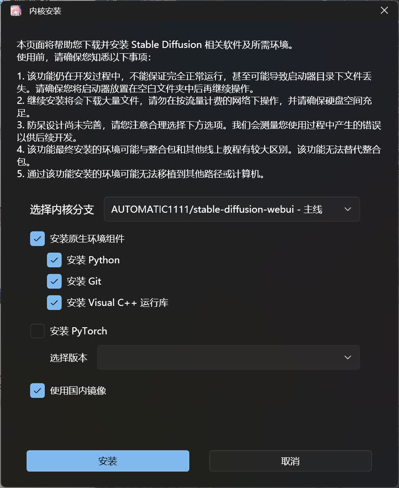

# 部署功能
在绘世启动器 2.6.0 之后的版本，支持从零构建完整环境，可不通过整合包来部署 SD WebUI，ComfyUI等。

## 打开部署功能
将绘世启动器放进一个空文件夹中后启动，等待绘世启动器检查自身的更新完成后，将会弹窗提醒找不到内核，点击确定后绘世启动器提示是否下载内核，点击是即可进入绘世启动器的部署界面。



## 内核分支

在选择内核分支中可以选择你想要部署的 Stable Diffusion 项目，目前支持部署的 Stable Diffusion 项目如下。

- AUTOMATIC1111/stable-diffusion-webui：功能多，插件丰富的 SD WebUI，
- lshqqytiger/stable-diffusion-webui-directml：在 SD WebUI 的基础上添加了 DirectML 的支持，使在 Windows 系统上不支持 ZLUDA 的 AMD 显卡也能跑图。
- vladmandic/automatic：和 SD WebUI 类似，但稳定性较差，不推荐。
- comfyanonymous/ComfyUI：使用节点流进行图片生成。
- lllyasviel/Fooocus：界面简单，可专注于提示词书写，一键出图。
- 油漆厂：图片打胶工具。

## 原生环境组件
为内核提供运行环境，同时为绘世启动器提供管理工具。默认保持勾选即可，除非系统环境中已经存在这些原生环境组件。

## CUDA
在cmd中输入如下命令即可查看CUDA Version
```
nvidia-smi
```

## PyTorch
PyTorch 是一个基于 Python 的机器学习库，为 AI 的运算提供大量的工具和函数，而 Stable Diffusion 在计算的时候依赖 PyTorch，所以需要安装 PyTorch。

PyTorch 版本需要和显卡的型号相对应，以保证 SD WebUI，ComfyUI等 WebUI 能够正常运行 Stable Diffusion。

查看显卡型号可在使用任务管理器，按下`Ctrl + Shift + ESC`启动任务管理器，点击`性能`->`GPU`，右上角就是显卡的型号。


以下为不同显卡对应可选的 PyTorch 版本（ x,y,z 分别代表三个数字）：

- Nvidia 显卡：
    - Torch x.y.z (CUDA x.y) + xFormers x.y.z

- AMD 显卡：
    - 支持 ZLUDA 的：
        - Torch x.y.z (CUDA x.y) + xFormers x.y.z

    - 不支持 ZLUDA 的：
        - Torch x.y.z (DirectML)
		
- Intel 显卡：
    - 独显：
        - Torch x.y.z (IPEX AOT, Arc)
    - 核显：
        - Torch x.y.z (IPEX AOT, Core Ultra)

!!!note
   	建议将显卡驱动更到最新公版驱动以保证 PyTorch 能够正常工作。  
    Nvidia 驱动下载：https://www.nvidia.cn/geforce/drivers  
    AMD 驱动下载：https://www.amd.com/zh-hans/support  
    Intel 驱动下载：https://www.intel.cn/content/www/cn/zh/download-center/home.html

    AMD 780M （核显），RX 5000 系（独显）及以上的 AMD 显卡支持 ZLUDA，而其他不支持的系列请使用 DirectML。

    AMD 780M 核显无法直接使用 ZLUDA，需要手动添加文件：[适用于绘世启动器的 AMD Radeon 780M 的 ZLUDA 教程 - 哔哩哔哩](https://www.bilibili.com/read/cv33327387)。

## 国内镜像
用于加速国内网络下载内核等文件的速度，保持勾选即可，如果是在国外网络环境下则取消勾选。

上述设置配置完成后即可点击左下角的安装进行部署。
