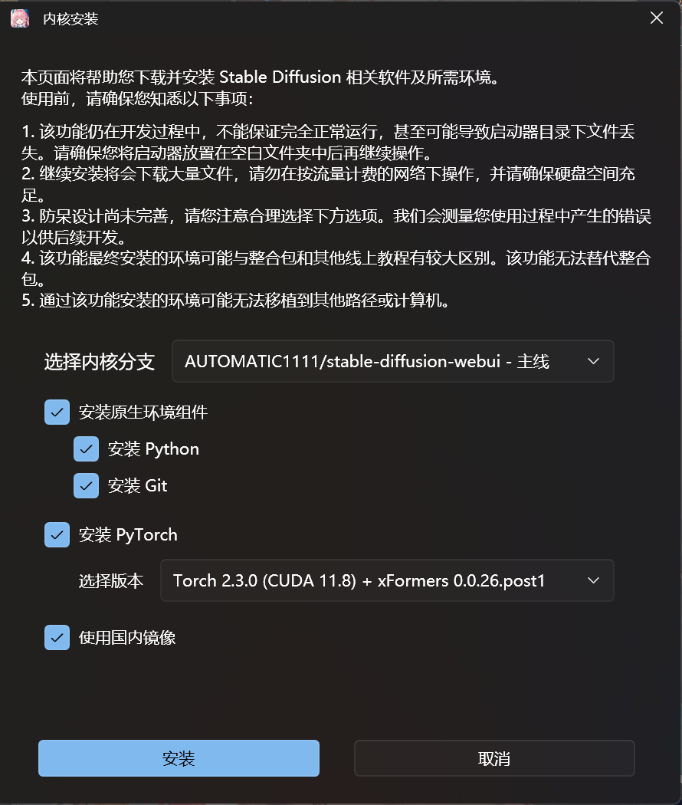

# 安装流程
绘世启动器安装流程主要分为 3 个步骤，分别为**安装内核**、**安装原生环境组件**和**安装 PyTorch**，实际安装需要执行的步骤和安装前选择的参数有关。

因为绘世启动器未做安装进度恢复的功能，所以当某个步骤安装失败时，绘世启动器将提示删除所有文件再重新安装。实际上，不需要删除所有文件再重新安装，只需要知道绘世启动器在哪步出现失败后，再次进入启动器后进入对应的选项重新安装即可。

下面将按顺序介绍绘世启动器在安装时执行的步骤。

## 安装
下面是绘世启动器执行的安装步骤。

### 安装内核
在**安装内核**阶段，绘世启动器的安装界面将提示**正在克隆仓库…**，此时绘世启动器将使用内置的 Git 模块从内核的 Github 仓库地址克隆内核到 Windows 系统的缓存文件夹中，当克隆成功时，绘世启动器将内核从缓存文件夹移动到绘世启动器所在路径。

如果该步骤出现失败，重启绘世启动器后并重新调整参数再安装。

### 安装原生环境组件
在**安装原生环境组件**阶段，绘世启动器的安装界面将提示**安装原生环境组件…**，此时绘世启动器调用 MicroManba 安装原生环境组件，原生环境组件将安装在绘世启动器所在目录的`.ext`文件夹中。

如果该步骤出现失败，此时再打开绘世启动器时将直接进入绘世启动器的主界面而不是绘世启动器的安装界面，此时需要在绘世启动器的**高级选项 -> 环境维护 -> 原生组件管理**中安装 Python 和 Git，安装完成后在**安装 PyTorch**选项选择 PyTorch 版本并安装。

### 安装 PyTorch
在**安装 PyTorch**阶段，绘世启动器的安装界面将提示**正在安装 PyTorch…**，此时绘世启动器调用 Pip 安装 PyTorch 到 Python 环境中。

如果该步骤出现失败，此时再打开绘世启动器时将直接进入绘世启动器的主界面而不是绘世启动器的安装界面，此时需要在绘世启动器的**高级选项 -> 环境维护 -> 安装 PyTorch**选项选择 PyTorch 版本并安装。

## 使用国内镜像
该选项用于设置安装过程中是否使用国内镜像下载组件。因为这些组件的下载源所在服务器在国外，所以国内网络会出现访问速度慢或者连接不稳定的问题，导致安装失败。而使用国内镜像就可以很好的解决该问题。

## 绘世启动器界面的显示规则
当绘世启动器所在目录只包含绘世启动器自身的文件（`绘世.exe`和`.launcher`），则打开绘世启动器可以进入部署模式，用于部署 SD WebUI / ComfyUI / ...

如果包含绘世启动器之外的文件，则绘世启动器将无法进入部署模式，将尝试进入管理模型。

进入管理模式需要满足条件，即绘世启动器所在目录包含内核的 Git 文件（在`.git`文件夹中），否则绘世启动器将无法进入管理模式，也就是绘世启动器的主界面。
